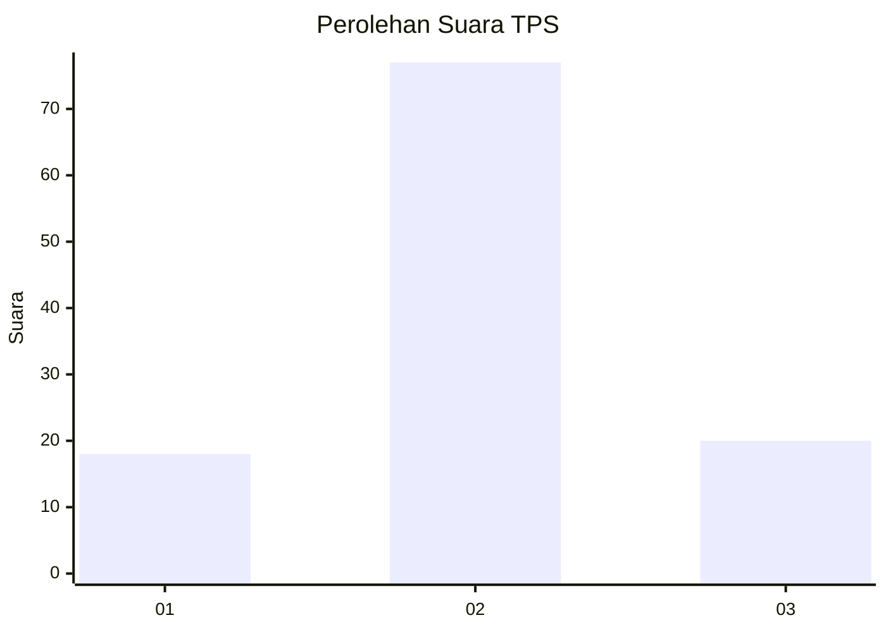
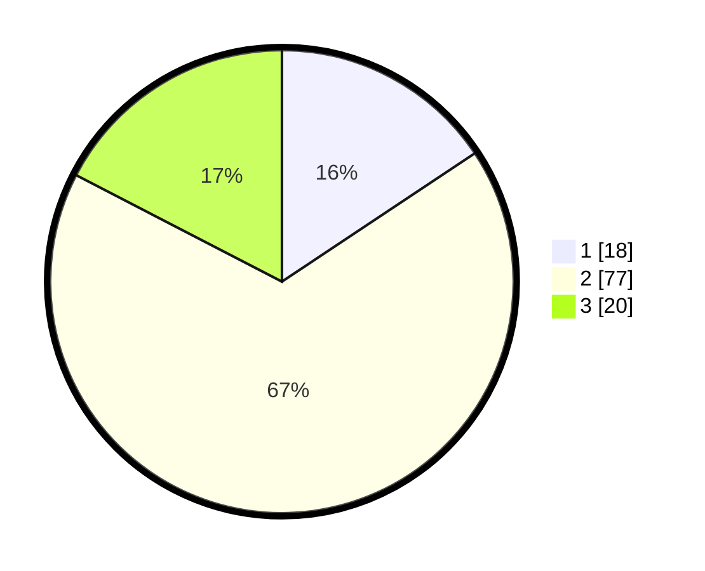

# Hasil

## Grafik

## Tabel

| No. | Nama Paslon    | Suara | Suara (raw) | Persentase |
|:--- |:-------------- | -----:| -----------:| ----------:|
| 1   | ANIES MUHAIMIN | 18    | [18][p-1]   | 15,65      |
| 2   | PRABOWO GIBRAN | 77    | [77][p-2]   | 66,96      |
| 3   | GANJAR MAHFUD  | 20    | [20][p-3]   | 17,39      |

[p-1]: https://github.com/gigit-pemilu/pemilu-2024/blob/main/pilpres/hitung-suara/sub/33-jawa-tengah/sub/29-brebes/sub/10-songgom/sub/2008-gegerkunci/sub/015-tps/sub/paslon-1.txt
[p-2]: https://github.com/gigit-pemilu/pemilu-2024/blob/main/pilpres/hitung-suara/sub/33-jawa-tengah/sub/29-brebes/sub/10-songgom/sub/2008-gegerkunci/sub/015-tps/sub/paslon-2.txt
[p-3]: https://github.com/gigit-pemilu/pemilu-2024/blob/main/pilpres/hitung-suara/sub/33-jawa-tengah/sub/29-brebes/sub/10-songgom/sub/2008-gegerkunci/sub/015-tps/sub/paslon-3.txt

## Foto C Plano

https://sirekap-obj-formc.kpu.go.id/a89d/pemilu/ppwp/33/29/10/20/08/3329102008015-20240215-094610--401eaa2d-0c5a-45c9-b455-06ef5021c2bd.jpg

https://sirekap-obj-formc.kpu.go.id/a89d/pemilu/ppwp/33/29/10/20/08/3329102008015-20240215-094701--beadaa0e-e4e5-4a8e-8558-a3b453ac0f9b.jpg

https://sirekap-obj-formc.kpu.go.id/a89d/pemilu/ppwp/33/29/10/20/08/3329102008015-20240215-095018--334b6132-bddc-410e-9978-6208aec8580f.jpg

## Metadata

| Key        | Value               |
| ---------- | ------------------- |
| Time Stamp | 2024-02-16 21:01:00 |

