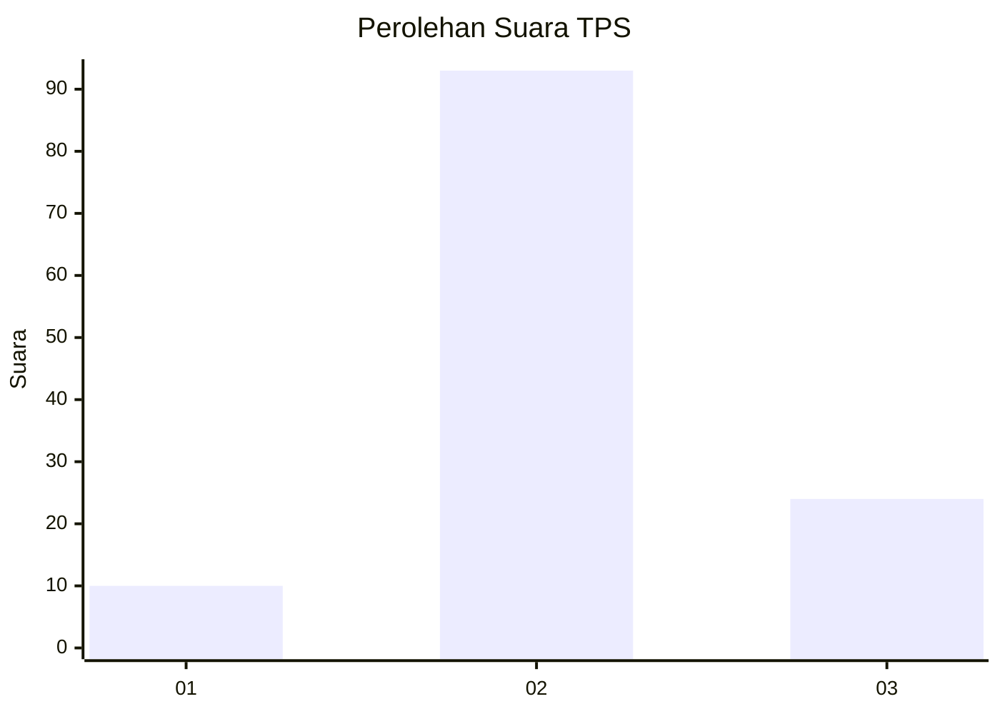
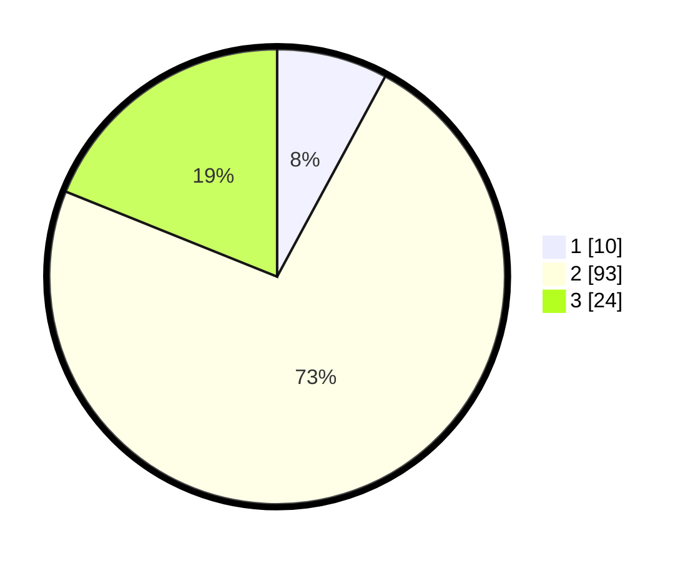

# Hasil

## Grafik

## Tabel

| No. | Nama Paslon    | Suara | Suara (raw) | Persentase |
|:--- |:-------------- | -----:| -----------:| ----------:|
| 1   | ANIES MUHAIMIN | 10    | [10][p-1]   | 7,87       |
| 2   | PRABOWO GIBRAN | 93    | [93][p-2]   | 73,23      |
| 3   | GANJAR MAHFUD  | 24    | [24][p-3]   | 18,90      |

[p-1]: https://github.com/gigit-pemilu/pemilu-2024-33-jawa-tengah/blob/main/pilpres/hitung-suara/sub/33-jawa-tengah/sub/29-brebes/sub/10-songgom/sub/2010-songgom-lor/sub/029-tps/sub/paslon-1.txt
[p-2]: https://github.com/gigit-pemilu/pemilu-2024-33-jawa-tengah/blob/main/pilpres/hitung-suara/sub/33-jawa-tengah/sub/29-brebes/sub/10-songgom/sub/2010-songgom-lor/sub/029-tps/sub/paslon-2.txt
[p-3]: https://github.com/gigit-pemilu/pemilu-2024-33-jawa-tengah/blob/main/pilpres/hitung-suara/sub/33-jawa-tengah/sub/29-brebes/sub/10-songgom/sub/2010-songgom-lor/sub/029-tps/sub/paslon-3.txt

## Foto C Plano

https://sirekap-obj-formc.kpu.go.id/3d3a/pemilu/ppwp/33/29/10/20/10/3329102010029-20240214-184521--01c5a110-3399-4155-a26c-6eae29924573.jpg

https://sirekap-obj-formc.kpu.go.id/3d3a/pemilu/ppwp/33/29/10/20/10/3329102010029-20240214-184540--58286126-2ef8-49b8-b90a-c1b6989ae240.jpg

https://sirekap-obj-formc.kpu.go.id/3d3a/pemilu/ppwp/33/29/10/20/10/3329102010029-20240214-184534--301c9591-fd17-4336-b650-3dc1289c2246.jpg

## Metadata

| Key        | Value               |
| ---------- | ------------------- |
| Time Stamp | 2024-02-19 16:00:00 |

