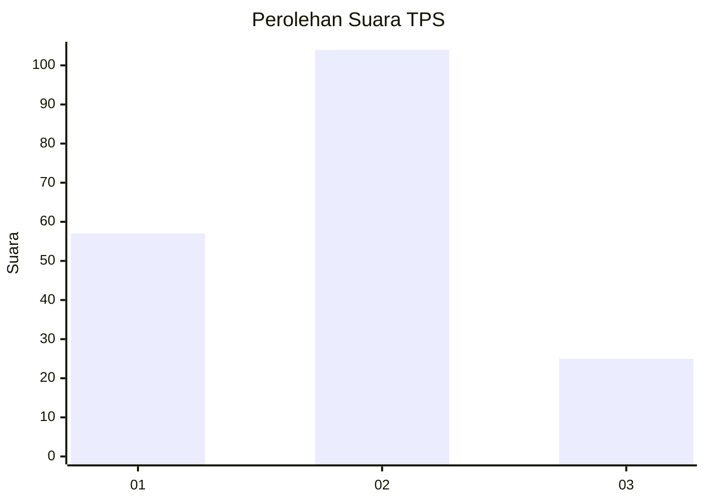
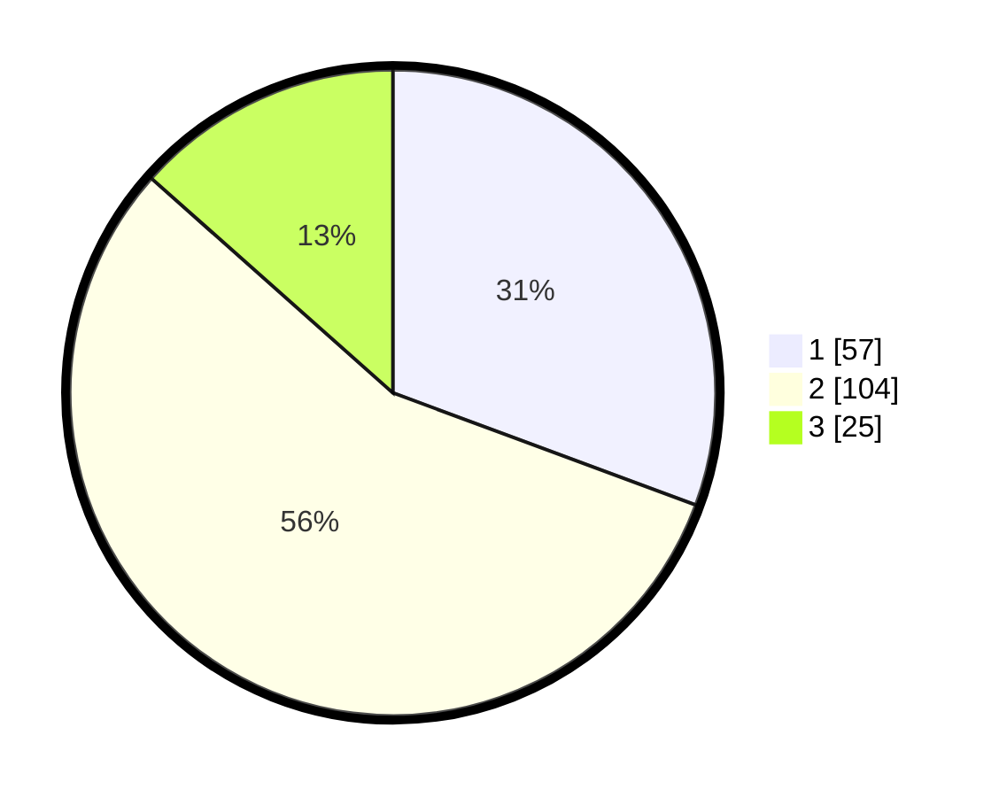

# Hasil

## Grafik

## Tabel

| No. | Nama Paslon    | Suara | Suara (raw) | Persentase |
|:--- |:-------------- | -----:| -----------:| ----------:|
| 1   | ANIES MUHAIMIN | 57    | [57][p-1]   | 30,65      |
| 2   | PRABOWO GIBRAN | 104   | [104][p-2]  | 55,91      |
| 3   | GANJAR MAHFUD  | 25    | [25][p-3]   | 13,44      |

[p-1]: https://github.com/gigit-pemilu/pemilu-2024-33-jawa-tengah/blob/main/pilpres/hitung-suara/sub/33-jawa-tengah/sub/29-brebes/sub/11-kersana/sub/2001-ciampel/sub/002-tps/sub/paslon-1.txt
[p-2]: https://github.com/gigit-pemilu/pemilu-2024-33-jawa-tengah/blob/main/pilpres/hitung-suara/sub/33-jawa-tengah/sub/29-brebes/sub/11-kersana/sub/2001-ciampel/sub/002-tps/sub/paslon-2.txt
[p-3]: https://github.com/gigit-pemilu/pemilu-2024-33-jawa-tengah/blob/main/pilpres/hitung-suara/sub/33-jawa-tengah/sub/29-brebes/sub/11-kersana/sub/2001-ciampel/sub/002-tps/sub/paslon-3.txt

## Foto C Plano

https://sirekap-obj-formc.kpu.go.id/14a4/pemilu/ppwp/33/29/11/20/01/3329112001002-20240217-222634--a1c6a7fa-377a-4aa7-9c2c-64f0dcca8063.jpg

https://sirekap-obj-formc.kpu.go.id/14a4/pemilu/ppwp/33/29/11/20/01/3329112001002-20240217-222637--60cb6c22-853d-449a-adad-a13168e5cefd.jpg

https://sirekap-obj-formc.kpu.go.id/14a4/pemilu/ppwp/33/29/11/20/01/3329112001002-20240217-222639--3f47fba2-e51d-431c-a633-fc7cb6e6e7ea.jpg

## Metadata

| Key        | Value               |
| ---------- | ------------------- |
| Time Stamp | 2024-02-19 16:00:00 |

