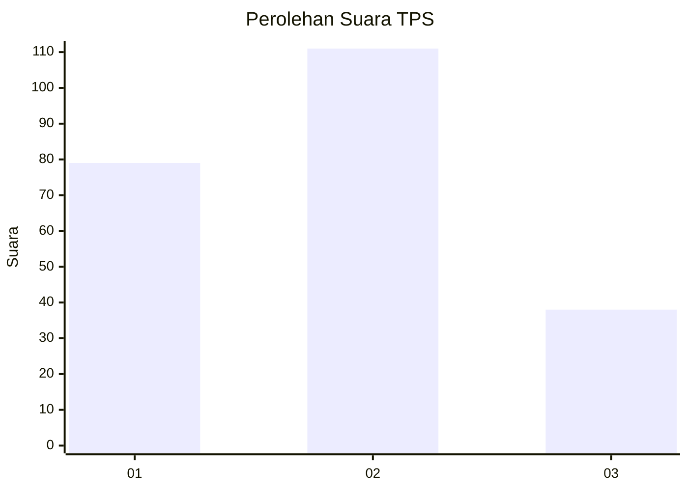
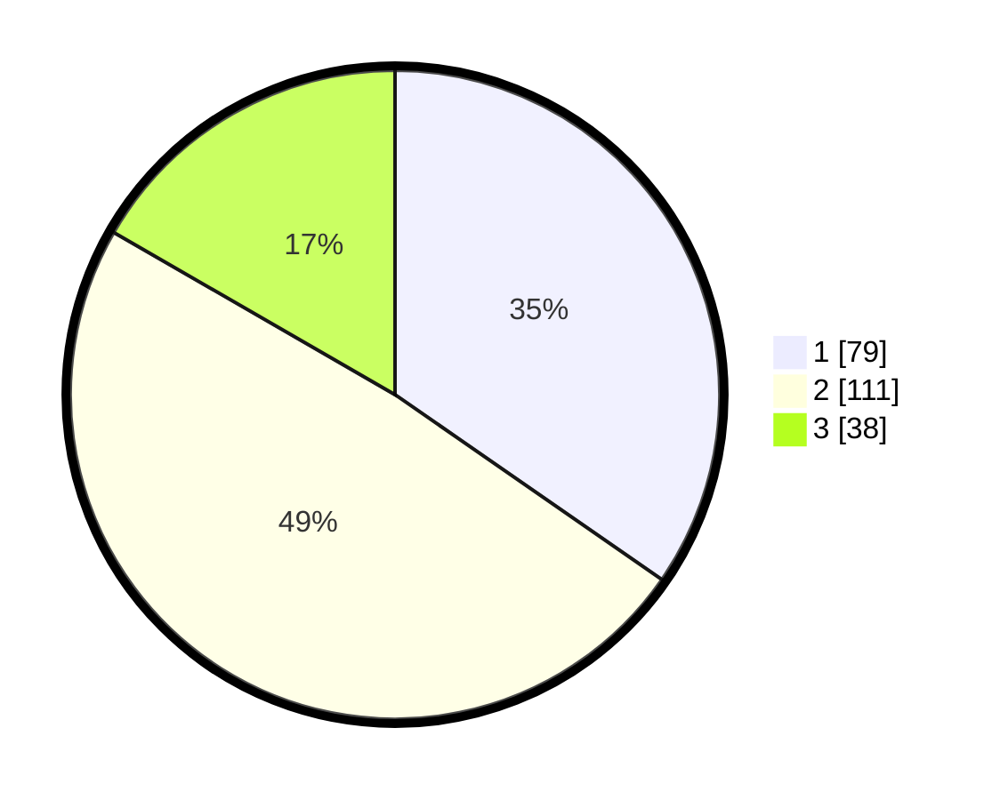

# Hasil

## Grafik

## Tabel

| No. | Nama Paslon    | Suara | Suara (raw) | Persentase |
|:--- |:-------------- | -----:| -----------:| ----------:|
| 1   | ANIES MUHAIMIN | 79    | [79][p-1]   | 34,65      |
| 2   | PRABOWO GIBRAN | 111   | [111][p-2]  | 48,68      |
| 3   | GANJAR MAHFUD  | 38    | [38][p-3]   | 16,67      |

[p-1]: https://github.com/gigit-pemilu/pemilu-2024/blob/main/pilpres/hitung-suara/sub/33-jawa-tengah/sub/29-brebes/sub/11-kersana/sub/2001-ciampel/sub/004-tps/sub/paslon-1.txt
[p-2]: https://github.com/gigit-pemilu/pemilu-2024/blob/main/pilpres/hitung-suara/sub/33-jawa-tengah/sub/29-brebes/sub/11-kersana/sub/2001-ciampel/sub/004-tps/sub/paslon-2.txt
[p-3]: https://github.com/gigit-pemilu/pemilu-2024/blob/main/pilpres/hitung-suara/sub/33-jawa-tengah/sub/29-brebes/sub/11-kersana/sub/2001-ciampel/sub/004-tps/sub/paslon-3.txt

## Foto C Plano

https://sirekap-obj-formc.kpu.go.id/b8df/pemilu/ppwp/33/29/11/20/01/3329112001004-20240214-234427--abc37874-0ada-4da8-83b3-abf7dce23fd0.jpg

https://sirekap-obj-formc.kpu.go.id/b8df/pemilu/ppwp/33/29/11/20/01/3329112001004-20240214-234443--8d6b8694-7e6d-4973-9d45-1e98490bde57.jpg

https://sirekap-obj-formc.kpu.go.id/b8df/pemilu/ppwp/33/29/11/20/01/3329112001004-20240214-234451--d4a6b54b-39a5-464d-9638-757e5fdd396b.jpg

## Metadata

| Key        | Value               |
| ---------- | ------------------- |
| Time Stamp | 2024-02-24 22:31:28 |

