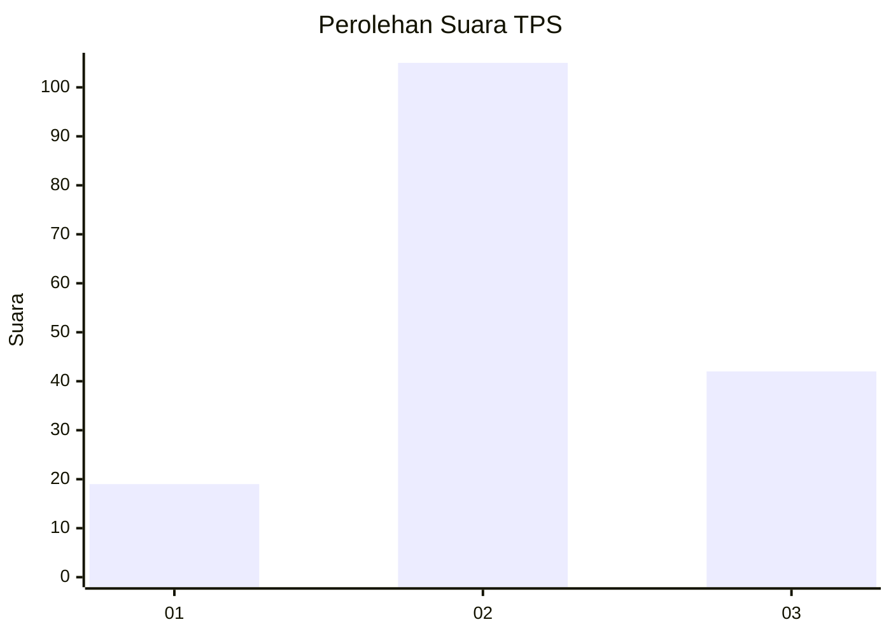
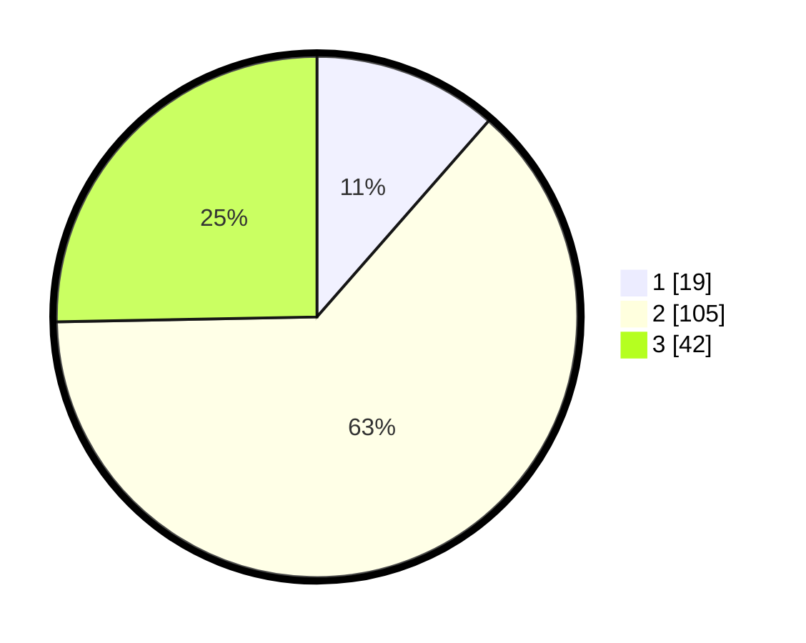

# Hasil

## Grafik

## Tabel

| No. | Nama Paslon    | Suara | Suara (raw) | Persentase |
|:--- |:-------------- | -----:| -----------:| ----------:|
| 1   | ANIES MUHAIMIN | 19    | [19][p-1]   | 11,45      |
| 2   | PRABOWO GIBRAN | 105   | [105][p-2]  | 63,25      |
| 3   | GANJAR MAHFUD  | 42    | [42][p-3]   | 25,30      |

[p-1]: https://github.com/gigit-pemilu/pemilu-2024/blob/main/pilpres/hitung-suara/sub/33-jawa-tengah/sub/29-brebes/sub/11-kersana/sub/2001-ciampel/sub/005-tps/sub/paslon-1.txt
[p-2]: https://github.com/gigit-pemilu/pemilu-2024/blob/main/pilpres/hitung-suara/sub/33-jawa-tengah/sub/29-brebes/sub/11-kersana/sub/2001-ciampel/sub/005-tps/sub/paslon-2.txt
[p-3]: https://github.com/gigit-pemilu/pemilu-2024/blob/main/pilpres/hitung-suara/sub/33-jawa-tengah/sub/29-brebes/sub/11-kersana/sub/2001-ciampel/sub/005-tps/sub/paslon-3.txt

## Foto C Plano

https://sirekap-obj-formc.kpu.go.id/7f34/pemilu/ppwp/33/29/11/20/01/3329112001005-20240215-005936--4f6b5546-372b-4716-a59d-609f9dff6fe1.jpg

https://sirekap-obj-formc.kpu.go.id/7f34/pemilu/ppwp/33/29/11/20/01/3329112001005-20240215-010123--982221aa-9841-429f-b582-14759bad7216.jpg

https://sirekap-obj-formc.kpu.go.id/7f34/pemilu/ppwp/33/29/11/20/01/3329112001005-20240215-010233--b009fde5-1631-40ff-8a90-82dede2bad48.jpg

## Metadata

| Key        | Value               |
| ---------- | ------------------- |
| Time Stamp | 2024-02-25 14:00:00 |

