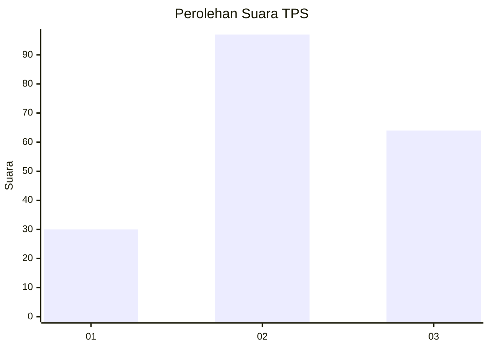
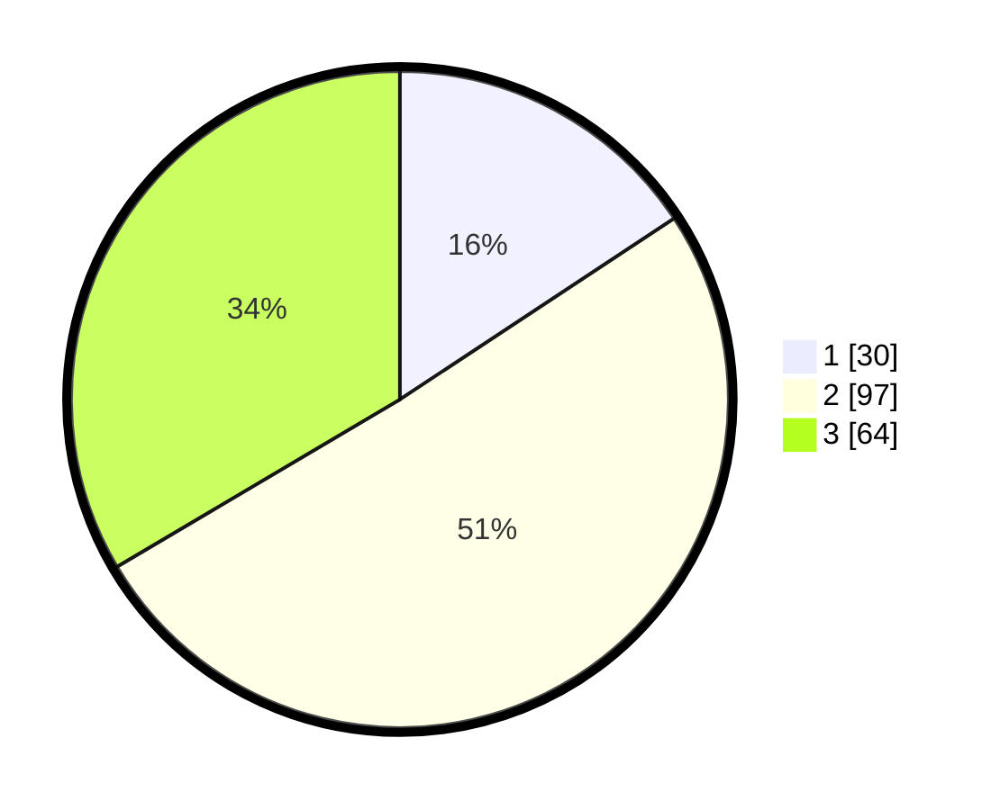

# Hasil

## Grafik

## Tabel

| No. | Nama Paslon    | Suara | Suara (raw) | Persentase |
|:--- |:-------------- | -----:| -----------:| ----------:|
| 1   | ANIES MUHAIMIN | 30    | [30][p-1]   | 15,71      |
| 2   | PRABOWO GIBRAN | 97    | [97][p-2]   | 50,79      |
| 3   | GANJAR MAHFUD  | 64    | [64][p-3]   | 33,51      |

[p-1]: https://github.com/gigit-pemilu/pemilu-2024-33-jawa-tengah/blob/main/pilpres/hitung-suara/sub/33-jawa-tengah/sub/29-brebes/sub/11-kersana/sub/2001-ciampel/sub/006-tps/sub/paslon-1.txt
[p-2]: https://github.com/gigit-pemilu/pemilu-2024-33-jawa-tengah/blob/main/pilpres/hitung-suara/sub/33-jawa-tengah/sub/29-brebes/sub/11-kersana/sub/2001-ciampel/sub/006-tps/sub/paslon-2.txt
[p-3]: https://github.com/gigit-pemilu/pemilu-2024-33-jawa-tengah/blob/main/pilpres/hitung-suara/sub/33-jawa-tengah/sub/29-brebes/sub/11-kersana/sub/2001-ciampel/sub/006-tps/sub/paslon-3.txt

## Foto C Plano

https://sirekap-obj-formc.kpu.go.id/bee7/pemilu/ppwp/33/29/11/20/01/3329112001006-20240215-012324--34abc03e-63fc-496c-b90d-63031e301463.jpg

https://sirekap-obj-formc.kpu.go.id/bee7/pemilu/ppwp/33/29/11/20/01/3329112001006-20240215-012640--13690931-4077-4736-9ae3-85456244ec65.jpg

https://sirekap-obj-formc.kpu.go.id/bee7/pemilu/ppwp/33/29/11/20/01/3329112001006-20240215-012733--e6e27ee8-da87-4b91-8d1d-0bf76f1db4bd.jpg

## Metadata

| Key        | Value               |
| ---------- | ------------------- |
| Time Stamp | 2024-02-17 19:00:04 |

