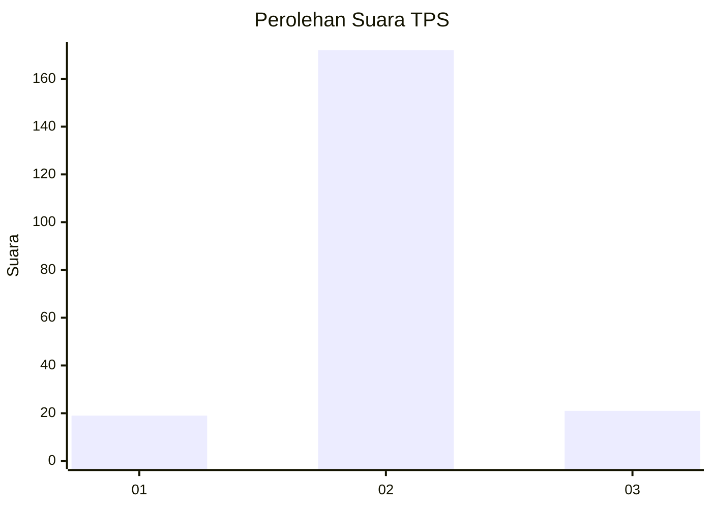
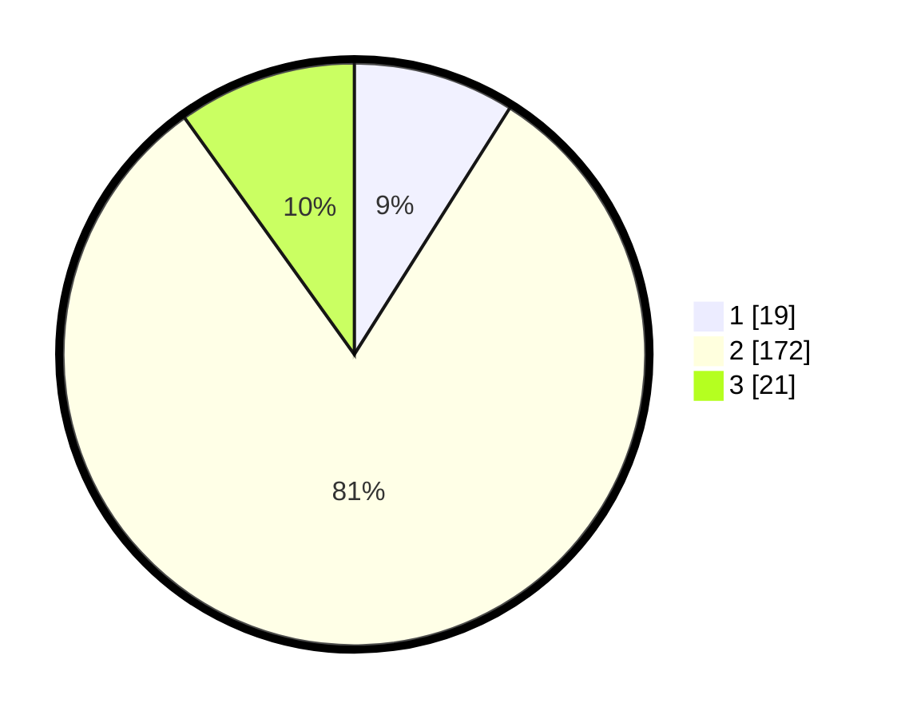

# Hasil

## Grafik

## Tabel

| No. | Nama Paslon    | Suara | Suara (raw) | Persentase |
|:--- |:-------------- | -----:| -----------:| ----------:|
| 1   | ANIES MUHAIMIN | 19    | [19][p-1]   | 8,96       |
| 2   | PRABOWO GIBRAN | 172   | [172][p-2]  | 81,13      |
| 3   | GANJAR MAHFUD  | 21    | [21][p-3]   | 9,91       |

[p-1]: https://github.com/gigit-pemilu/pemilu-2024/blob/main/pilpres/hitung-suara/sub/33-jawa-tengah/sub/29-brebes/sub/11-kersana/sub/2005-kemukten/sub/008-tps/sub/paslon-1.txt
[p-2]: https://github.com/gigit-pemilu/pemilu-2024/blob/main/pilpres/hitung-suara/sub/33-jawa-tengah/sub/29-brebes/sub/11-kersana/sub/2005-kemukten/sub/008-tps/sub/paslon-2.txt
[p-3]: https://github.com/gigit-pemilu/pemilu-2024/blob/main/pilpres/hitung-suara/sub/33-jawa-tengah/sub/29-brebes/sub/11-kersana/sub/2005-kemukten/sub/008-tps/sub/paslon-3.txt

## Foto C Plano

https://sirekap-obj-formc.kpu.go.id/efc2/pemilu/ppwp/33/29/11/20/05/3329112005008-20240215-130736--ca3dfda3-6852-4976-a770-6d0c5a0a7ec0.jpg

https://sirekap-obj-formc.kpu.go.id/efc2/pemilu/ppwp/33/29/11/20/05/3329112005008-20240216-203052--6c25b230-d999-436a-ae4e-b68189023e2d.jpg

https://sirekap-obj-formc.kpu.go.id/efc2/pemilu/ppwp/33/29/11/20/05/3329112005008-20240214-141325--c7a6d99b-200c-4274-8d9d-11d979c9a034.jpg

## Metadata

| Key        | Value               |
| ---------- | ------------------- |
| Time Stamp | 2024-02-17 19:30:00 |

