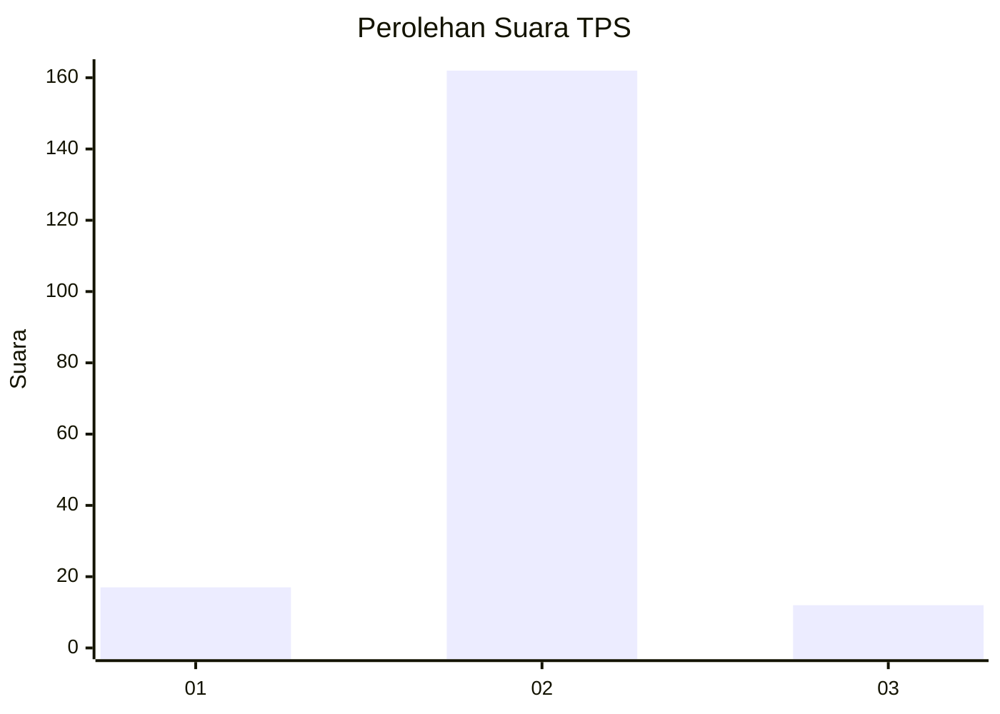
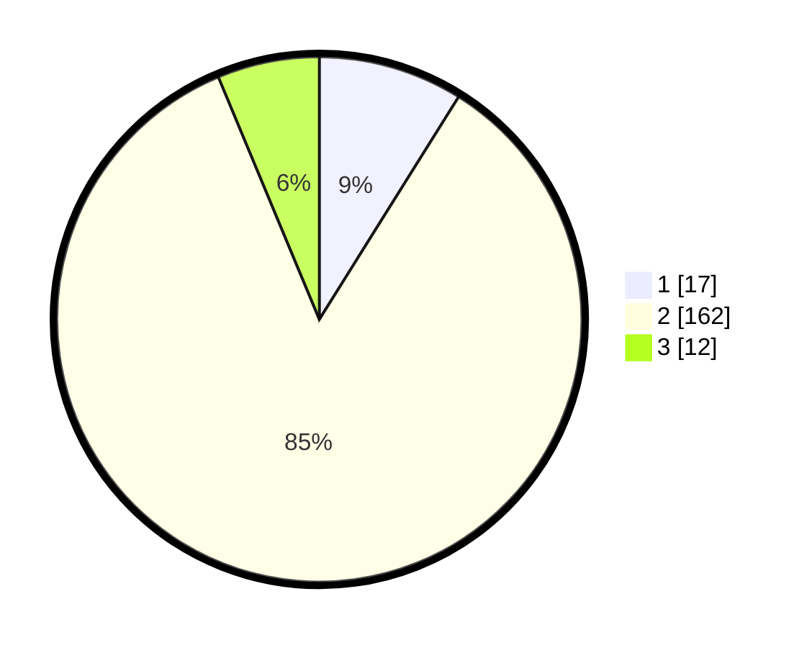

# Hasil

## Grafik

## Tabel

| No. | Nama Paslon    | Suara | Suara (raw) | Persentase |
|:--- |:-------------- | -----:| -----------:| ----------:|
| 1   | ANIES MUHAIMIN | 17    | [17][p-1]   | 8,90       |
| 2   | PRABOWO GIBRAN | 162   | [162][p-2]  | 84,82      |
| 3   | GANJAR MAHFUD  | 12    | [12][p-3]   | 6,28       |

[p-1]: https://github.com/gigit-pemilu/pemilu-2024/blob/main/pilpres/hitung-suara/sub/33-jawa-tengah/sub/29-brebes/sub/11-kersana/sub/2005-kemukten/sub/009-tps/sub/paslon-1.txt
[p-2]: https://github.com/gigit-pemilu/pemilu-2024/blob/main/pilpres/hitung-suara/sub/33-jawa-tengah/sub/29-brebes/sub/11-kersana/sub/2005-kemukten/sub/009-tps/sub/paslon-2.txt
[p-3]: https://github.com/gigit-pemilu/pemilu-2024/blob/main/pilpres/hitung-suara/sub/33-jawa-tengah/sub/29-brebes/sub/11-kersana/sub/2005-kemukten/sub/009-tps/sub/paslon-3.txt

## Foto C Plano

https://sirekap-obj-formc.kpu.go.id/017c/pemilu/ppwp/33/29/11/20/05/3329112005009-20240214-232046--92335f8c-cb01-4bd2-ac2e-3a0d4d140601.jpg

https://sirekap-obj-formc.kpu.go.id/017c/pemilu/ppwp/33/29/11/20/05/3329112005009-20240215-003502--b1c72c38-1c11-4a6b-9f21-10f0f975bf5c.jpg

https://sirekap-obj-formc.kpu.go.id/017c/pemilu/ppwp/33/29/11/20/05/3329112005009-20240214-232759--6583d7e6-e8d4-413f-9036-b1e3976a9a61.jpg

## Metadata

| Key        | Value               |
| ---------- | ------------------- |
| Time Stamp | 2024-02-17 19:30:00 |

