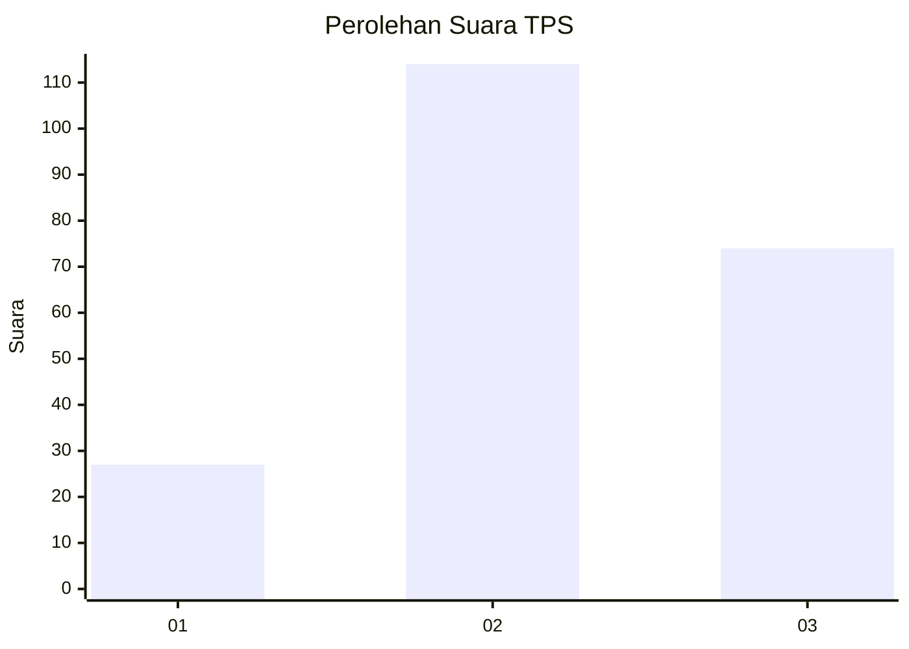
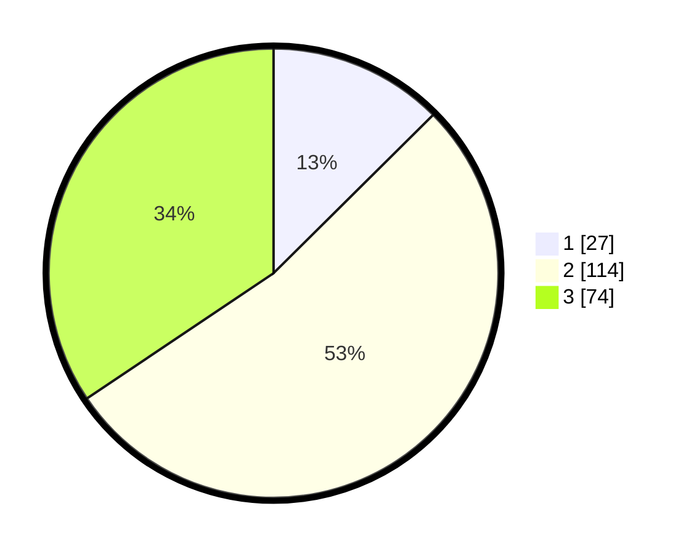

# Hasil

## Grafik

## Tabel

| No. | Nama Paslon    | Suara | Suara (raw) | Persentase |
|:--- |:-------------- | -----:| -----------:| ----------:|
| 1   | ANIES MUHAIMIN | 27    | [27][p-1]   | 12,56      |
| 2   | PRABOWO GIBRAN | 114   | [114][p-2]  | 53,02      |
| 3   | GANJAR MAHFUD  | 74    | [74][p-3]   | 34,42      |

[p-1]: https://github.com/gigit-pemilu/pemilu-2024/blob/main/pilpres/hitung-suara/sub/33-jawa-tengah/sub/29-brebes/sub/11-kersana/sub/2008-kramatsampang/sub/002-tps/sub/paslon-1.txt
[p-2]: https://github.com/gigit-pemilu/pemilu-2024/blob/main/pilpres/hitung-suara/sub/33-jawa-tengah/sub/29-brebes/sub/11-kersana/sub/2008-kramatsampang/sub/002-tps/sub/paslon-2.txt
[p-3]: https://github.com/gigit-pemilu/pemilu-2024/blob/main/pilpres/hitung-suara/sub/33-jawa-tengah/sub/29-brebes/sub/11-kersana/sub/2008-kramatsampang/sub/002-tps/sub/paslon-3.txt

## Foto C Plano

https://sirekap-obj-formc.kpu.go.id/f3fb/pemilu/ppwp/33/29/11/20/08/3329112008002-20240215-071356--be58d3d6-2a87-4fd5-bdc2-10f52cd2e6c5.jpg

https://sirekap-obj-formc.kpu.go.id/f3fb/pemilu/ppwp/33/29/11/20/08/3329112008002-20240215-011623--656b83a3-87bc-4794-8717-14e53529f8bf.jpg

https://sirekap-obj-formc.kpu.go.id/f3fb/pemilu/ppwp/33/29/11/20/08/3329112008002-20240215-071840--6b399531-579b-4d22-aefc-239813f1b240.jpg

## Metadata

| Key        | Value               |
| ---------- | ------------------- |
| Time Stamp | 2024-02-25 12:00:00 |

