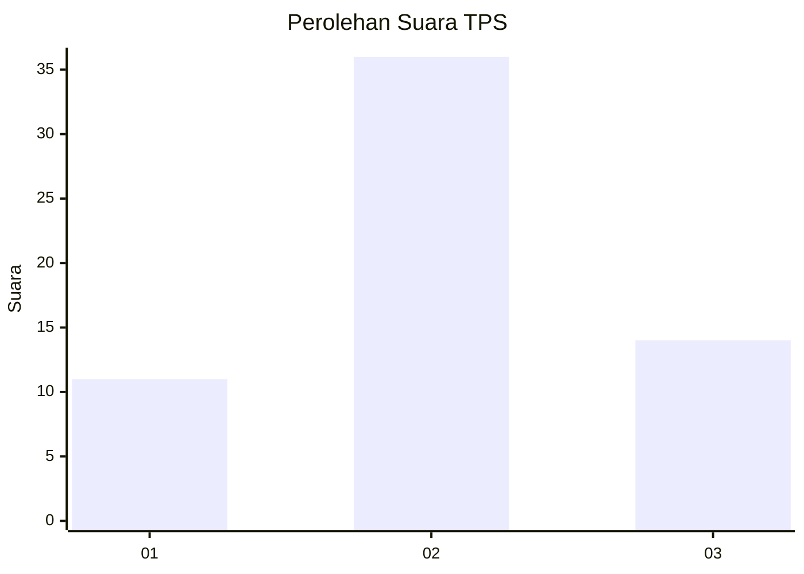
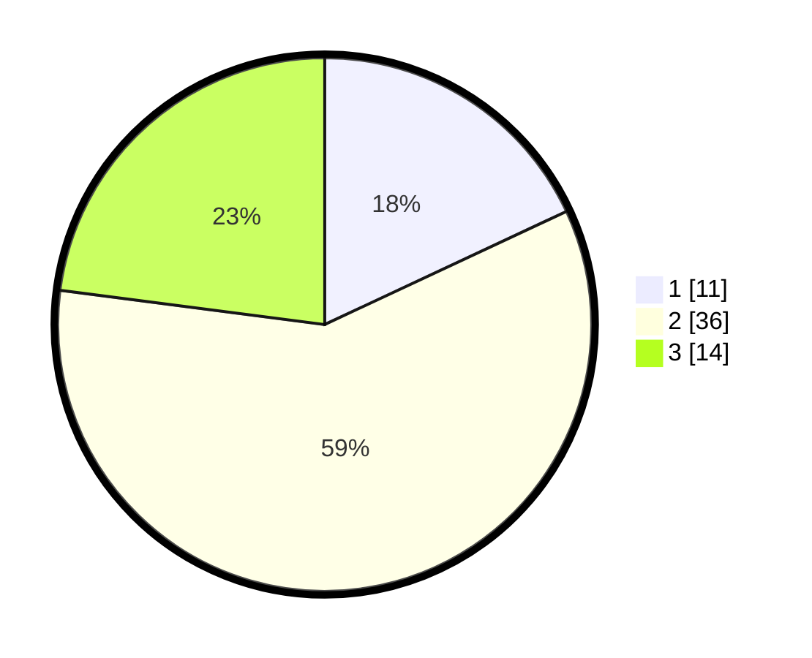

# Hasil

## Grafik

## Tabel

| No. | Nama Paslon    | Suara | Suara (raw) | Persentase |
|:--- |:-------------- | -----:| -----------:| ----------:|
| 1   | ANIES MUHAIMIN | 11    | [11][p-1]   | 18,03      |
| 2   | PRABOWO GIBRAN | 36    | [36][p-2]   | 59,02      |
| 3   | GANJAR MAHFUD  | 14    | [14][p-3]   | 22,95      |

[p-1]: https://github.com/gigit-pemilu/pemilu-2024/blob/main/pilpres/hitung-suara/sub/33-jawa-tengah/sub/29-brebes/sub/11-kersana/sub/2010-limbangan/sub/029-tps/sub/paslon-1.txt
[p-2]: https://github.com/gigit-pemilu/pemilu-2024/blob/main/pilpres/hitung-suara/sub/33-jawa-tengah/sub/29-brebes/sub/11-kersana/sub/2010-limbangan/sub/029-tps/sub/paslon-2.txt
[p-3]: https://github.com/gigit-pemilu/pemilu-2024/blob/main/pilpres/hitung-suara/sub/33-jawa-tengah/sub/29-brebes/sub/11-kersana/sub/2010-limbangan/sub/029-tps/sub/paslon-3.txt

## Foto C Plano

https://sirekap-obj-formc.kpu.go.id/a7d9/pemilu/ppwp/33/29/11/20/10/3329112010029-20240215-120951--5818c9ac-1d5c-462d-812f-5bc4e22b2151.jpg

https://sirekap-obj-formc.kpu.go.id/a7d9/pemilu/ppwp/33/29/11/20/10/3329112010029-20240215-121140--b4ce7e03-2796-4b80-ba57-845e94e76f2b.jpg

https://sirekap-obj-formc.kpu.go.id/a7d9/pemilu/ppwp/33/29/11/20/10/3329112010029-20240215-121251--b2ed5f18-4ed8-4d0f-9a84-c6764270a4d3.jpg

## Metadata

| Key        | Value               |
| ---------- | ------------------- |
| Time Stamp | 2024-02-19 06:16:00 |

