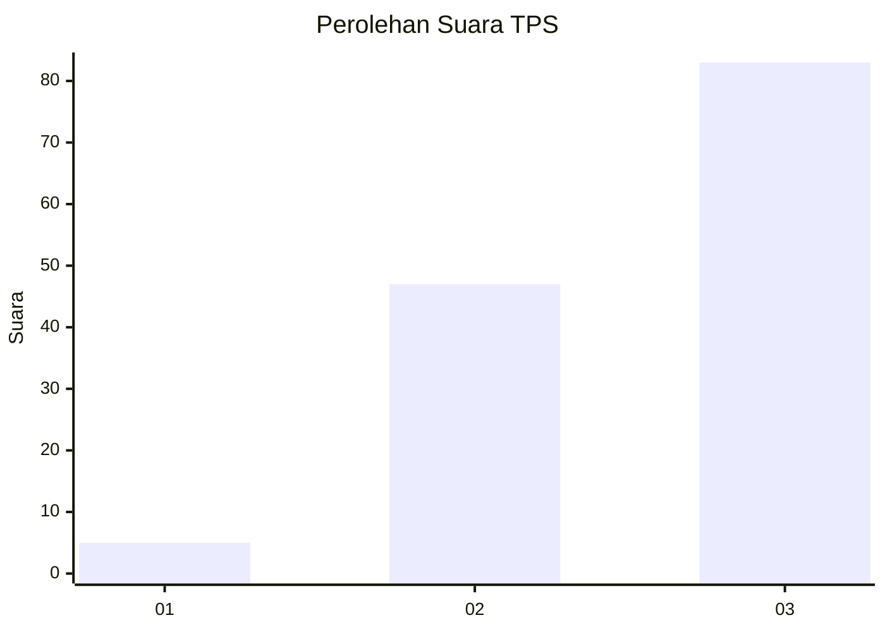
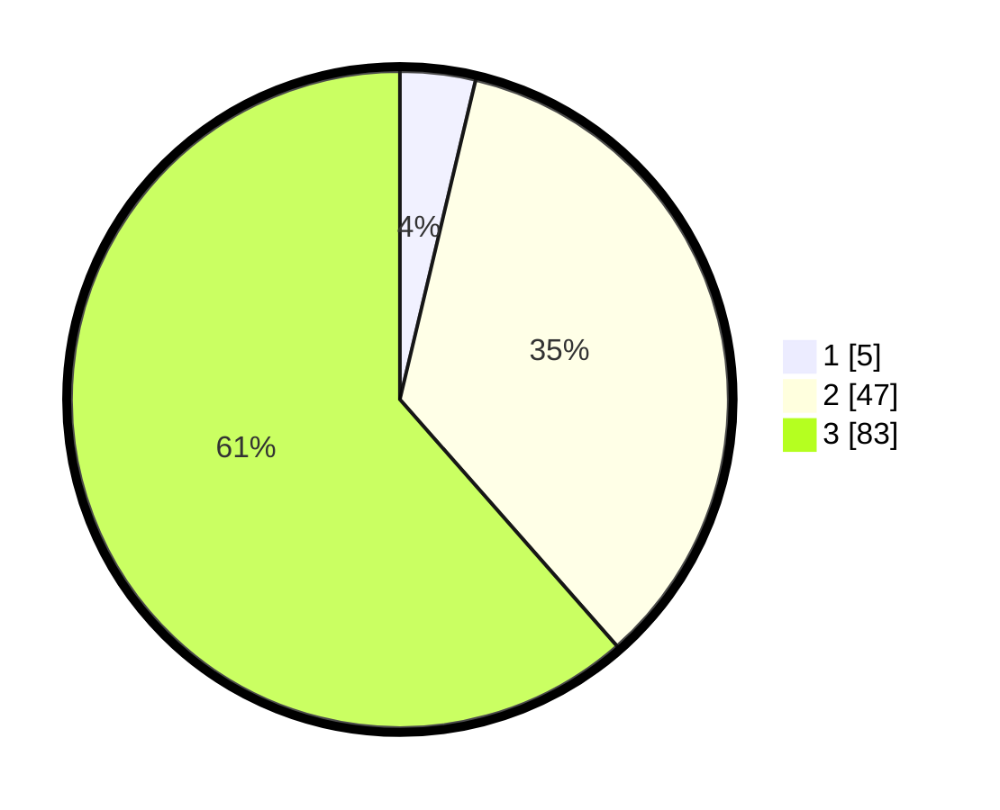

# Hasil

## Grafik

## Tabel

| No. | Nama Paslon    | Suara | Suara (raw) | Persentase |
|:--- |:-------------- | -----:| -----------:| ----------:|
| 1   | ANIES MUHAIMIN | 5     | [5][p-1]    | 3,70       |
| 2   | PRABOWO GIBRAN | 47    | [47][p-2]   | 34,81      |
| 3   | GANJAR MAHFUD  | 83    | [83][p-3]   | 61,48      |

[p-1]: https://github.com/gigit-pemilu/pemilu-2024-33-jawa-tengah/blob/main/pilpres/hitung-suara/sub/33-jawa-tengah/sub/29-brebes/sub/11-kersana/sub/2013-sutamaja/sub/011-tps/sub/paslon-1.txt
[p-2]: https://github.com/gigit-pemilu/pemilu-2024-33-jawa-tengah/blob/main/pilpres/hitung-suara/sub/33-jawa-tengah/sub/29-brebes/sub/11-kersana/sub/2013-sutamaja/sub/011-tps/sub/paslon-2.txt
[p-3]: https://github.com/gigit-pemilu/pemilu-2024-33-jawa-tengah/blob/main/pilpres/hitung-suara/sub/33-jawa-tengah/sub/29-brebes/sub/11-kersana/sub/2013-sutamaja/sub/011-tps/sub/paslon-3.txt

## Foto C Plano

https://sirekap-obj-formc.kpu.go.id/abf7/pemilu/ppwp/33/29/11/20/13/3329112013011-20240214-215407--4f8ace9c-24e5-4269-bf5a-0e84b9837129.jpg

https://sirekap-obj-formc.kpu.go.id/abf7/pemilu/ppwp/33/29/11/20/13/3329112013011-20240214-215540--aba90940-c5d5-4820-95d3-6620526ca6e2.jpg

https://sirekap-obj-formc.kpu.go.id/abf7/pemilu/ppwp/33/29/11/20/13/3329112013011-20240214-222726--8b3b4da6-d23c-45d0-8302-b7bcb6ab6d54.jpg

## Metadata

| Key        | Value               |
| ---------- | ------------------- |
| Time Stamp | 2024-02-19 06:16:00 |

