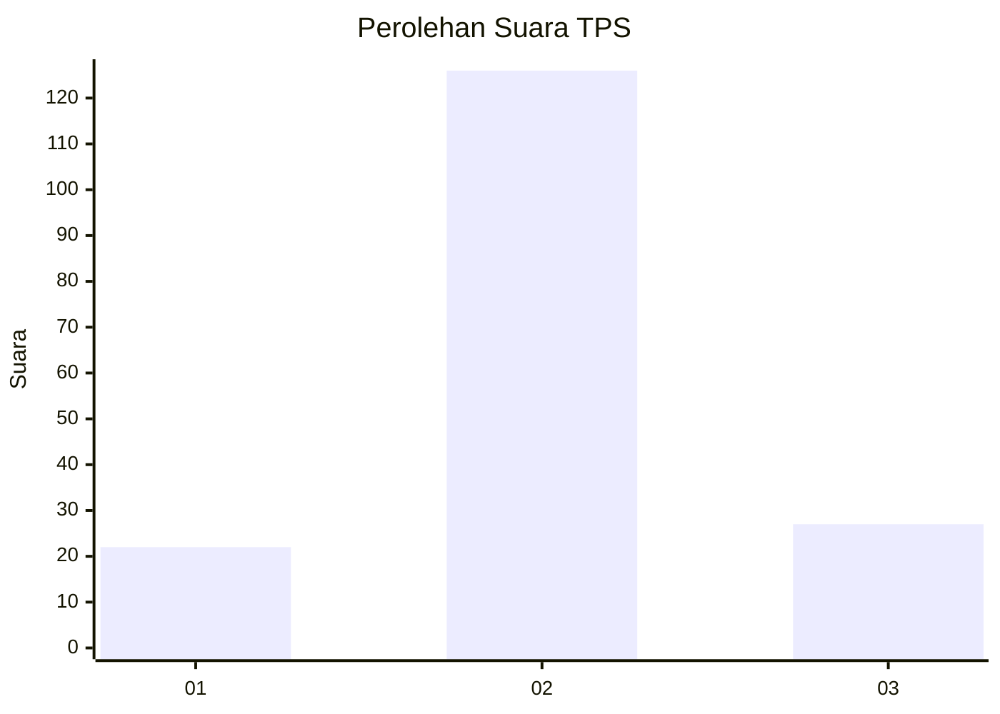
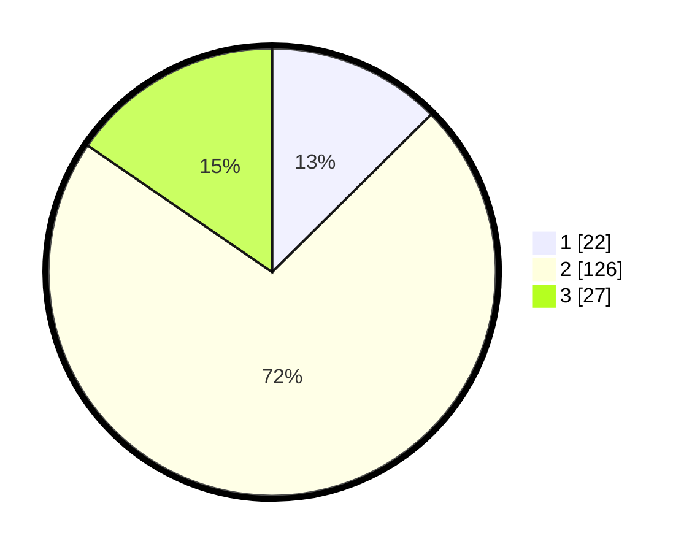

# Hasil

## Grafik

## Tabel

| No. | Nama Paslon    | Suara | Suara (raw) | Persentase |
|:--- |:-------------- | -----:| -----------:| ----------:|
| 1   | ANIES MUHAIMIN | 22    | [22][p-1]   | 12,57      |
| 2   | PRABOWO GIBRAN | 126   | [126][p-2]  | 72,00      |
| 3   | GANJAR MAHFUD  | 27    | [27][p-3]   | 15,43      |

[p-1]: https://github.com/gigit-pemilu/pemilu-2024-33-jawa-tengah/blob/main/pilpres/hitung-suara/sub/33-jawa-tengah/sub/29-brebes/sub/12-losari/sub/2001-babakan/sub/006-tps/sub/paslon-1.txt
[p-2]: https://github.com/gigit-pemilu/pemilu-2024-33-jawa-tengah/blob/main/pilpres/hitung-suara/sub/33-jawa-tengah/sub/29-brebes/sub/12-losari/sub/2001-babakan/sub/006-tps/sub/paslon-2.txt
[p-3]: https://github.com/gigit-pemilu/pemilu-2024-33-jawa-tengah/blob/main/pilpres/hitung-suara/sub/33-jawa-tengah/sub/29-brebes/sub/12-losari/sub/2001-babakan/sub/006-tps/sub/paslon-3.txt

## Foto C Plano

https://sirekap-obj-formc.kpu.go.id/2f69/pemilu/ppwp/33/29/12/20/01/3329122001006-20240214-194058--001077cb-8627-46f5-b74a-9a2934850d20.jpg

https://sirekap-obj-formc.kpu.go.id/2f69/pemilu/ppwp/33/29/12/20/01/3329122001006-20240214-141925--7374f516-98be-42db-a12f-61647e1c53e8.jpg

https://sirekap-obj-formc.kpu.go.id/2f69/pemilu/ppwp/33/29/12/20/01/3329122001006-20240214-194137--020a2c1f-2bda-4b5b-a498-83533b6cf66e.jpg

## Metadata

| Key        | Value               |
| ---------- | ------------------- |
| Time Stamp | 2024-02-25 15:00:00 |

