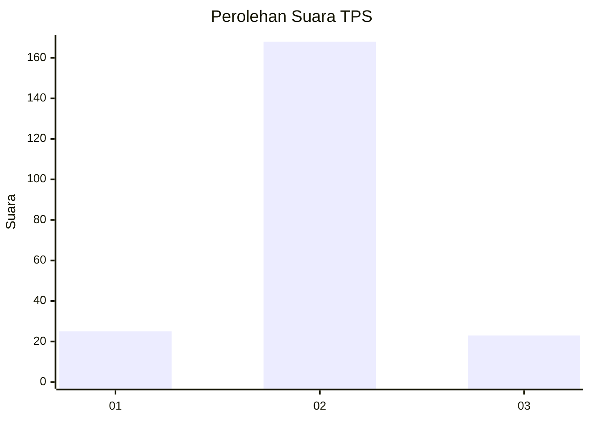
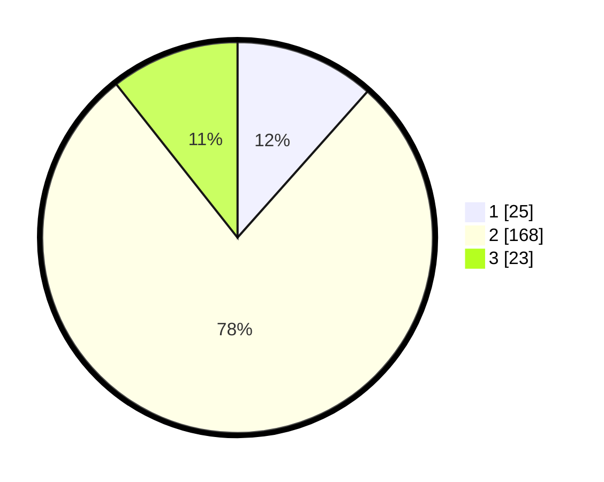

# Hasil

## Grafik

## Tabel

| No. | Nama Paslon    | Suara | Suara (raw) | Persentase |
|:--- |:-------------- | -----:| -----------:| ----------:|
| 1   | ANIES MUHAIMIN | 25    | [25][p-1]   | 11,57      |
| 2   | PRABOWO GIBRAN | 168   | [168][p-2]  | 77,78      |
| 3   | GANJAR MAHFUD  | 23    | [23][p-3]   | 10,65      |

[p-1]: https://github.com/gigit-pemilu/pemilu-2024-33-jawa-tengah/blob/main/pilpres/hitung-suara/sub/33-jawa-tengah/sub/29-brebes/sub/12-losari/sub/2002-blubuk/sub/005-tps/sub/paslon-1.txt
[p-2]: https://github.com/gigit-pemilu/pemilu-2024-33-jawa-tengah/blob/main/pilpres/hitung-suara/sub/33-jawa-tengah/sub/29-brebes/sub/12-losari/sub/2002-blubuk/sub/005-tps/sub/paslon-2.txt
[p-3]: https://github.com/gigit-pemilu/pemilu-2024-33-jawa-tengah/blob/main/pilpres/hitung-suara/sub/33-jawa-tengah/sub/29-brebes/sub/12-losari/sub/2002-blubuk/sub/005-tps/sub/paslon-3.txt

## Foto C Plano

https://sirekap-obj-formc.kpu.go.id/1b8d/pemilu/ppwp/33/29/12/20/02/3329122002005-20240214-233533--4c336bbb-24ca-4048-971c-237e58565a1f.jpg

https://sirekap-obj-formc.kpu.go.id/1b8d/pemilu/ppwp/33/29/12/20/02/3329122002005-20240214-233716--6bc6c7f2-df8f-4041-8365-d5bb87bcf630.jpg

https://sirekap-obj-formc.kpu.go.id/1b8d/pemilu/ppwp/33/29/12/20/02/3329122002005-20240214-233916--95929b6b-93f6-4df6-9be2-98d79523e779.jpg

## Metadata

| Key        | Value               |
| ---------- | ------------------- |
| Time Stamp | 2024-02-25 12:00:00 |

