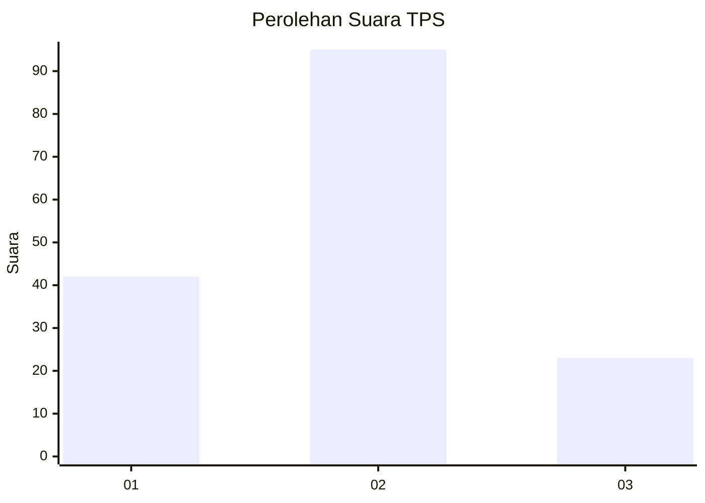
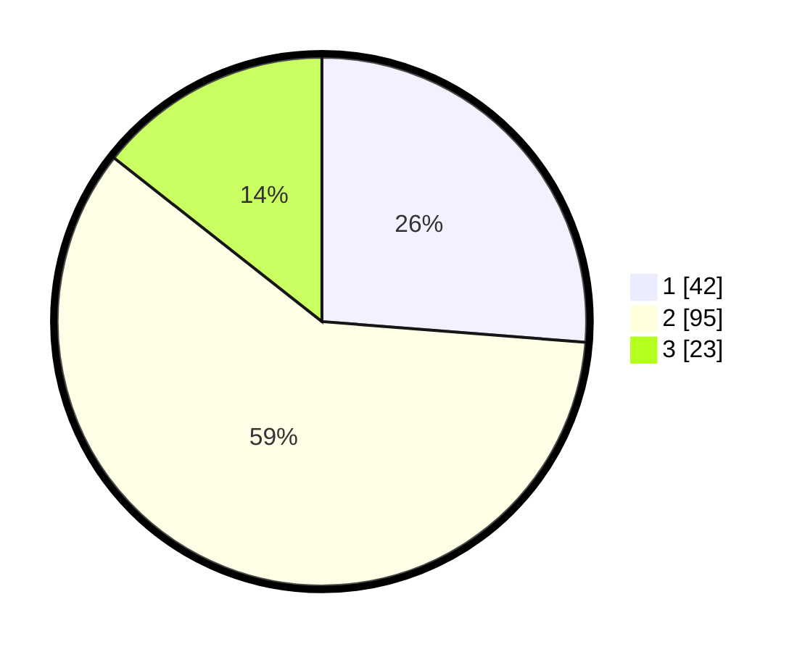

# Hasil

## Grafik

## Tabel

| No. | Nama Paslon    | Suara | Suara (raw) | Persentase |
|:--- |:-------------- | -----:| -----------:| ----------:|
| 1   | ANIES MUHAIMIN | 42    | [42][p-1]   | 26,25      |
| 2   | PRABOWO GIBRAN | 95    | [95][p-2]   | 59,38      |
| 3   | GANJAR MAHFUD  | 23    | [23][p-3]   | 14,38      |

[p-1]: https://github.com/gigit-pemilu/pemilu-2024/blob/main/pilpres/hitung-suara/sub/33-jawa-tengah/sub/29-brebes/sub/12-losari/sub/2006-kalibuntu/sub/007-tps/sub/paslon-1.txt
[p-2]: https://github.com/gigit-pemilu/pemilu-2024/blob/main/pilpres/hitung-suara/sub/33-jawa-tengah/sub/29-brebes/sub/12-losari/sub/2006-kalibuntu/sub/007-tps/sub/paslon-2.txt
[p-3]: https://github.com/gigit-pemilu/pemilu-2024/blob/main/pilpres/hitung-suara/sub/33-jawa-tengah/sub/29-brebes/sub/12-losari/sub/2006-kalibuntu/sub/007-tps/sub/paslon-3.txt

## Foto C Plano

https://sirekap-obj-formc.kpu.go.id/e746/pemilu/ppwp/33/29/12/20/06/3329122006007-20240214-210707--9575cf1e-cc9a-44fb-8719-9b33584d25e8.jpg

https://sirekap-obj-formc.kpu.go.id/e746/pemilu/ppwp/33/29/12/20/06/3329122006007-20240214-210852--283de1de-23e1-4e1f-8d47-2322cf0f9b03.jpg

https://sirekap-obj-formc.kpu.go.id/e746/pemilu/ppwp/33/29/12/20/06/3329122006007-20240214-211014--b1564e0f-f5f4-4251-85d2-21e1aa9ae60e.jpg

## Metadata

| Key        | Value               |
| ---------- | ------------------- |
| Time Stamp | 2024-02-25 17:00:00 |

