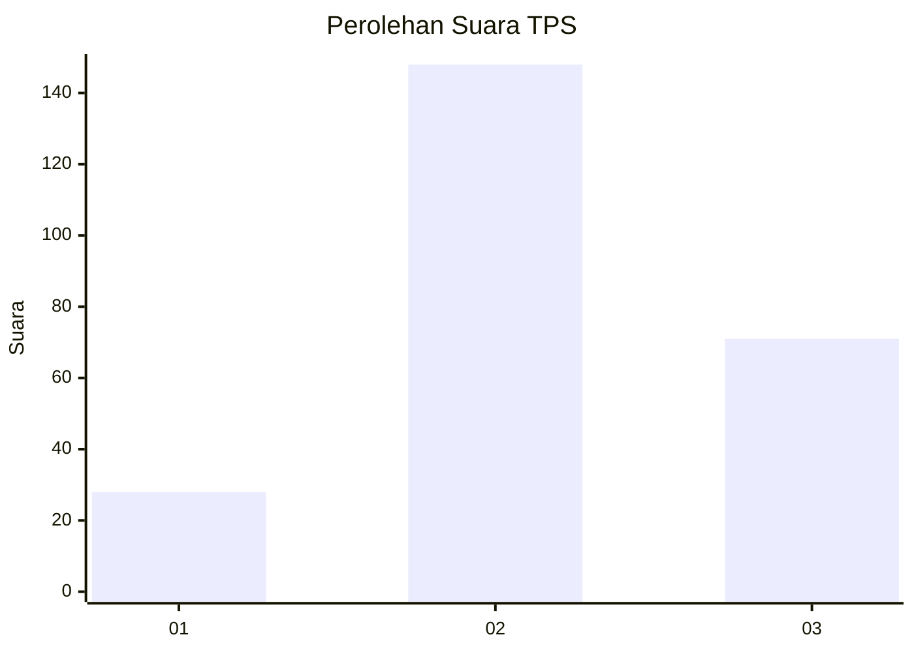
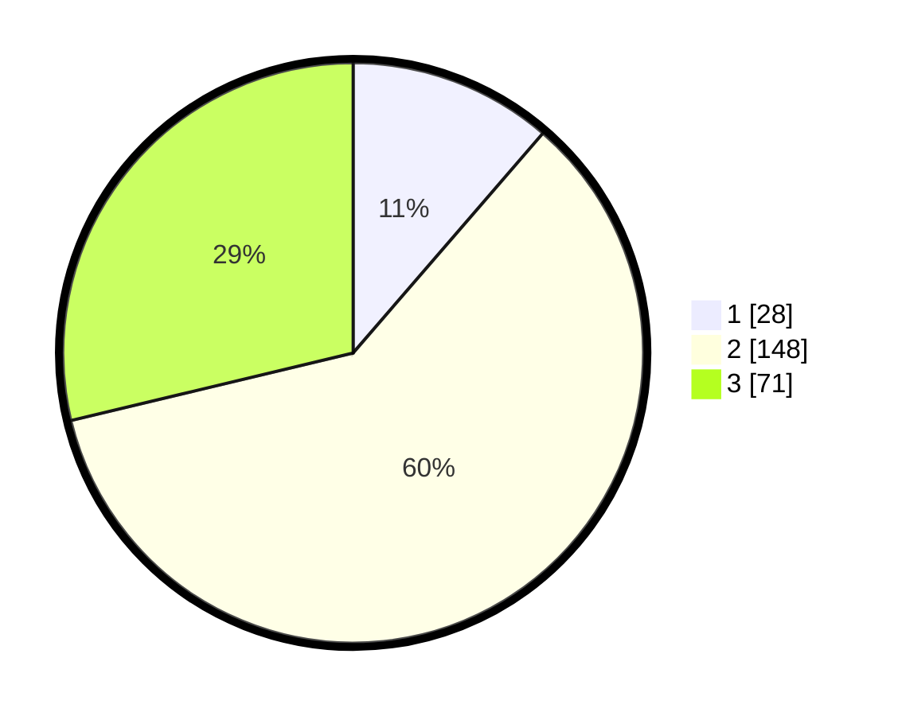

# Hasil

## Grafik

## Tabel

| No. | Nama Paslon    | Suara | Suara (raw) | Persentase |
|:--- |:-------------- | -----:| -----------:| ----------:|
| 1   | ANIES MUHAIMIN | 28    | [28][p-1]   | 11,34      |
| 2   | PRABOWO GIBRAN | 148   | [148][p-2]  | 59,92      |
| 3   | GANJAR MAHFUD  | 71    | [71][p-3]   | 28,74      |

[p-1]: https://github.com/gigit-pemilu/pemilu-2024/blob/main/pilpres/hitung-suara/sub/33-jawa-tengah/sub/29-brebes/sub/12-losari/sub/2007-karangdempel/sub/008-tps/sub/paslon-1.txt
[p-2]: https://github.com/gigit-pemilu/pemilu-2024/blob/main/pilpres/hitung-suara/sub/33-jawa-tengah/sub/29-brebes/sub/12-losari/sub/2007-karangdempel/sub/008-tps/sub/paslon-2.txt
[p-3]: https://github.com/gigit-pemilu/pemilu-2024/blob/main/pilpres/hitung-suara/sub/33-jawa-tengah/sub/29-brebes/sub/12-losari/sub/2007-karangdempel/sub/008-tps/sub/paslon-3.txt

## Foto C Plano

https://sirekap-obj-formc.kpu.go.id/45b4/pemilu/ppwp/33/29/12/20/07/3329122007008-20240214-215246--b45d09c3-522e-4068-8d24-81bd0709eaa7.jpg

https://sirekap-obj-formc.kpu.go.id/45b4/pemilu/ppwp/33/29/12/20/07/3329122007008-20240214-193034--a720746d-c8f3-4f4f-b730-5f311de79c57.jpg

https://sirekap-obj-formc.kpu.go.id/45b4/pemilu/ppwp/33/29/12/20/07/3329122007008-20240214-215603--9c862e39-3b6a-4cb8-98ba-f0a9b95aac15.jpg

## Metadata

| Key        | Value               |
| ---------- | ------------------- |
| Time Stamp | 2024-02-15 18:00:26 |

