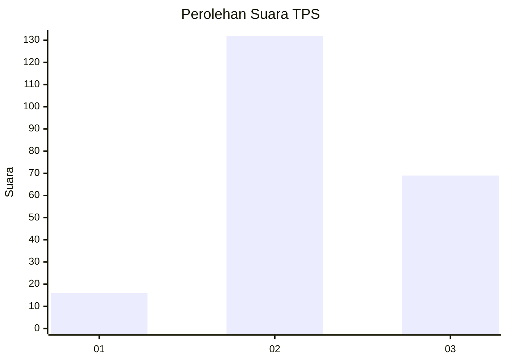
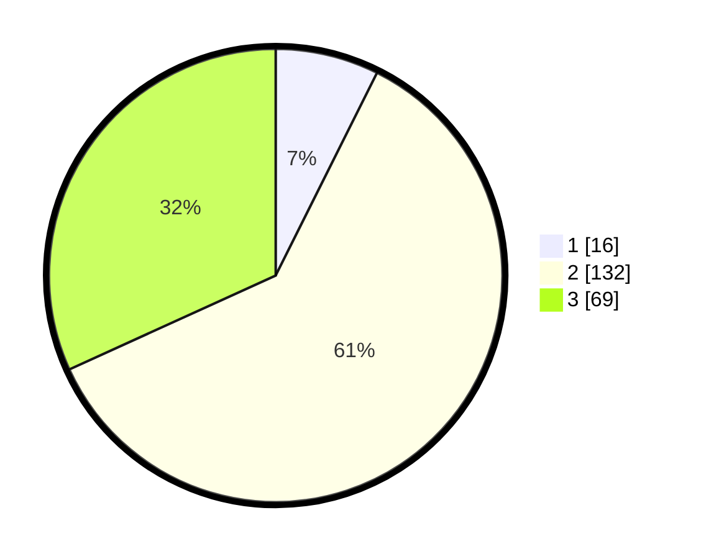

# Hasil

## Grafik

## Tabel

| No. | Nama Paslon    | Suara | Suara (raw) | Persentase |
|:--- |:-------------- | -----:| -----------:| ----------:|
| 1   | ANIES MUHAIMIN | 16    | [16][p-1]   | 7,37       |
| 2   | PRABOWO GIBRAN | 132   | [132][p-2]  | 60,83      |
| 3   | GANJAR MAHFUD  | 69    | [69][p-3]   | 31,80      |

[p-1]: https://github.com/gigit-pemilu/pemilu-2024/blob/main/pilpres/hitung-suara/sub/33-jawa-tengah/sub/29-brebes/sub/12-losari/sub/2007-karangdempel/sub/010-tps/sub/paslon-1.txt
[p-2]: https://github.com/gigit-pemilu/pemilu-2024/blob/main/pilpres/hitung-suara/sub/33-jawa-tengah/sub/29-brebes/sub/12-losari/sub/2007-karangdempel/sub/010-tps/sub/paslon-2.txt
[p-3]: https://github.com/gigit-pemilu/pemilu-2024/blob/main/pilpres/hitung-suara/sub/33-jawa-tengah/sub/29-brebes/sub/12-losari/sub/2007-karangdempel/sub/010-tps/sub/paslon-3.txt

## Foto C Plano

https://sirekap-obj-formc.kpu.go.id/2a96/pemilu/ppwp/33/29/12/20/07/3329122007010-20240215-024422--b29c3562-fd95-46cc-8aee-769eedfccb99.jpg

https://sirekap-obj-formc.kpu.go.id/2a96/pemilu/ppwp/33/29/12/20/07/3329122007010-20240215-024617--a1cee85d-6007-489a-a98d-cd58d7a64ff8.jpg

https://sirekap-obj-formc.kpu.go.id/2a96/pemilu/ppwp/33/29/12/20/07/3329122007010-20240215-024703--5553d18d-07c8-4120-85ed-df2b2f04e23a.jpg

## Metadata

| Key        | Value               |
| ---------- | ------------------- |
| Time Stamp | 2024-02-24 22:31:28 |

