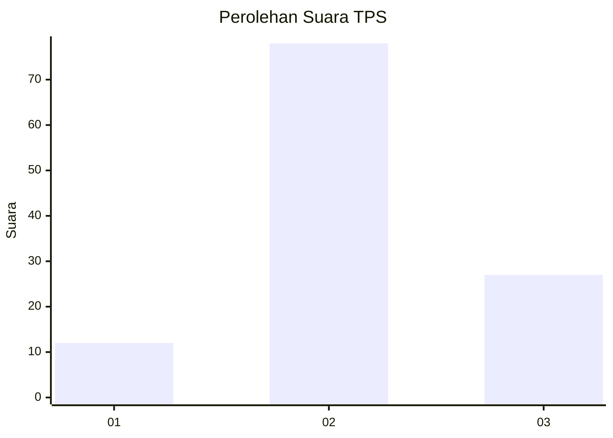
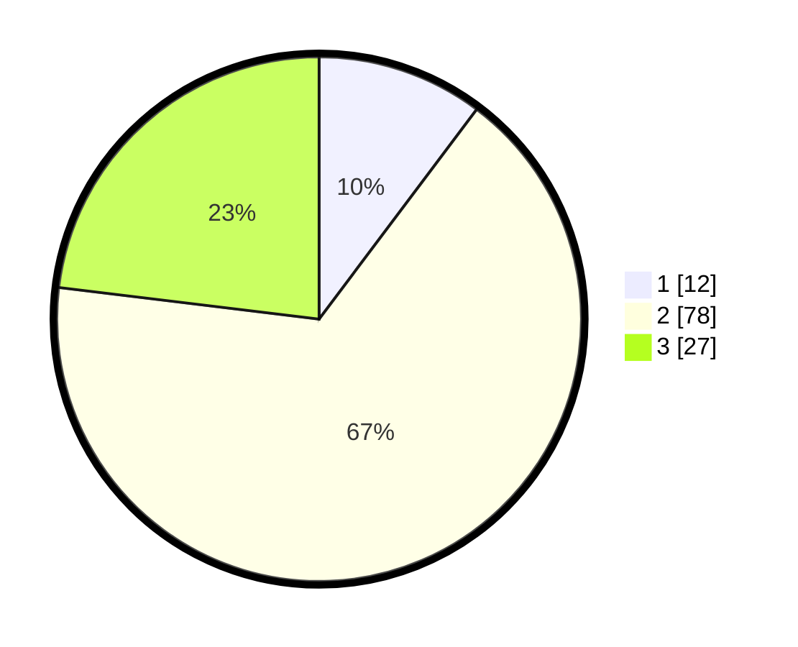

# Hasil

## Grafik

## Tabel

| No. | Nama Paslon    | Suara | Suara (raw) | Persentase |
|:--- |:-------------- | -----:| -----------:| ----------:|
| 1   | ANIES MUHAIMIN | 12    | [12][p-1]   | 10,26      |
| 2   | PRABOWO GIBRAN | 78    | [78][p-2]   | 66,67      |
| 3   | GANJAR MAHFUD  | 27    | [27][p-3]   | 23,08      |

[p-1]: https://github.com/gigit-pemilu/pemilu-2024/blob/main/pilpres/hitung-suara/sub/33-jawa-tengah/sub/29-brebes/sub/12-losari/sub/2009-karangsambung/sub/010-tps/sub/paslon-1.txt
[p-2]: https://github.com/gigit-pemilu/pemilu-2024/blob/main/pilpres/hitung-suara/sub/33-jawa-tengah/sub/29-brebes/sub/12-losari/sub/2009-karangsambung/sub/010-tps/sub/paslon-2.txt
[p-3]: https://github.com/gigit-pemilu/pemilu-2024/blob/main/pilpres/hitung-suara/sub/33-jawa-tengah/sub/29-brebes/sub/12-losari/sub/2009-karangsambung/sub/010-tps/sub/paslon-3.txt

## Foto C Plano

https://sirekap-obj-formc.kpu.go.id/dcde/pemilu/ppwp/33/29/12/20/09/3329122009010-20240214-230701--a8714ed9-a94f-4d14-aaa5-460ec3f0147f.jpg

https://sirekap-obj-formc.kpu.go.id/dcde/pemilu/ppwp/33/29/12/20/09/3329122009010-20240214-140954--875b7f46-27a3-4678-ab74-6a4e4fdfce57.jpg

https://sirekap-obj-formc.kpu.go.id/dcde/pemilu/ppwp/33/29/12/20/09/3329122009010-20240214-195338--843d4e4e-0efd-4bb3-afe3-49d3204d44bd.jpg

## Metadata

| Key        | Value               |
| ---------- | ------------------- |
| Time Stamp | 2024-02-15 00:41:44 |

