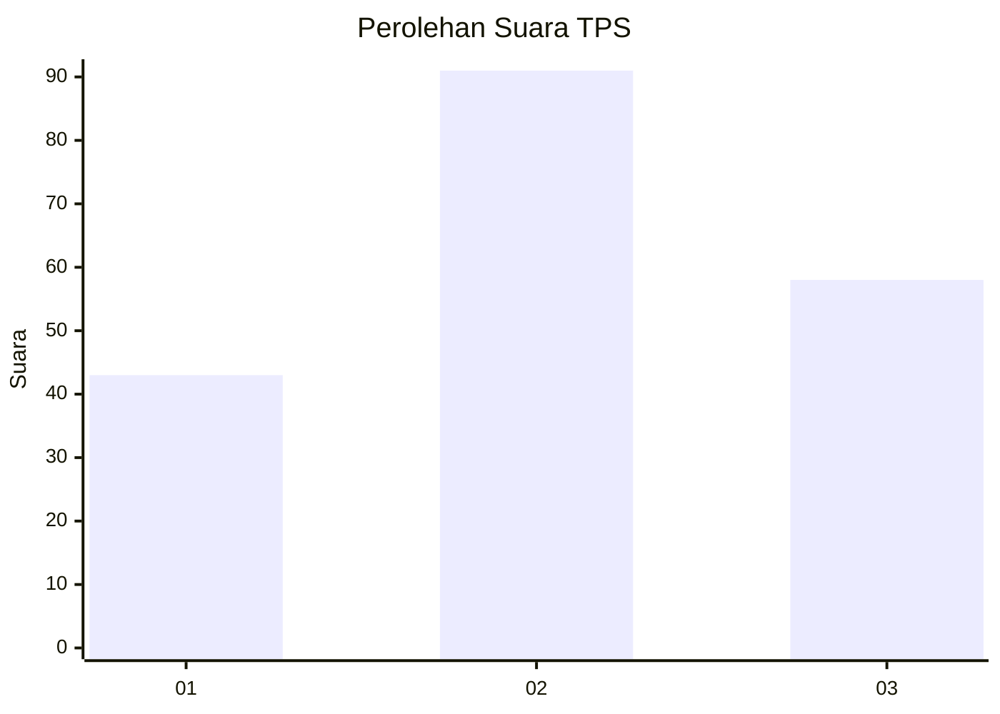
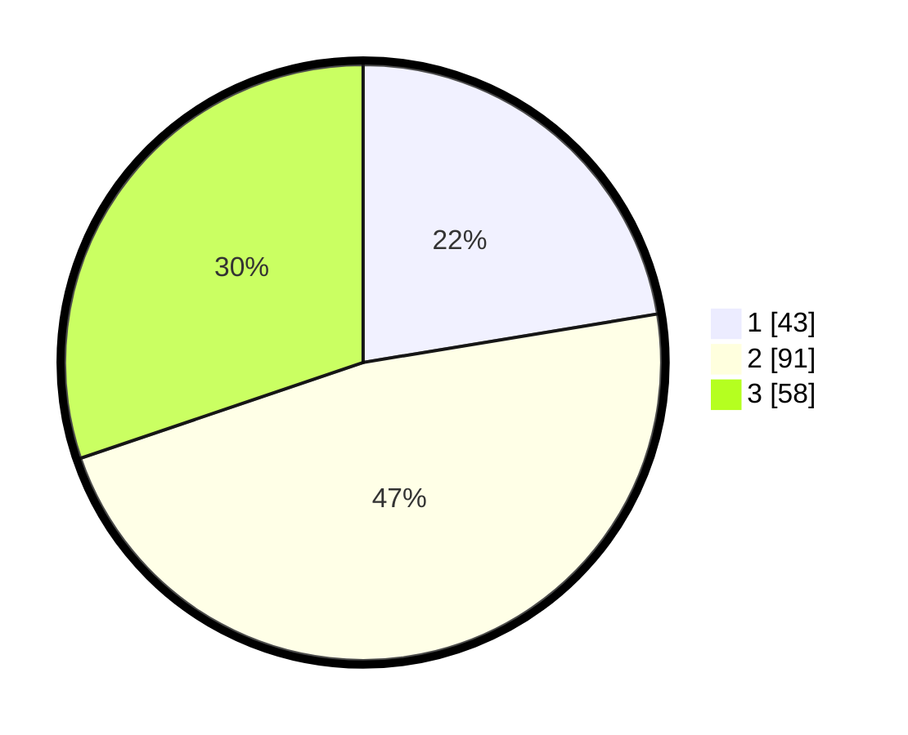

# Hasil

## Grafik

## Tabel

| No. | Nama Paslon    | Suara | Suara (raw) | Persentase |
|:--- |:-------------- | -----:| -----------:| ----------:|
| 1   | ANIES MUHAIMIN | 43    | [43][p-1]   | 22,40      |
| 2   | PRABOWO GIBRAN | 91    | [91][p-2]   | 47,40      |
| 3   | GANJAR MAHFUD  | 58    | [58][p-3]   | 30,21      |

[p-1]: https://github.com/gigit-pemilu/pemilu-2024/blob/main/pilpres/hitung-suara/sub/33-jawa-tengah/sub/29-brebes/sub/12-losari/sub/2015-negla/sub/003-tps/sub/paslon-1.txt
[p-2]: https://github.com/gigit-pemilu/pemilu-2024/blob/main/pilpres/hitung-suara/sub/33-jawa-tengah/sub/29-brebes/sub/12-losari/sub/2015-negla/sub/003-tps/sub/paslon-2.txt
[p-3]: https://github.com/gigit-pemilu/pemilu-2024/blob/main/pilpres/hitung-suara/sub/33-jawa-tengah/sub/29-brebes/sub/12-losari/sub/2015-negla/sub/003-tps/sub/paslon-3.txt

## Foto C Plano

https://sirekap-obj-formc.kpu.go.id/6c9d/pemilu/ppwp/33/29/12/20/15/3329122015003-20240214-233301--540b53fc-0e20-4fa5-8e58-3a0acd9db56e.jpg

https://sirekap-obj-formc.kpu.go.id/6c9d/pemilu/ppwp/33/29/12/20/15/3329122015003-20240214-191122--bc50faa5-5b76-4c9b-b735-865665eb1f5d.jpg

https://sirekap-obj-formc.kpu.go.id/6c9d/pemilu/ppwp/33/29/12/20/15/3329122015003-20240214-191128--37f07616-dd6c-4ca1-a49b-2248307cc3c8.jpg

## Metadata

| Key        | Value               |
| ---------- | ------------------- |
| Time Stamp | 2024-02-15 15:00:29 |

