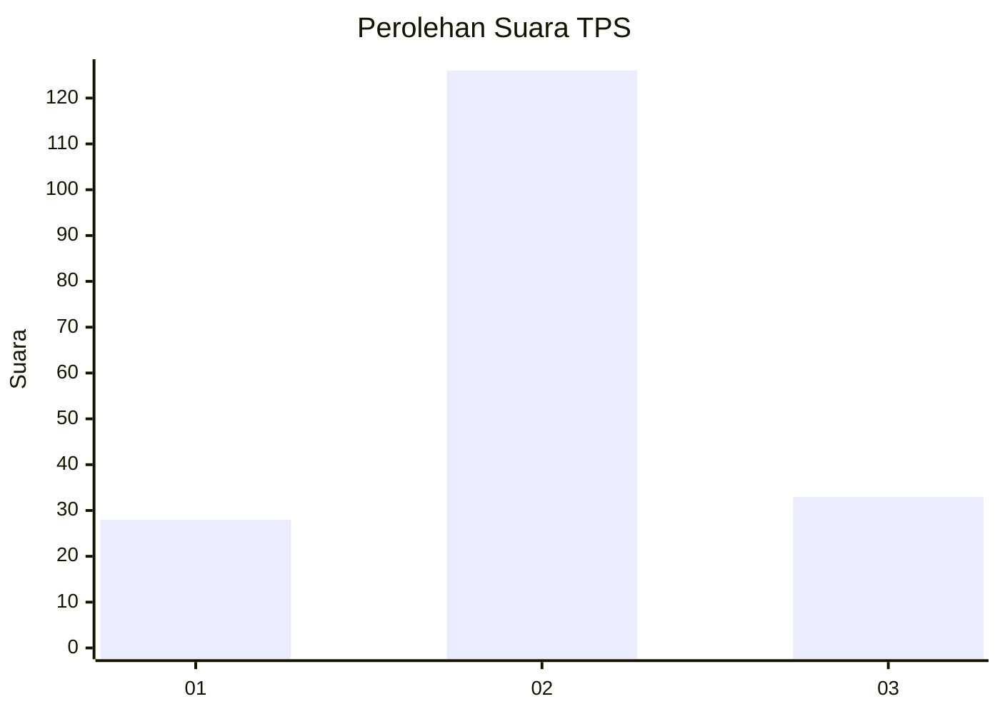
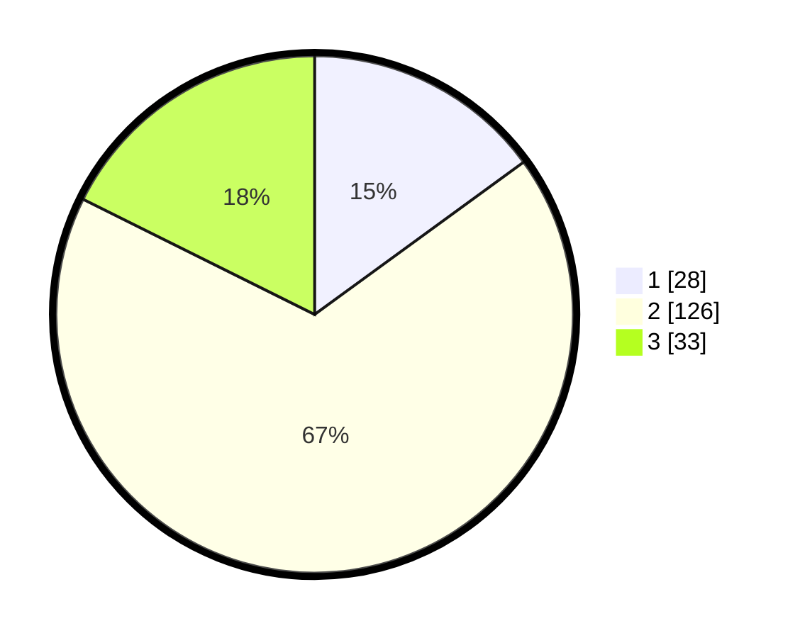

# Hasil

## Grafik

## Tabel

| No. | Nama Paslon    | Suara | Suara (raw) | Persentase |
|:--- |:-------------- | -----:| -----------:| ----------:|
| 1   | ANIES MUHAIMIN | 28    | [28][p-1]   | 14,97      |
| 2   | PRABOWO GIBRAN | 126   | [126][p-2]  | 67,38      |
| 3   | GANJAR MAHFUD  | 33    | [33][p-3]   | 17,65      |

[p-1]: https://github.com/gigit-pemilu/pemilu-2024-33-jawa-tengah/blob/main/pilpres/hitung-suara/sub/33-jawa-tengah/sub/29-brebes/sub/13-tanjung/sub/2001-karangreja/sub/001-tps/sub/paslon-1.txt
[p-2]: https://github.com/gigit-pemilu/pemilu-2024-33-jawa-tengah/blob/main/pilpres/hitung-suara/sub/33-jawa-tengah/sub/29-brebes/sub/13-tanjung/sub/2001-karangreja/sub/001-tps/sub/paslon-2.txt
[p-3]: https://github.com/gigit-pemilu/pemilu-2024-33-jawa-tengah/blob/main/pilpres/hitung-suara/sub/33-jawa-tengah/sub/29-brebes/sub/13-tanjung/sub/2001-karangreja/sub/001-tps/sub/paslon-3.txt

## Foto C Plano

https://sirekap-obj-formc.kpu.go.id/f75a/pemilu/ppwp/33/29/13/20/01/3329132001001-20240215-013421--09fa2fdf-bae1-440a-9144-12705d5d5470.jpg

https://sirekap-obj-formc.kpu.go.id/f75a/pemilu/ppwp/33/29/13/20/01/3329132001001-20240215-013525--cebacba4-cfbc-4819-bcfc-b5cbf9e6f66e.jpg

https://sirekap-obj-formc.kpu.go.id/f75a/pemilu/ppwp/33/29/13/20/01/3329132001001-20240215-013608--2d36a31a-7c0d-40bc-88a2-1bc9e288105c.jpg

## Metadata

| Key        | Value               |
| ---------- | ------------------- |
| Time Stamp | 2024-02-15 16:00:26 |

