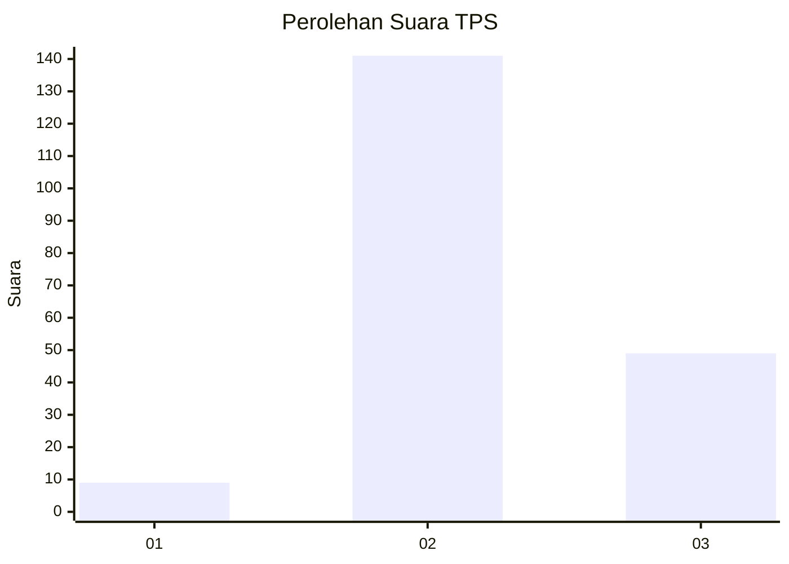
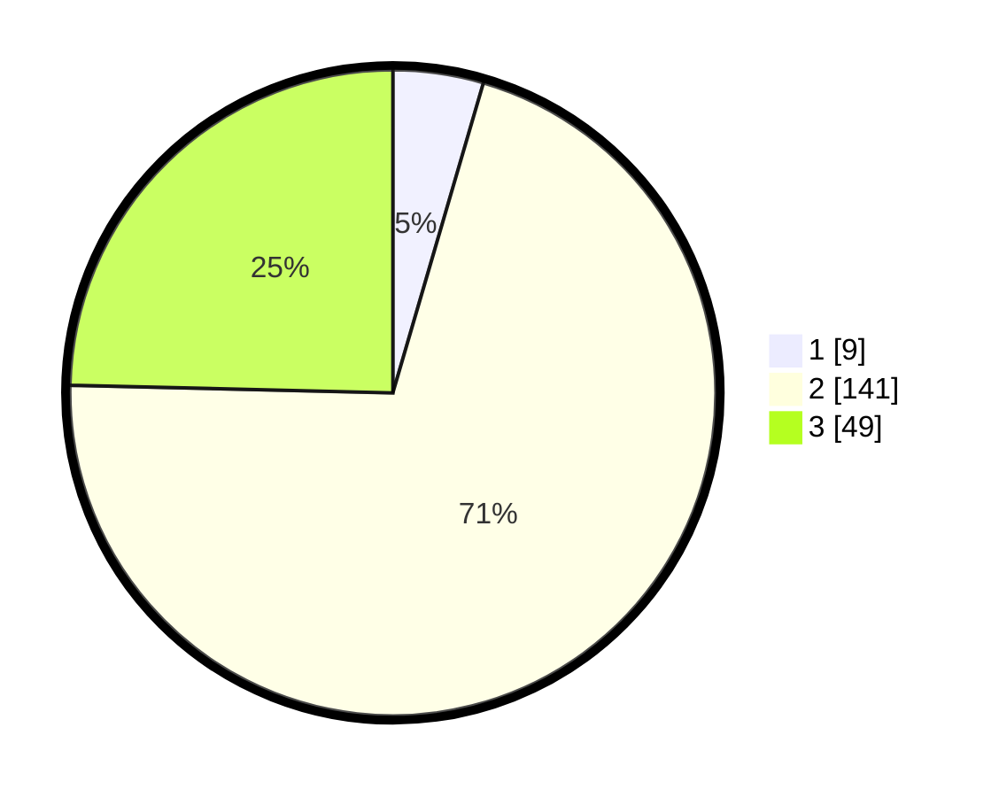

# Hasil

## Grafik

## Tabel

| No. | Nama Paslon    | Suara | Suara (raw) | Persentase |
|:--- |:-------------- | -----:| -----------:| ----------:|
| 1   | ANIES MUHAIMIN | 9     | [9][p-1]    | 4,52       |
| 2   | PRABOWO GIBRAN | 141   | [141][p-2]  | 70,85      |
| 3   | GANJAR MAHFUD  | 49    | [49][p-3]   | 24,62      |

[p-1]: https://github.com/gigit-pemilu/pemilu-2024/blob/main/pilpres/hitung-suara/sub/33-jawa-tengah/sub/29-brebes/sub/13-tanjung/sub/2001-karangreja/sub/004-tps/sub/paslon-1.txt
[p-2]: https://github.com/gigit-pemilu/pemilu-2024/blob/main/pilpres/hitung-suara/sub/33-jawa-tengah/sub/29-brebes/sub/13-tanjung/sub/2001-karangreja/sub/004-tps/sub/paslon-2.txt
[p-3]: https://github.com/gigit-pemilu/pemilu-2024/blob/main/pilpres/hitung-suara/sub/33-jawa-tengah/sub/29-brebes/sub/13-tanjung/sub/2001-karangreja/sub/004-tps/sub/paslon-3.txt

## Foto C Plano

https://sirekap-obj-formc.kpu.go.id/2762/pemilu/ppwp/33/29/13/20/01/3329132001004-20240215-030730--e0578ee7-2b73-43c9-959f-875fc29d5a62.jpg

https://sirekap-obj-formc.kpu.go.id/2762/pemilu/ppwp/33/29/13/20/01/3329132001004-20240215-030855--f332e87f-e19c-4aa0-8be0-259d09ea404f.jpg

https://sirekap-obj-formc.kpu.go.id/2762/pemilu/ppwp/33/29/13/20/01/3329132001004-20240215-031018--0e05a0fc-807d-4bbb-9458-3d437d1e2633.jpg

## Metadata

| Key        | Value               |
| ---------- | ------------------- |
| Time Stamp | 2024-02-25 16:00:00 |

