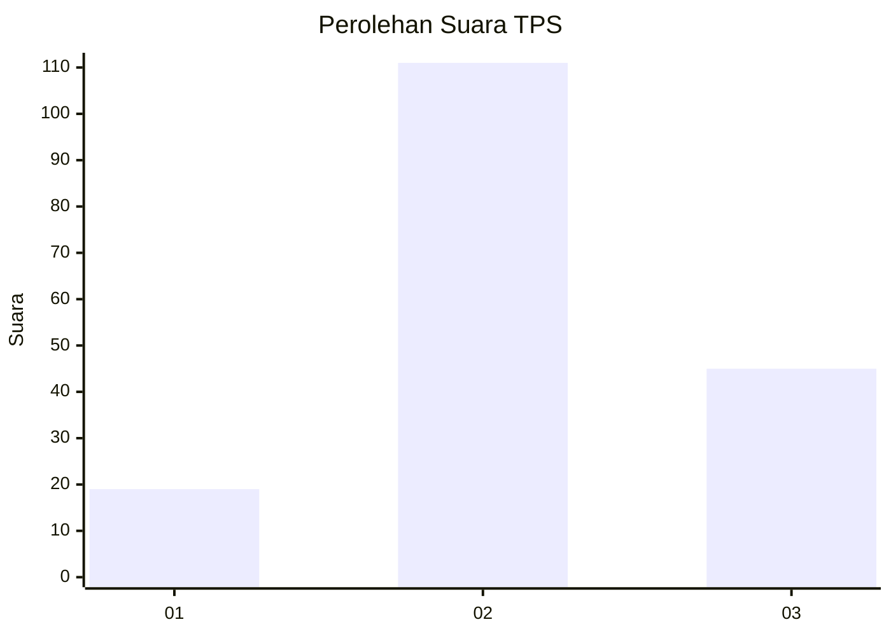
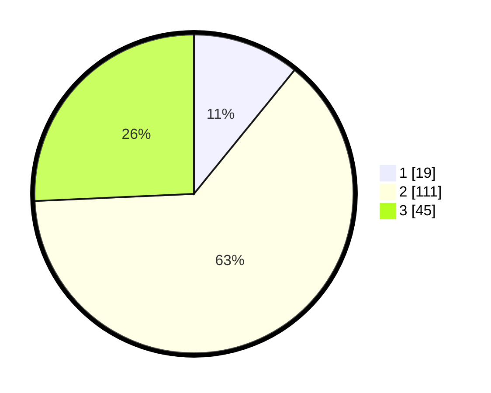

# Hasil

## Grafik

## Tabel

| No. | Nama Paslon    | Suara | Suara (raw) | Persentase |
|:--- |:-------------- | -----:| -----------:| ----------:|
| 1   | ANIES MUHAIMIN | 19    | [19][p-1]   | 10,86      |
| 2   | PRABOWO GIBRAN | 111   | [111][p-2]  | 63,43      |
| 3   | GANJAR MAHFUD  | 45    | [45][p-3]   | 25,71      |

[p-1]: https://github.com/gigit-pemilu/pemilu-2024-33-jawa-tengah/blob/main/pilpres/hitung-suara/sub/33-jawa-tengah/sub/29-brebes/sub/13-tanjung/sub/2001-karangreja/sub/005-tps/sub/paslon-1.txt
[p-2]: https://github.com/gigit-pemilu/pemilu-2024-33-jawa-tengah/blob/main/pilpres/hitung-suara/sub/33-jawa-tengah/sub/29-brebes/sub/13-tanjung/sub/2001-karangreja/sub/005-tps/sub/paslon-2.txt
[p-3]: https://github.com/gigit-pemilu/pemilu-2024-33-jawa-tengah/blob/main/pilpres/hitung-suara/sub/33-jawa-tengah/sub/29-brebes/sub/13-tanjung/sub/2001-karangreja/sub/005-tps/sub/paslon-3.txt

## Foto C Plano

https://sirekap-obj-formc.kpu.go.id/a477/pemilu/ppwp/33/29/13/20/01/3329132001005-20240215-020945--4e5ff333-6d47-45a3-8da4-9b1fbbff1cd7.jpg

https://sirekap-obj-formc.kpu.go.id/a477/pemilu/ppwp/33/29/13/20/01/3329132001005-20240215-022855--7c28cd95-e6dd-4b33-bd0d-c28f936c6bd7.jpg

https://sirekap-obj-formc.kpu.go.id/a477/pemilu/ppwp/33/29/13/20/01/3329132001005-20240215-022504--044e802d-db54-40ec-88a3-ac73181d2923.jpg

## Metadata

| Key        | Value               |
| ---------- | ------------------- |
| Time Stamp | 2024-02-15 15:00:29 |

