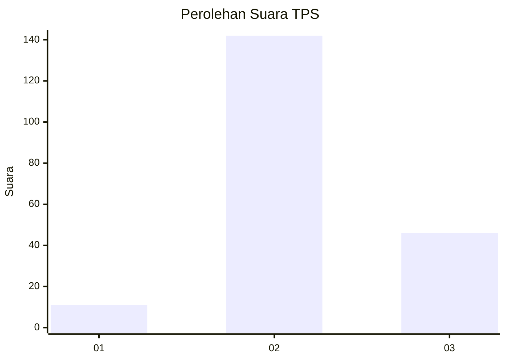
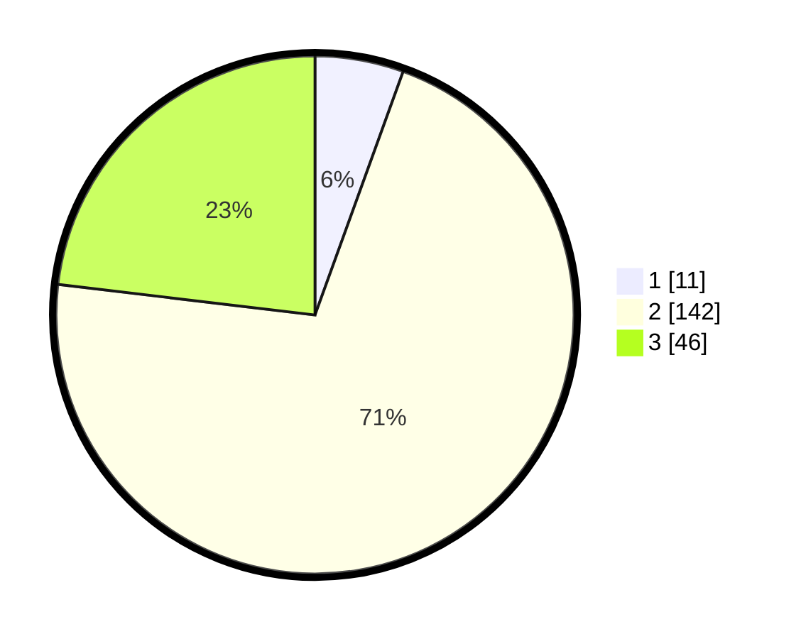

# Hasil

## Grafik

## Tabel

| No. | Nama Paslon    | Suara | Suara (raw) | Persentase |
|:--- |:-------------- | -----:| -----------:| ----------:|
| 1   | ANIES MUHAIMIN | 11    | [11][p-1]   | 5,53       |
| 2   | PRABOWO GIBRAN | 142   | [142][p-2]  | 71,36      |
| 3   | GANJAR MAHFUD  | 46    | [46][p-3]   | 23,12      |

[p-1]: https://github.com/gigit-pemilu/pemilu-2024-33-jawa-tengah/blob/main/pilpres/hitung-suara/sub/33-jawa-tengah/sub/29-brebes/sub/13-tanjung/sub/2001-karangreja/sub/006-tps/sub/paslon-1.txt
[p-2]: https://github.com/gigit-pemilu/pemilu-2024-33-jawa-tengah/blob/main/pilpres/hitung-suara/sub/33-jawa-tengah/sub/29-brebes/sub/13-tanjung/sub/2001-karangreja/sub/006-tps/sub/paslon-2.txt
[p-3]: https://github.com/gigit-pemilu/pemilu-2024-33-jawa-tengah/blob/main/pilpres/hitung-suara/sub/33-jawa-tengah/sub/29-brebes/sub/13-tanjung/sub/2001-karangreja/sub/006-tps/sub/paslon-3.txt

## Foto C Plano

https://sirekap-obj-formc.kpu.go.id/e8a6/pemilu/ppwp/33/29/13/20/01/3329132001006-20240215-041011--4688bad6-31a5-466c-8d1a-cb02ae19ad2b.jpg

https://sirekap-obj-formc.kpu.go.id/e8a6/pemilu/ppwp/33/29/13/20/01/3329132001006-20240215-040208--5a47a466-e0d9-4314-92e5-0e165f884812.jpg

https://sirekap-obj-formc.kpu.go.id/e8a6/pemilu/ppwp/33/29/13/20/01/3329132001006-20240215-040332--a60dcfb9-7689-4950-ab7e-22852d99f7ed.jpg

## Metadata

| Key        | Value               |
| ---------- | ------------------- |
| Time Stamp | 2024-02-25 15:00:00 |

