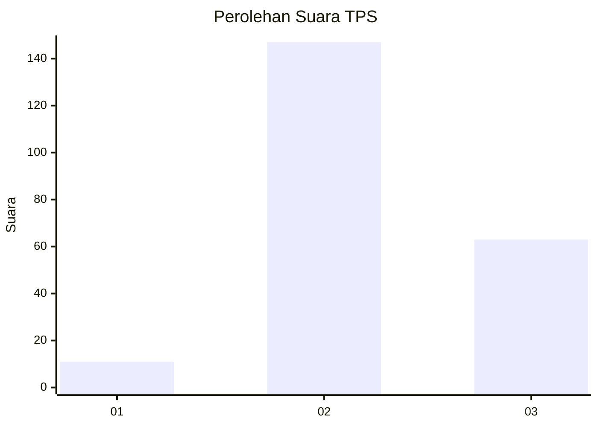
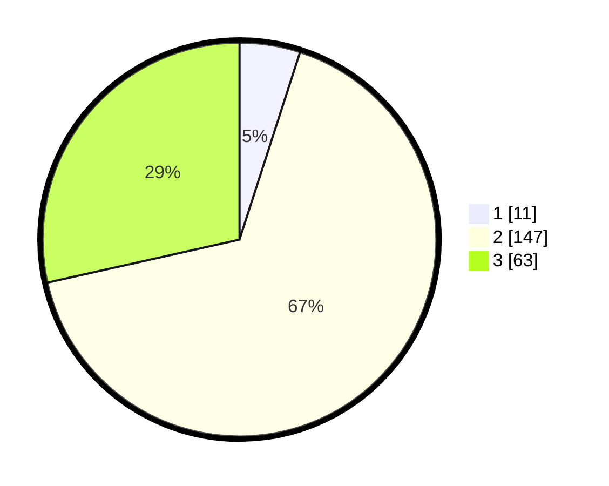

# Hasil

## Grafik

## Tabel

| No. | Nama Paslon    | Suara | Suara (raw) | Persentase |
|:--- |:-------------- | -----:| -----------:| ----------:|
| 1   | ANIES MUHAIMIN | 11    | [11][p-1]   | 4,98       |
| 2   | PRABOWO GIBRAN | 147   | [147][p-2]  | 66,52      |
| 3   | GANJAR MAHFUD  | 63    | [63][p-3]   | 28,51      |

[p-1]: https://github.com/gigit-pemilu/pemilu-2024/blob/main/pilpres/hitung-suara/sub/33-jawa-tengah/sub/29-brebes/sub/13-tanjung/sub/2003-kemurang-kulon/sub/007-tps/sub/paslon-1.txt
[p-2]: https://github.com/gigit-pemilu/pemilu-2024/blob/main/pilpres/hitung-suara/sub/33-jawa-tengah/sub/29-brebes/sub/13-tanjung/sub/2003-kemurang-kulon/sub/007-tps/sub/paslon-2.txt
[p-3]: https://github.com/gigit-pemilu/pemilu-2024/blob/main/pilpres/hitung-suara/sub/33-jawa-tengah/sub/29-brebes/sub/13-tanjung/sub/2003-kemurang-kulon/sub/007-tps/sub/paslon-3.txt

## Foto C Plano

https://sirekap-obj-formc.kpu.go.id/a955/pemilu/ppwp/33/29/13/20/03/3329132003007-20240216-204324--d8325f9f-59b0-4e85-89ff-7f04b91d4755.jpg

https://sirekap-obj-formc.kpu.go.id/a955/pemilu/ppwp/33/29/13/20/03/3329132003007-20240216-205430--c4ae4e77-4bbc-4783-91cd-fc86aaf9af24.jpg

https://sirekap-obj-formc.kpu.go.id/a955/pemilu/ppwp/33/29/13/20/03/3329132003007-20240216-205613--46e46c5a-1cd5-4859-a6ba-04d3d6a2d2f9.jpg

## Metadata

| Key        | Value               |
| ---------- | ------------------- |
| Time Stamp | 2024-02-19 06:16:00 |

