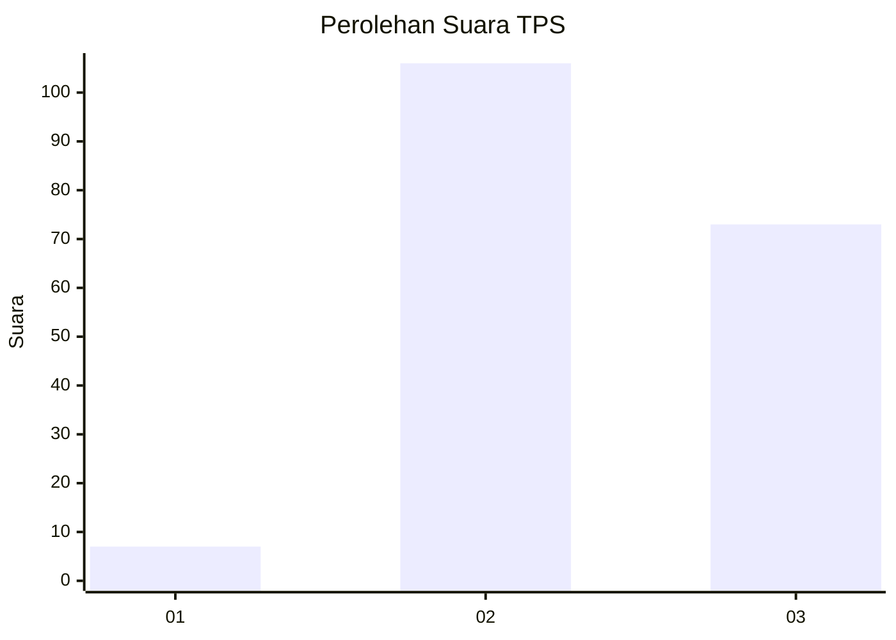
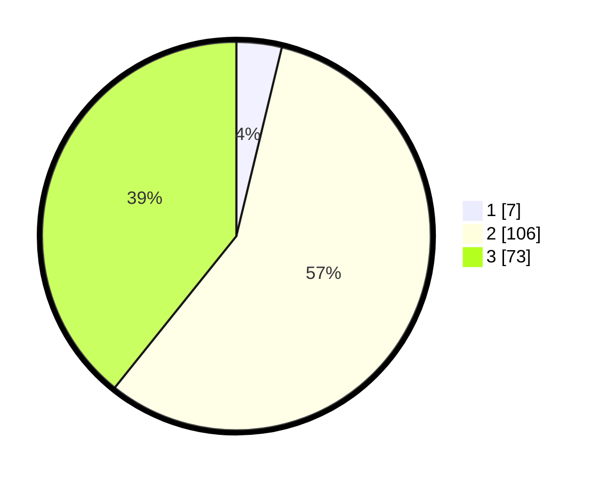

# Hasil

## Grafik

## Tabel

| No. | Nama Paslon    | Suara | Suara (raw) | Persentase |
|:--- |:-------------- | -----:| -----------:| ----------:|
| 1   | ANIES MUHAIMIN | 7     | [7][p-1]    | 3,76       |
| 2   | PRABOWO GIBRAN | 106   | [106][p-2]  | 56,99      |
| 3   | GANJAR MAHFUD  | 73    | [73][p-3]   | 39,25      |

[p-1]: https://github.com/gigit-pemilu/pemilu-2024/blob/main/pilpres/hitung-suara/sub/33-jawa-tengah/sub/29-brebes/sub/13-tanjung/sub/2013-sarireja/sub/003-tps/sub/paslon-1.txt
[p-2]: https://github.com/gigit-pemilu/pemilu-2024/blob/main/pilpres/hitung-suara/sub/33-jawa-tengah/sub/29-brebes/sub/13-tanjung/sub/2013-sarireja/sub/003-tps/sub/paslon-2.txt
[p-3]: https://github.com/gigit-pemilu/pemilu-2024/blob/main/pilpres/hitung-suara/sub/33-jawa-tengah/sub/29-brebes/sub/13-tanjung/sub/2013-sarireja/sub/003-tps/sub/paslon-3.txt

## Foto C Plano

https://sirekap-obj-formc.kpu.go.id/d278/pemilu/ppwp/33/29/13/20/13/3329132013003-20240215-225611--bc5a6917-e3fb-4e1f-b908-8dd21af057a0.jpg

https://sirekap-obj-formc.kpu.go.id/d278/pemilu/ppwp/33/29/13/20/13/3329132013003-20240215-225651--606c1840-6768-48e5-b0d8-ba84fb39a3ae.jpg

https://sirekap-obj-formc.kpu.go.id/d278/pemilu/ppwp/33/29/13/20/13/3329132013003-20240215-225816--f21e3ef0-8cf9-4acf-9502-42ecb6afacc7.jpg

## Metadata

| Key        | Value               |
| ---------- | ------------------- |
| Time Stamp | 2024-02-19 06:16:00 |

