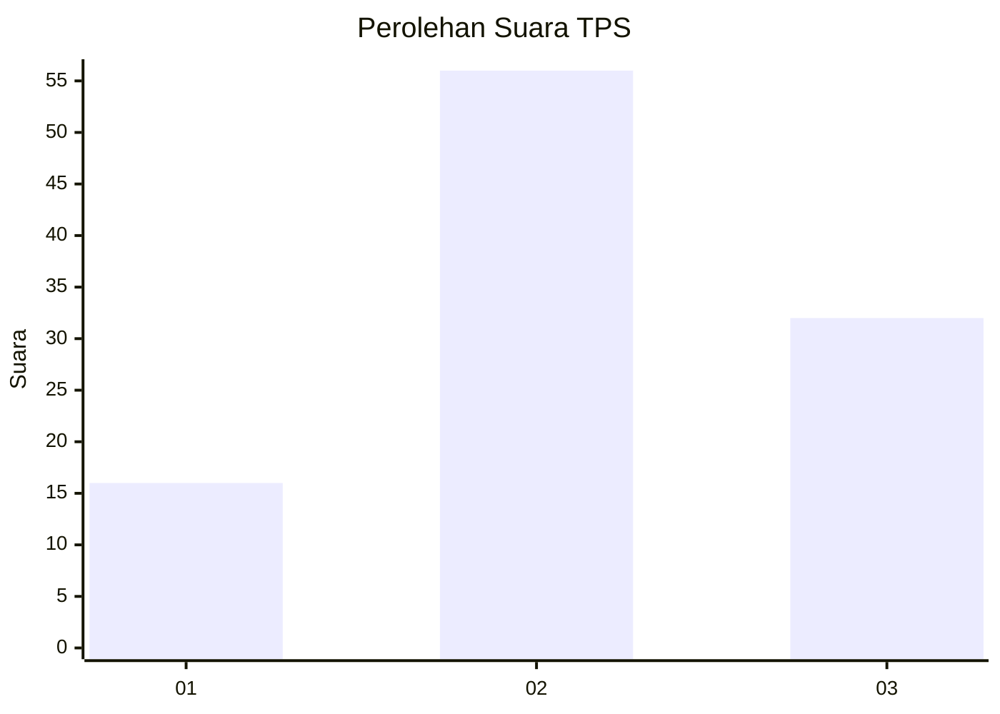
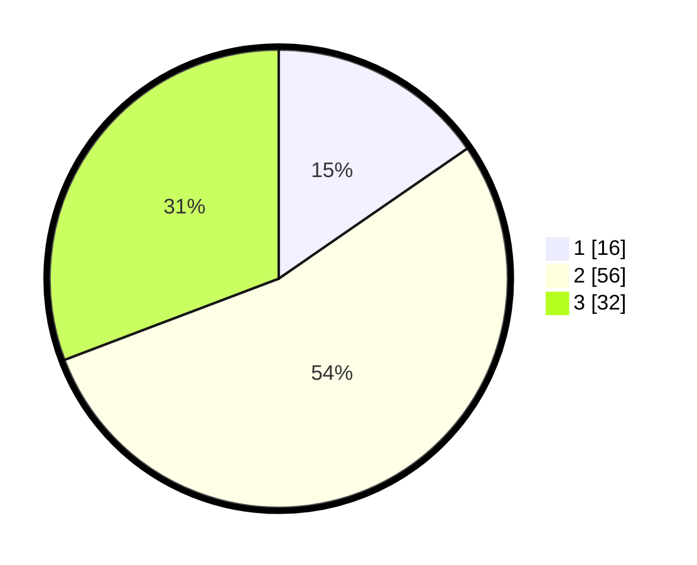

# Hasil

## Grafik

## Tabel

| No. | Nama Paslon    | Suara | Suara (raw) | Persentase |
|:--- |:-------------- | -----:| -----------:| ----------:|
| 1   | ANIES MUHAIMIN | 16    | [16][p-1]   | 15,38      |
| 2   | PRABOWO GIBRAN | 56    | [56][p-2]   | 53,85      |
| 3   | GANJAR MAHFUD  | 32    | [32][p-3]   | 30,77      |

[p-1]: https://github.com/gigit-pemilu/pemilu-2024-33-jawa-tengah/blob/main/pilpres/hitung-suara/sub/33-jawa-tengah/sub/29-brebes/sub/14-bulakamba/sub/2013-luwungragi/sub/028-tps/sub/paslon-1.txt
[p-2]: https://github.com/gigit-pemilu/pemilu-2024-33-jawa-tengah/blob/main/pilpres/hitung-suara/sub/33-jawa-tengah/sub/29-brebes/sub/14-bulakamba/sub/2013-luwungragi/sub/028-tps/sub/paslon-2.txt
[p-3]: https://github.com/gigit-pemilu/pemilu-2024-33-jawa-tengah/blob/main/pilpres/hitung-suara/sub/33-jawa-tengah/sub/29-brebes/sub/14-bulakamba/sub/2013-luwungragi/sub/028-tps/sub/paslon-3.txt

## Foto C Plano

https://sirekap-obj-formc.kpu.go.id/5c5b/pemilu/ppwp/33/29/14/20/13/3329142013028-20240214-225504--d80e9d42-86b3-45bd-8d0a-e789f632fcec.jpg

https://sirekap-obj-formc.kpu.go.id/5c5b/pemilu/ppwp/33/29/14/20/13/3329142013028-20240214-225634--c004b6b7-38b1-4944-9dcc-0ba68449b448.jpg

https://sirekap-obj-formc.kpu.go.id/5c5b/pemilu/ppwp/33/29/14/20/13/3329142013028-20240214-225822--1571e6cb-6b18-4c08-bf3f-a2866e181045.jpg

## Metadata

| Key        | Value               |
| ---------- | ------------------- |
| Time Stamp | 2024-02-25 11:00:00 |

