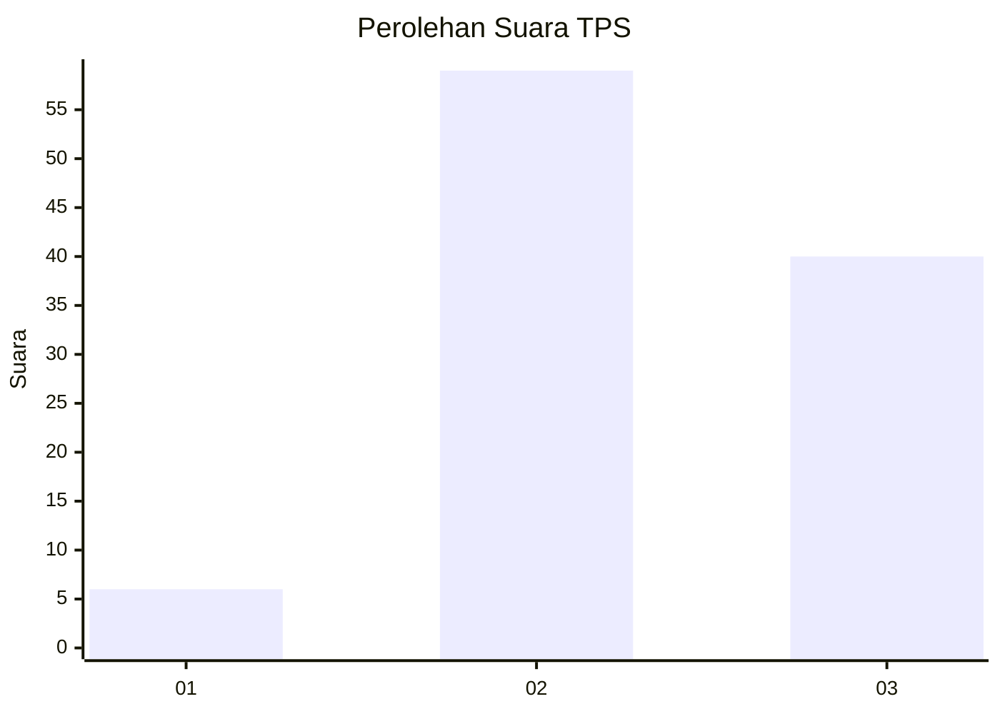
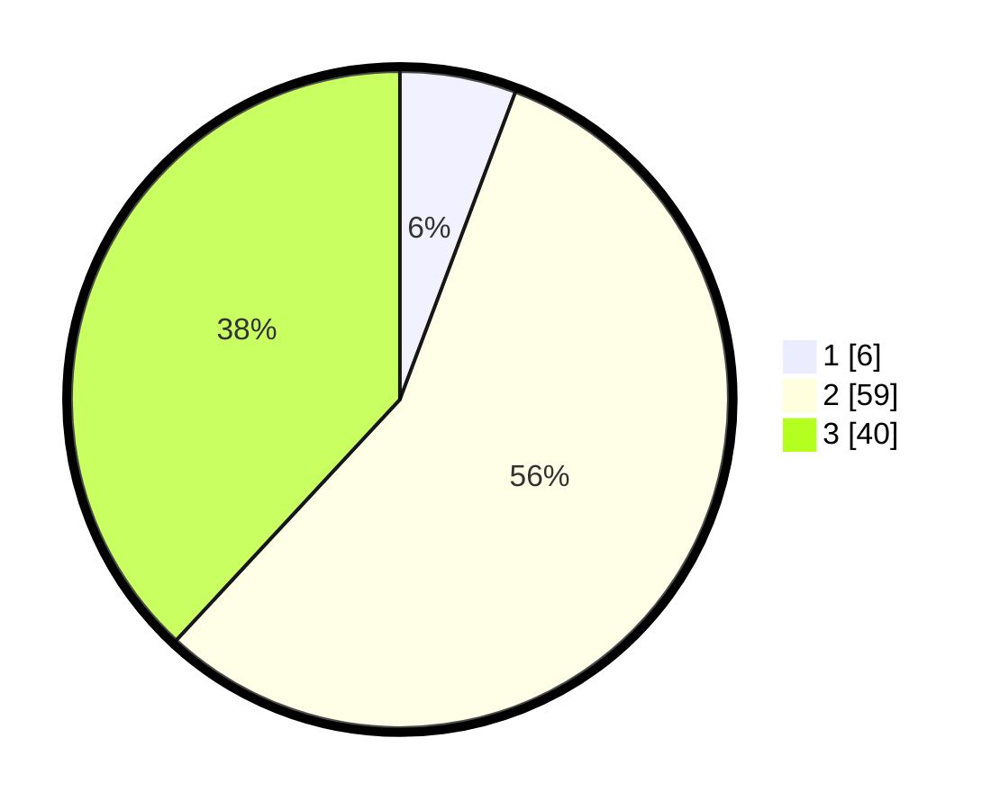

# Hasil

## Grafik

## Tabel

| No. | Nama Paslon    | Suara | Suara (raw) | Persentase |
|:--- |:-------------- | -----:| -----------:| ----------:|
| 1   | ANIES MUHAIMIN | 6     | [6][p-1]    | 5,71       |
| 2   | PRABOWO GIBRAN | 59    | [59][p-2]   | 56,19      |
| 3   | GANJAR MAHFUD  | 40    | [40][p-3]   | 38,10      |

[p-1]: https://github.com/gigit-pemilu/pemilu-2024-33-jawa-tengah/blob/main/pilpres/hitung-suara/sub/33-jawa-tengah/sub/29-brebes/sub/14-bulakamba/sub/2014-pakijangan/sub/015-tps/sub/paslon-1.txt
[p-2]: https://github.com/gigit-pemilu/pemilu-2024-33-jawa-tengah/blob/main/pilpres/hitung-suara/sub/33-jawa-tengah/sub/29-brebes/sub/14-bulakamba/sub/2014-pakijangan/sub/015-tps/sub/paslon-2.txt
[p-3]: https://github.com/gigit-pemilu/pemilu-2024-33-jawa-tengah/blob/main/pilpres/hitung-suara/sub/33-jawa-tengah/sub/29-brebes/sub/14-bulakamba/sub/2014-pakijangan/sub/015-tps/sub/paslon-3.txt

## Foto C Plano

https://sirekap-obj-formc.kpu.go.id/3eb7/pemilu/ppwp/33/29/14/20/14/3329142014015-20240214-141200--111edbe6-9bbf-4ce2-a7b7-daf4ac370da4.jpg

https://sirekap-obj-formc.kpu.go.id/3eb7/pemilu/ppwp/33/29/14/20/14/3329142014015-20240214-141818--2c0182de-ea7a-46da-8183-3e1c21d33903.jpg

https://sirekap-obj-formc.kpu.go.id/3eb7/pemilu/ppwp/33/29/14/20/14/3329142014015-20240214-141454--59b0c569-bc8c-4b52-835a-db837aaf04d2.jpg

## Metadata

| Key        | Value               |
| ---------- | ------------------- |
| Time Stamp | 2024-02-25 13:00:00 |

