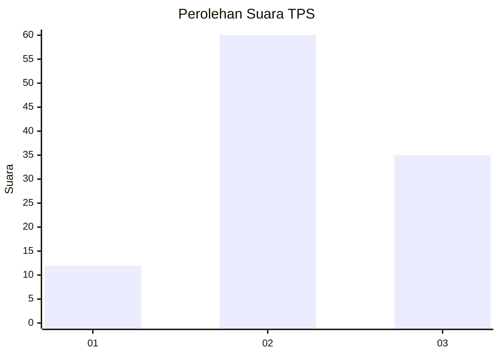
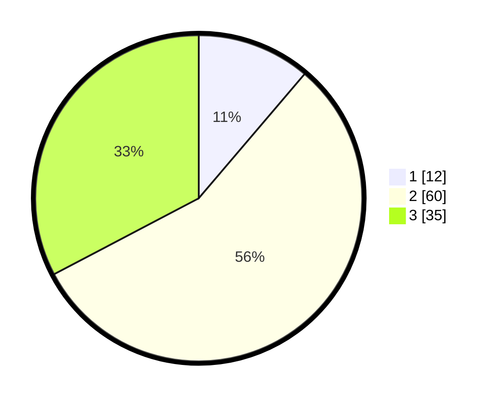

# Hasil

## Grafik

## Tabel

| No. | Nama Paslon    | Suara | Suara (raw) | Persentase |
|:--- |:-------------- | -----:| -----------:| ----------:|
| 1   | ANIES MUHAIMIN | 12    | [12][p-1]   | 11,21      |
| 2   | PRABOWO GIBRAN | 60    | [60][p-2]   | 56,07      |
| 3   | GANJAR MAHFUD  | 35    | [35][p-3]   | 32,71      |

[p-1]: https://github.com/gigit-pemilu/pemilu-2024/blob/main/pilpres/hitung-suara/sub/33-jawa-tengah/sub/29-brebes/sub/14-bulakamba/sub/2014-pakijangan/sub/017-tps/sub/paslon-1.txt
[p-2]: https://github.com/gigit-pemilu/pemilu-2024/blob/main/pilpres/hitung-suara/sub/33-jawa-tengah/sub/29-brebes/sub/14-bulakamba/sub/2014-pakijangan/sub/017-tps/sub/paslon-2.txt
[p-3]: https://github.com/gigit-pemilu/pemilu-2024/blob/main/pilpres/hitung-suara/sub/33-jawa-tengah/sub/29-brebes/sub/14-bulakamba/sub/2014-pakijangan/sub/017-tps/sub/paslon-3.txt

## Foto C Plano

https://sirekap-obj-formc.kpu.go.id/b081/pemilu/ppwp/33/29/14/20/14/3329142014017-20240214-233012--f2ee4da7-1dfb-4025-b6ab-f01146b43049.jpg

https://sirekap-obj-formc.kpu.go.id/b081/pemilu/ppwp/33/29/14/20/14/3329142014017-20240214-233626--8780db1b-0617-4e89-8672-effd223d95ec.jpg

https://sirekap-obj-formc.kpu.go.id/b081/pemilu/ppwp/33/29/14/20/14/3329142014017-20240214-234038--a230f4b6-e2cf-4f07-9604-3ba4a3c2a484.jpg

## Metadata

| Key        | Value               |
| ---------- | ------------------- |
| Time Stamp | 2024-02-24 22:31:28 |

