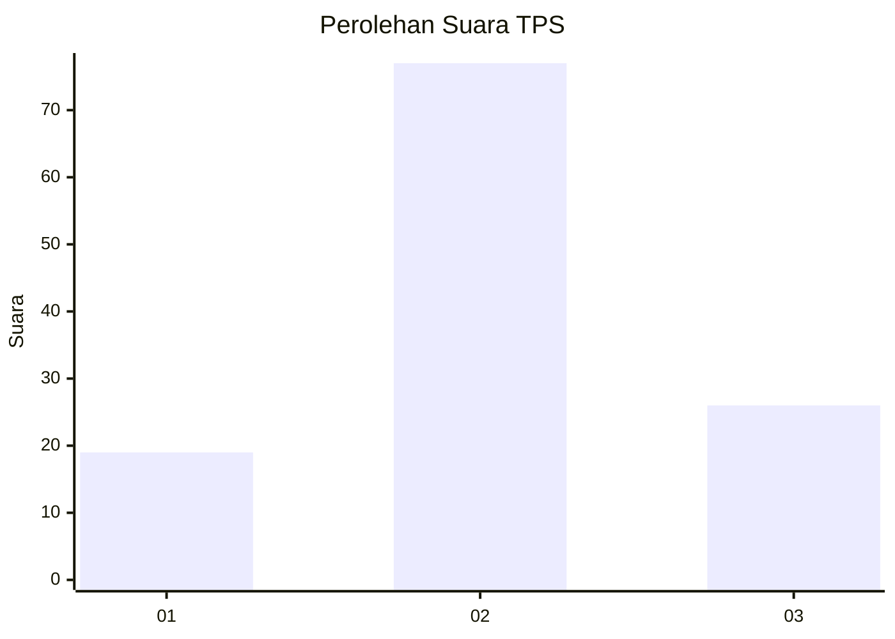
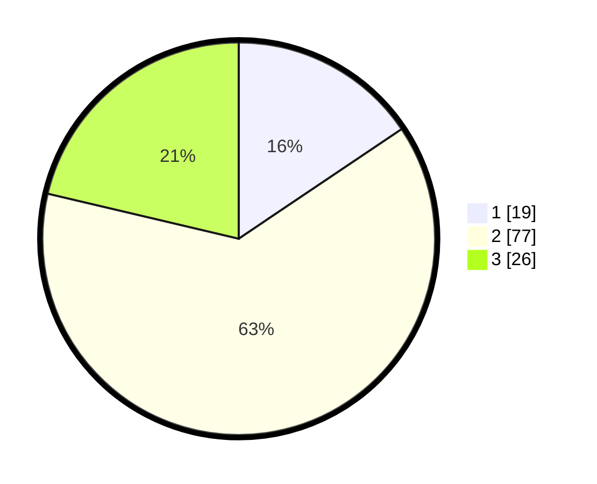

# Hasil

## Grafik

## Tabel

| No. | Nama Paslon    | Suara | Suara (raw) | Persentase |
|:--- |:-------------- | -----:| -----------:| ----------:|
| 1   | ANIES MUHAIMIN | 19    | [19][p-1]   | 15,57      |
| 2   | PRABOWO GIBRAN | 77    | [77][p-2]   | 63,11      |
| 3   | GANJAR MAHFUD  | 26    | [26][p-3]   | 21,31      |

[p-1]: https://github.com/gigit-pemilu/pemilu-2024/blob/main/pilpres/hitung-suara/sub/33-jawa-tengah/sub/29-brebes/sub/14-bulakamba/sub/2014-pakijangan/sub/018-tps/sub/paslon-1.txt
[p-2]: https://github.com/gigit-pemilu/pemilu-2024/blob/main/pilpres/hitung-suara/sub/33-jawa-tengah/sub/29-brebes/sub/14-bulakamba/sub/2014-pakijangan/sub/018-tps/sub/paslon-2.txt
[p-3]: https://github.com/gigit-pemilu/pemilu-2024/blob/main/pilpres/hitung-suara/sub/33-jawa-tengah/sub/29-brebes/sub/14-bulakamba/sub/2014-pakijangan/sub/018-tps/sub/paslon-3.txt

## Foto C Plano

https://sirekap-obj-formc.kpu.go.id/6c19/pemilu/ppwp/33/29/14/20/14/3329142014018-20240215-083416--f7cb2650-fa9f-4372-b466-548394864aaa.jpg

https://sirekap-obj-formc.kpu.go.id/6c19/pemilu/ppwp/33/29/14/20/14/3329142014018-20240214-204749--6da9b2de-a72c-4365-8c21-cd3be43396b6.jpg

https://sirekap-obj-formc.kpu.go.id/6c19/pemilu/ppwp/33/29/14/20/14/3329142014018-20240215-084549--59bc3a21-7d97-4756-88e6-80ee62676a16.jpg

## Metadata

| Key        | Value               |
| ---------- | ------------------- |
| Time Stamp | 2024-02-15 09:00:24 |

