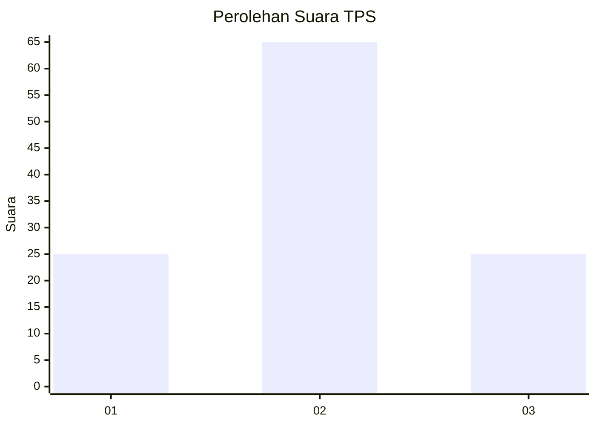
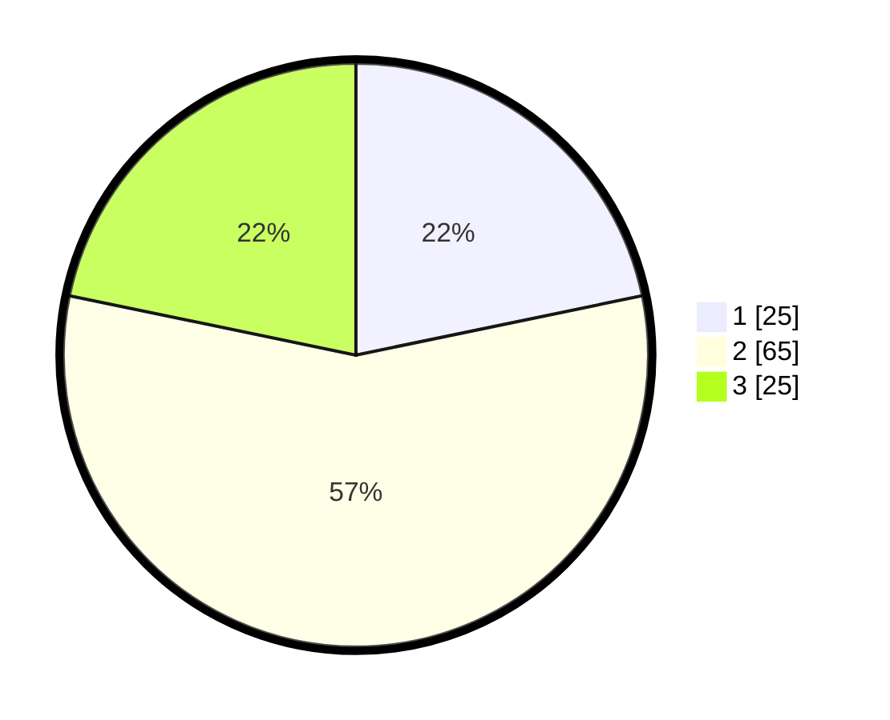

# Hasil

## Grafik

## Tabel

| No. | Nama Paslon    | Suara | Suara (raw) | Persentase |
|:--- |:-------------- | -----:| -----------:| ----------:|
| 1   | ANIES MUHAIMIN | 25    | [25][p-1]   | 21,74      |
| 2   | PRABOWO GIBRAN | 65    | [65][p-2]   | 56,52      |
| 3   | GANJAR MAHFUD  | 25    | [25][p-3]   | 21,74      |

[p-1]: https://github.com/gigit-pemilu/pemilu-2024/blob/main/pilpres/hitung-suara/sub/33-jawa-tengah/sub/29-brebes/sub/14-bulakamba/sub/2014-pakijangan/sub/025-tps/sub/paslon-1.txt
[p-2]: https://github.com/gigit-pemilu/pemilu-2024/blob/main/pilpres/hitung-suara/sub/33-jawa-tengah/sub/29-brebes/sub/14-bulakamba/sub/2014-pakijangan/sub/025-tps/sub/paslon-2.txt
[p-3]: https://github.com/gigit-pemilu/pemilu-2024/blob/main/pilpres/hitung-suara/sub/33-jawa-tengah/sub/29-brebes/sub/14-bulakamba/sub/2014-pakijangan/sub/025-tps/sub/paslon-3.txt

## Foto C Plano

https://sirekap-obj-formc.kpu.go.id/c39d/pemilu/ppwp/33/29/14/20/14/3329142014025-20240214-195233--11699384-b6c3-4b55-9a44-dd763c51887e.jpg

https://sirekap-obj-formc.kpu.go.id/c39d/pemilu/ppwp/33/29/14/20/14/3329142014025-20240214-202806--73219e3c-d55f-434e-8f78-b1fa66838998.jpg

https://sirekap-obj-formc.kpu.go.id/c39d/pemilu/ppwp/33/29/14/20/14/3329142014025-20240214-211210--515311eb-6397-4b97-9733-a45c23383880.jpg

## Metadata

| Key        | Value               |
| ---------- | ------------------- |
| Time Stamp | 2024-02-14 21:46:01 |

