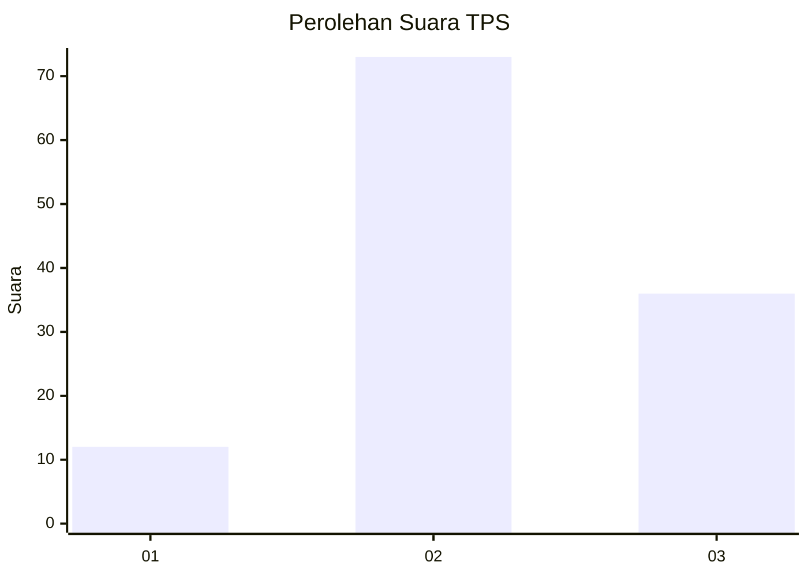
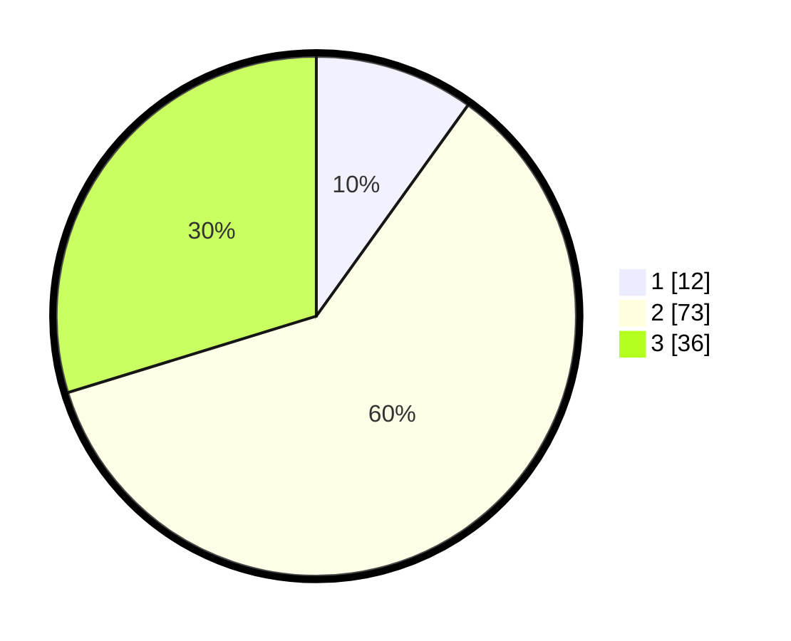

# Hasil

## Grafik

## Tabel

| No. | Nama Paslon    | Suara | Suara (raw) | Persentase |
|:--- |:-------------- | -----:| -----------:| ----------:|
| 1   | ANIES MUHAIMIN | 12    | [12][p-1]   | 9,92       |
| 2   | PRABOWO GIBRAN | 73    | [73][p-2]   | 60,33      |
| 3   | GANJAR MAHFUD  | 36    | [36][p-3]   | 29,75      |

[p-1]: https://github.com/gigit-pemilu/pemilu-2024/blob/main/pilpres/hitung-suara/sub/33-jawa-tengah/sub/29-brebes/sub/14-bulakamba/sub/2014-pakijangan/sub/029-tps/sub/paslon-1.txt
[p-2]: https://github.com/gigit-pemilu/pemilu-2024/blob/main/pilpres/hitung-suara/sub/33-jawa-tengah/sub/29-brebes/sub/14-bulakamba/sub/2014-pakijangan/sub/029-tps/sub/paslon-2.txt
[p-3]: https://github.com/gigit-pemilu/pemilu-2024/blob/main/pilpres/hitung-suara/sub/33-jawa-tengah/sub/29-brebes/sub/14-bulakamba/sub/2014-pakijangan/sub/029-tps/sub/paslon-3.txt

## Foto C Plano

https://sirekap-obj-formc.kpu.go.id/4e1a/pemilu/ppwp/33/29/14/20/14/3329142014029-20240214-214624--bc21389e-c9ec-45f3-9db8-d44cbeea1585.jpg

https://sirekap-obj-formc.kpu.go.id/4e1a/pemilu/ppwp/33/29/14/20/14/3329142014029-20240214-215152--53540d07-d72d-4567-ac3a-74fba569f03d.jpg

https://sirekap-obj-formc.kpu.go.id/4e1a/pemilu/ppwp/33/29/14/20/14/3329142014029-20240214-215437--edd820cb-28ac-45c8-82b0-3b11e8ffeede.jpg

## Metadata

| Key        | Value               |
| ---------- | ------------------- |
| Time Stamp | 2024-02-16 12:51:22 |

