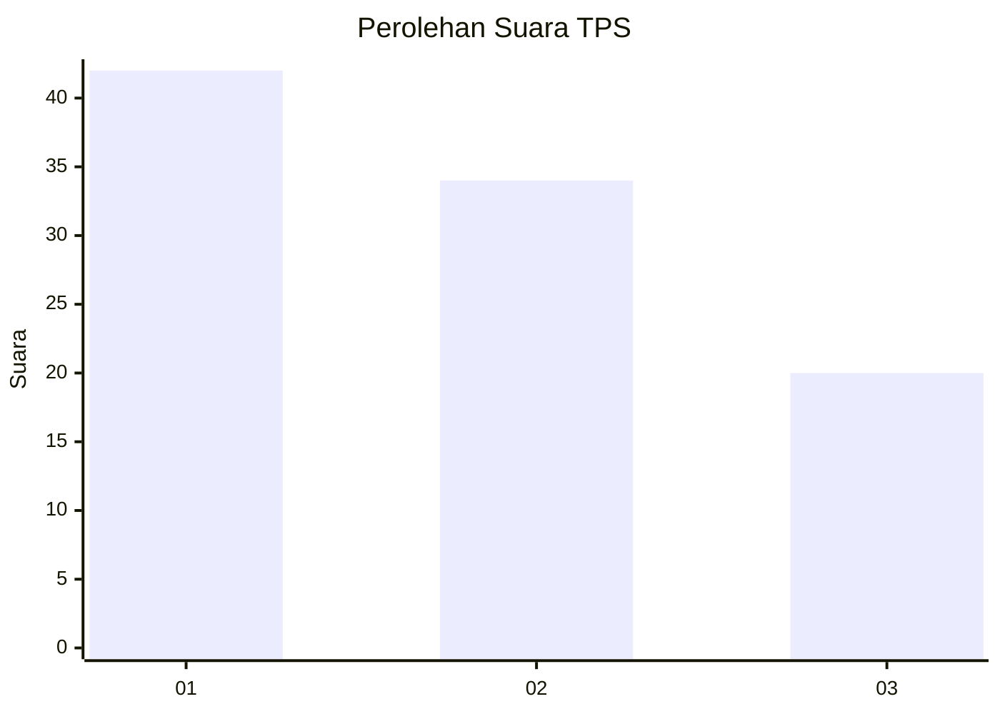
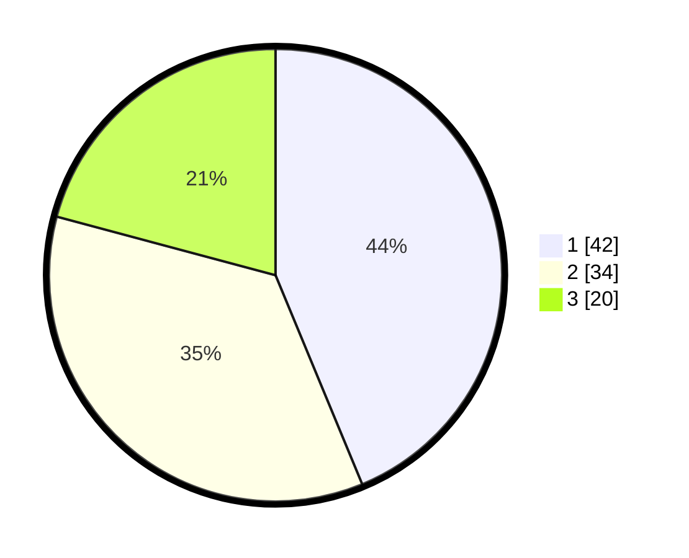

# Hasil

## Grafik

## Tabel

| No. | Nama Paslon    | Suara | Suara (raw) | Persentase |
|:--- |:-------------- | -----:| -----------:| ----------:|
| 1   | ANIES MUHAIMIN | 42    | [42][p-1]   | 43,75      |
| 2   | PRABOWO GIBRAN | 34    | [34][p-2]   | 35,42      |
| 3   | GANJAR MAHFUD  | 20    | [20][p-3]   | 20,83      |

[p-1]: https://github.com/gigit-pemilu/pemilu-2024/blob/main/pilpres/hitung-suara/sub/33-jawa-tengah/sub/29-brebes/sub/14-bulakamba/sub/2014-pakijangan/sub/030-tps/sub/paslon-1.txt
[p-2]: https://github.com/gigit-pemilu/pemilu-2024/blob/main/pilpres/hitung-suara/sub/33-jawa-tengah/sub/29-brebes/sub/14-bulakamba/sub/2014-pakijangan/sub/030-tps/sub/paslon-2.txt
[p-3]: https://github.com/gigit-pemilu/pemilu-2024/blob/main/pilpres/hitung-suara/sub/33-jawa-tengah/sub/29-brebes/sub/14-bulakamba/sub/2014-pakijangan/sub/030-tps/sub/paslon-3.txt

## Foto C Plano

https://sirekap-obj-formc.kpu.go.id/a7eb/pemilu/ppwp/33/29/14/20/14/3329142014030-20240214-234617--ddd9b815-cd29-41dc-883a-eaff2c3f7ca0.jpg

https://sirekap-obj-formc.kpu.go.id/a7eb/pemilu/ppwp/33/29/14/20/14/3329142014030-20240214-234823--5ef3f87d-b04b-412b-ad52-329c373b4474.jpg

https://sirekap-obj-formc.kpu.go.id/a7eb/pemilu/ppwp/33/29/14/20/14/3329142014030-20240214-234923--9cf3efaf-8e89-4fb9-8232-25b2ce027805.jpg

## Metadata

| Key        | Value               |
| ---------- | ------------------- |
| Time Stamp | 2024-02-16 12:51:22 |

