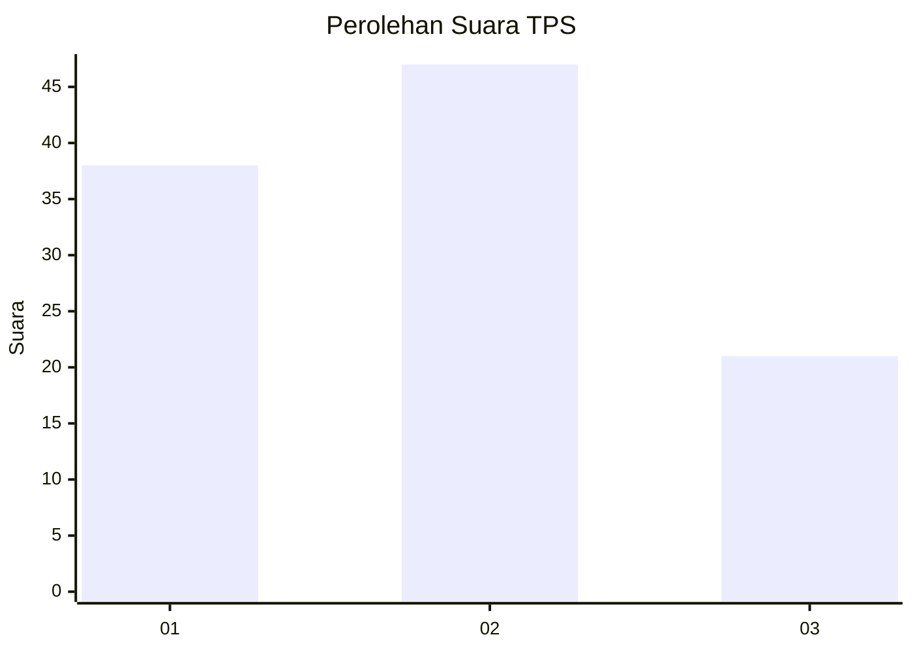
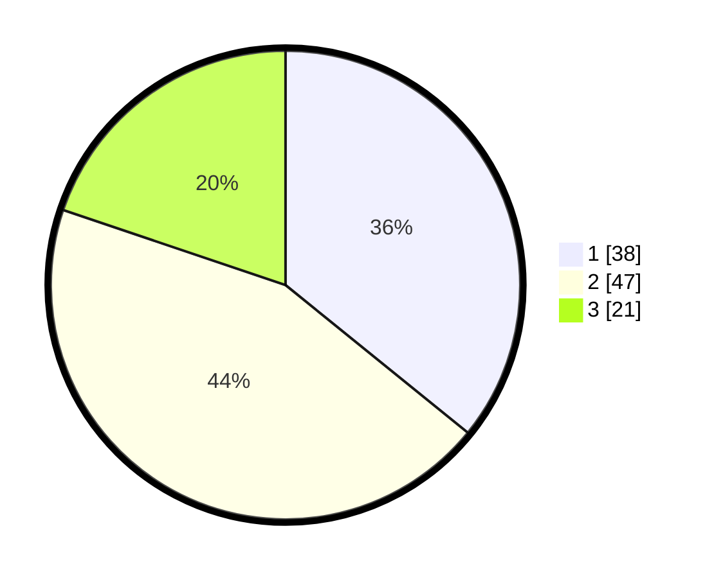

# Hasil

## Grafik

## Tabel

| No. | Nama Paslon    | Suara | Suara (raw) | Persentase |
|:--- |:-------------- | -----:| -----------:| ----------:|
| 1   | ANIES MUHAIMIN | 38    | [38][p-1]   | 35,85      |
| 2   | PRABOWO GIBRAN | 47    | [47][p-2]   | 44,34      |
| 3   | GANJAR MAHFUD  | 21    | [21][p-3]   | 19,81      |

[p-1]: https://github.com/gigit-pemilu/pemilu-2024-33-jawa-tengah/blob/main/pilpres/hitung-suara/sub/33-jawa-tengah/sub/29-brebes/sub/14-bulakamba/sub/2016-pulogading/sub/004-tps/sub/paslon-1.txt
[p-2]: https://github.com/gigit-pemilu/pemilu-2024-33-jawa-tengah/blob/main/pilpres/hitung-suara/sub/33-jawa-tengah/sub/29-brebes/sub/14-bulakamba/sub/2016-pulogading/sub/004-tps/sub/paslon-2.txt
[p-3]: https://github.com/gigit-pemilu/pemilu-2024-33-jawa-tengah/blob/main/pilpres/hitung-suara/sub/33-jawa-tengah/sub/29-brebes/sub/14-bulakamba/sub/2016-pulogading/sub/004-tps/sub/paslon-3.txt

## Foto C Plano

https://sirekap-obj-formc.kpu.go.id/75cf/pemilu/ppwp/33/29/14/20/16/3329142016004-20240217-085314--9cc4bf8b-c04b-420b-8933-a465db42393e.jpg

https://sirekap-obj-formc.kpu.go.id/75cf/pemilu/ppwp/33/29/14/20/16/3329142016004-20240217-090530--64f235d8-977e-4e76-a0d9-2558ad6118ad.jpg

https://sirekap-obj-formc.kpu.go.id/75cf/pemilu/ppwp/33/29/14/20/16/3329142016004-20240217-092759--49eea19b-b1f4-4dd4-8a2a-d351edbc7e38.jpg

## Metadata

| Key        | Value               |
| ---------- | ------------------- |
| Time Stamp | 2024-02-24 22:31:28 |

