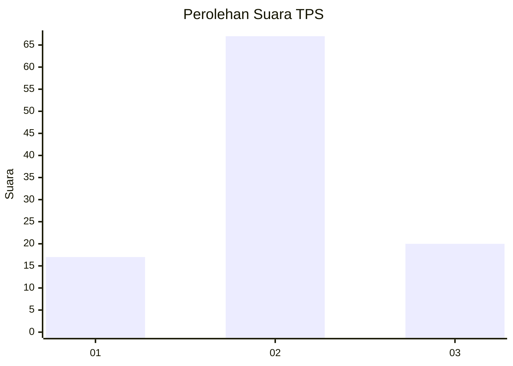
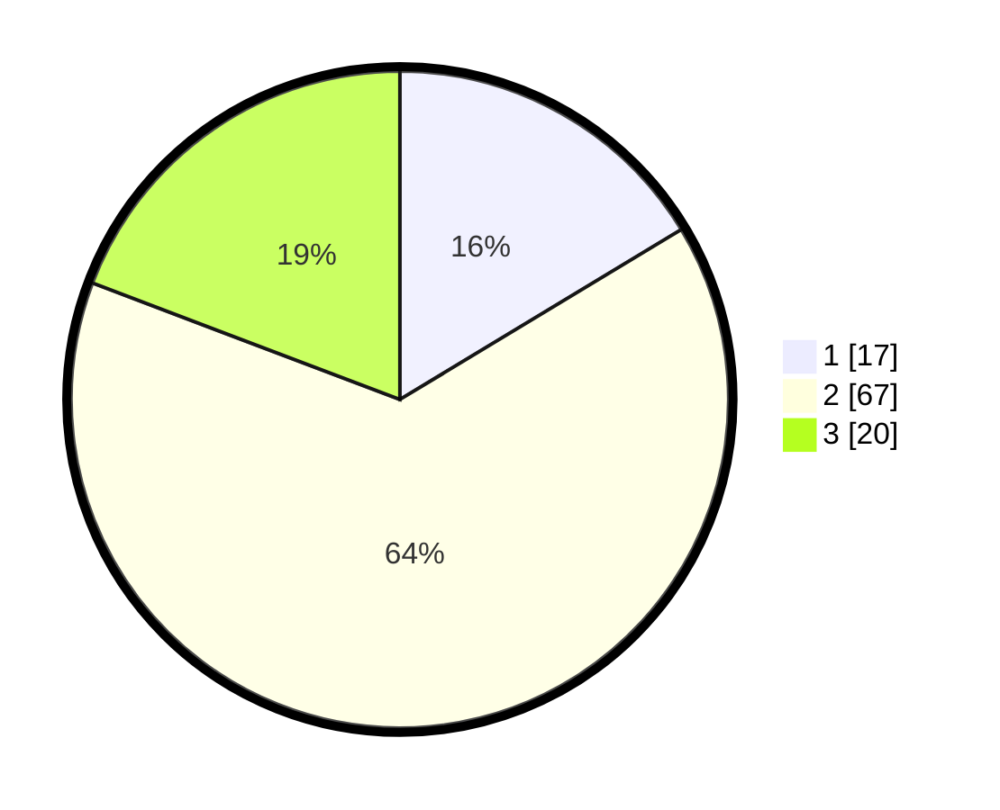

# Hasil

## Grafik

## Tabel

| No. | Nama Paslon    | Suara | Suara (raw) | Persentase |
|:--- |:-------------- | -----:| -----------:| ----------:|
| 1   | ANIES MUHAIMIN | 17    | [17][p-1]   | 16,35      |
| 2   | PRABOWO GIBRAN | 67    | [67][p-2]   | 64,42      |
| 3   | GANJAR MAHFUD  | 20    | [20][p-3]   | 19,23      |

[p-1]: https://github.com/gigit-pemilu/pemilu-2024/blob/main/pilpres/hitung-suara/sub/33-jawa-tengah/sub/29-brebes/sub/14-bulakamba/sub/2016-pulogading/sub/005-tps/sub/paslon-1.txt
[p-2]: https://github.com/gigit-pemilu/pemilu-2024/blob/main/pilpres/hitung-suara/sub/33-jawa-tengah/sub/29-brebes/sub/14-bulakamba/sub/2016-pulogading/sub/005-tps/sub/paslon-2.txt
[p-3]: https://github.com/gigit-pemilu/pemilu-2024/blob/main/pilpres/hitung-suara/sub/33-jawa-tengah/sub/29-brebes/sub/14-bulakamba/sub/2016-pulogading/sub/005-tps/sub/paslon-3.txt

## Foto C Plano

https://sirekap-obj-formc.kpu.go.id/dfbf/pemilu/ppwp/33/29/14/20/16/3329142016005-20240214-185153--b00febd6-a3ee-4e09-b170-c9021f527f9c.jpg

https://sirekap-obj-formc.kpu.go.id/dfbf/pemilu/ppwp/33/29/14/20/16/3329142016005-20240214-185653--a227a4eb-0550-4ceb-bd61-8d7d50722b0a.jpg

https://sirekap-obj-formc.kpu.go.id/dfbf/pemilu/ppwp/33/29/14/20/16/3329142016005-20240214-185837--7d17c133-57ca-460c-910d-d1a2e803c9d6.jpg

## Metadata

| Key        | Value               |
| ---------- | ------------------- |
| Time Stamp | 2024-02-14 21:46:01 |

