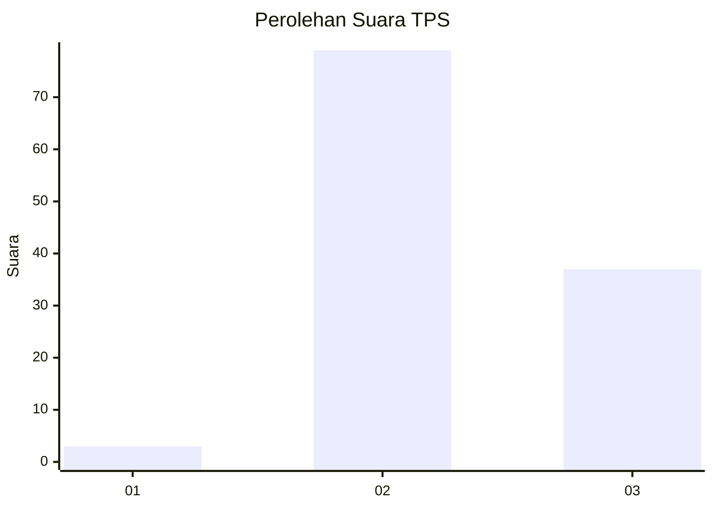
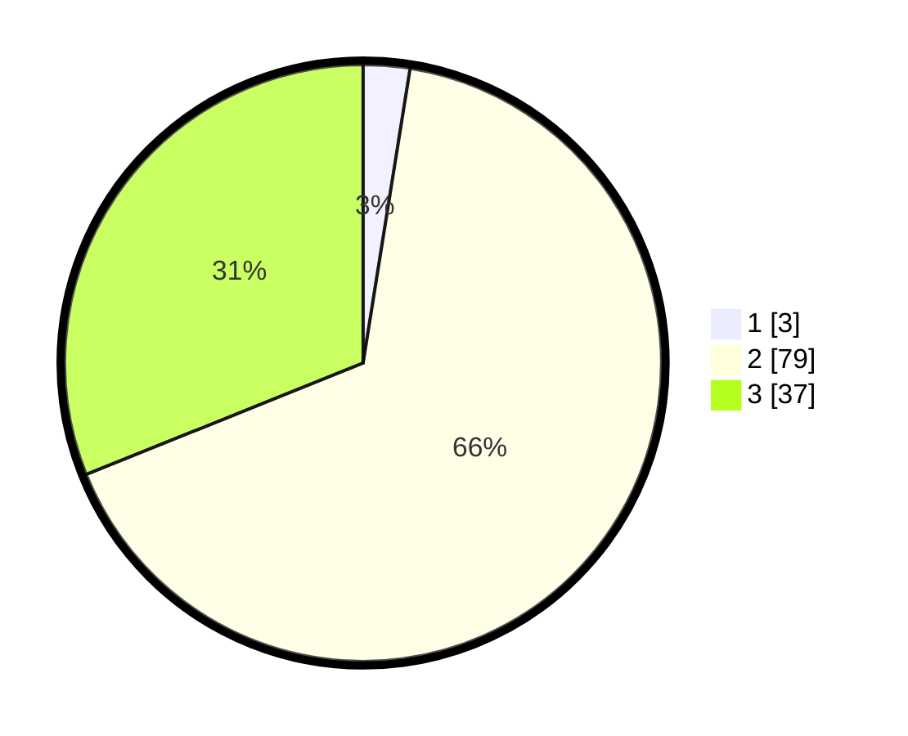

# Hasil

## Grafik

## Tabel

| No. | Nama Paslon    | Suara | Suara (raw) | Persentase |
|:--- |:-------------- | -----:| -----------:| ----------:|
| 1   | ANIES MUHAIMIN | 3     | [3][p-1]    | 2,52       |
| 2   | PRABOWO GIBRAN | 79    | [79][p-2]   | 66,39      |
| 3   | GANJAR MAHFUD  | 37    | [37][p-3]   | 31,09      |

[p-1]: https://github.com/gigit-pemilu/pemilu-2024-33-jawa-tengah/blob/main/pilpres/hitung-suara/sub/33-jawa-tengah/sub/29-brebes/sub/14-bulakamba/sub/2016-pulogading/sub/020-tps/sub/paslon-1.txt
[p-2]: https://github.com/gigit-pemilu/pemilu-2024-33-jawa-tengah/blob/main/pilpres/hitung-suara/sub/33-jawa-tengah/sub/29-brebes/sub/14-bulakamba/sub/2016-pulogading/sub/020-tps/sub/paslon-2.txt
[p-3]: https://github.com/gigit-pemilu/pemilu-2024-33-jawa-tengah/blob/main/pilpres/hitung-suara/sub/33-jawa-tengah/sub/29-brebes/sub/14-bulakamba/sub/2016-pulogading/sub/020-tps/sub/paslon-3.txt

## Foto C Plano

https://sirekap-obj-formc.kpu.go.id/64df/pemilu/ppwp/33/29/14/20/16/3329142016020-20240214-225300--38970d4d-3934-4516-94e6-43685f94fcaa.jpg

https://sirekap-obj-formc.kpu.go.id/64df/pemilu/ppwp/33/29/14/20/16/3329142016020-20240214-225430--5a2d592f-f84f-4dd7-a856-721805d88a1e.jpg

https://sirekap-obj-formc.kpu.go.id/64df/pemilu/ppwp/33/29/14/20/16/3329142016020-20240214-225550--a125871d-1636-4ee4-ad5b-55183519fae6.jpg

## Metadata

| Key        | Value               |
| ---------- | ------------------- |
| Time Stamp | 2024-02-25 13:00:00 |

