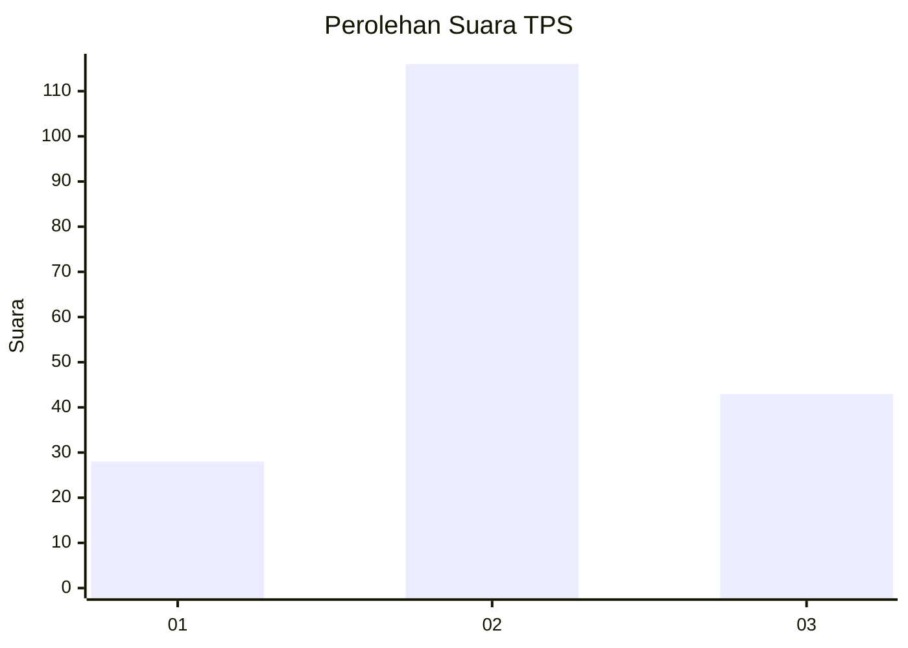
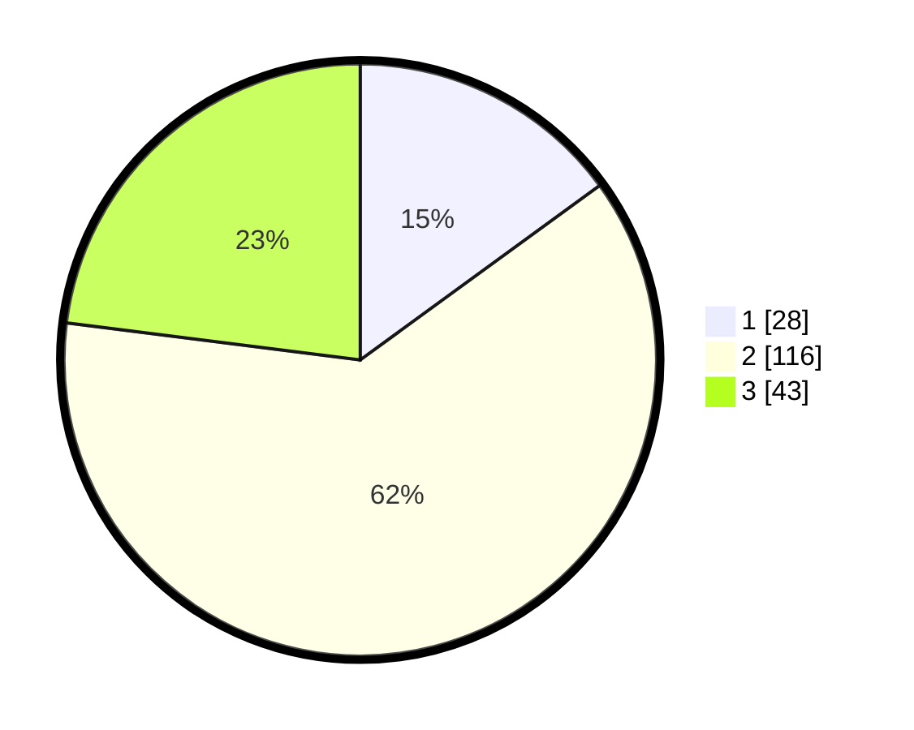

# Hasil

## Grafik

## Tabel

| No. | Nama Paslon    | Suara | Suara (raw) | Persentase |
|:--- |:-------------- | -----:| -----------:| ----------:|
| 1   | ANIES MUHAIMIN | 28    | [28][p-1]   | 14,97      |
| 2   | PRABOWO GIBRAN | 116   | [116][p-2]  | 62,03      |
| 3   | GANJAR MAHFUD  | 43    | [43][p-3]   | 22,99      |

[p-1]: https://github.com/gigit-pemilu/pemilu-2024/blob/main/pilpres/hitung-suara/sub/33-jawa-tengah/sub/29-brebes/sub/14-bulakamba/sub/2017-rancawuluh/sub/008-tps/sub/paslon-1.txt
[p-2]: https://github.com/gigit-pemilu/pemilu-2024/blob/main/pilpres/hitung-suara/sub/33-jawa-tengah/sub/29-brebes/sub/14-bulakamba/sub/2017-rancawuluh/sub/008-tps/sub/paslon-2.txt
[p-3]: https://github.com/gigit-pemilu/pemilu-2024/blob/main/pilpres/hitung-suara/sub/33-jawa-tengah/sub/29-brebes/sub/14-bulakamba/sub/2017-rancawuluh/sub/008-tps/sub/paslon-3.txt

## Foto C Plano

https://sirekap-obj-formc.kpu.go.id/d8db/pemilu/ppwp/33/29/14/20/17/3329142017008-20240215-004353--e32a3d21-e2ce-4b78-8c1d-8aaa80cd1ff1.jpg

https://sirekap-obj-formc.kpu.go.id/d8db/pemilu/ppwp/33/29/14/20/17/3329142017008-20240215-005039--aafd3b65-4b14-49ee-aa41-50165649015d.jpg

https://sirekap-obj-formc.kpu.go.id/d8db/pemilu/ppwp/33/29/14/20/17/3329142017008-20240215-005501--613d5e5d-6f96-44b8-b3a4-2eeb4f16e0eb.jpg

## Metadata

| Key        | Value               |
| ---------- | ------------------- |
| Time Stamp | 2024-02-24 22:31:28 |

