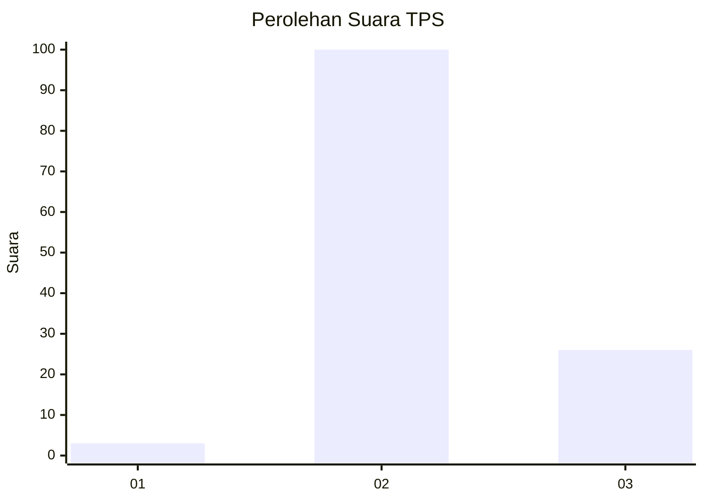

# Hasil

## Grafik

## Tabel

| No. | Nama Paslon    | Suara | Suara (raw) | Persentase |
|:--- |:-------------- | -----:| -----------:| ----------:|
| 1   | ANIES MUHAIMIN | 3     | [3][p-1]    | 2,33       |
| 2   | PRABOWO GIBRAN | 100   | [100][p-2]  | 77,52      |
| 3   | GANJAR MAHFUD  | 26    | [26][p-3]   | 20,16      |

[p-1]: https://github.com/gigit-pemilu/pemilu-2024/blob/main/pilpres/hitung-suara/sub/33-jawa-tengah/sub/29-brebes/sub/14-bulakamba/sub/2017-rancawuluh/sub/024-tps/sub/paslon-1.txt
[p-2]: https://github.com/gigit-pemilu/pemilu-2024/blob/main/pilpres/hitung-suara/sub/33-jawa-tengah/sub/29-brebes/sub/14-bulakamba/sub/2017-rancawuluh/sub/024-tps/sub/paslon-2.txt
[p-3]: https://github.com/gigit-pemilu/pemilu-2024/blob/main/pilpres/hitung-suara/sub/33-jawa-tengah/sub/29-brebes/sub/14-bulakamba/sub/2017-rancawuluh/sub/024-tps/sub/paslon-3.txt

## Foto C Plano

https://sirekap-obj-formc.kpu.go.id/22df/pemilu/ppwp/33/29/14/20/17/3329142017024-20240215-061246--389fa74a-36a2-445b-876f-09b2bc9dc78f.jpg

https://sirekap-obj-formc.kpu.go.id/22df/pemilu/ppwp/33/29/14/20/17/3329142017024-20240215-061410--aa02e633-775f-4a8b-8af8-69c82c4175eb.jpg

https://sirekap-obj-formc.kpu.go.id/22df/pemilu/ppwp/33/29/14/20/17/3329142017024-20240214-231721--8bc937cf-d346-43a9-b4fb-c67936460ad8.jpg

## Metadata

| Key        | Value               |
| ---------- | ------------------- |
| Time Stamp | 2024-02-25 12:00:00 |

