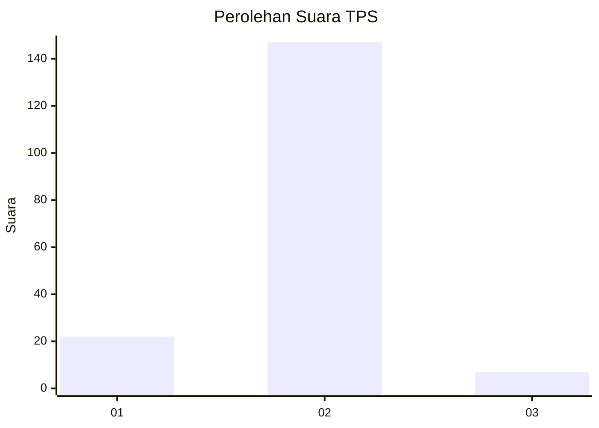
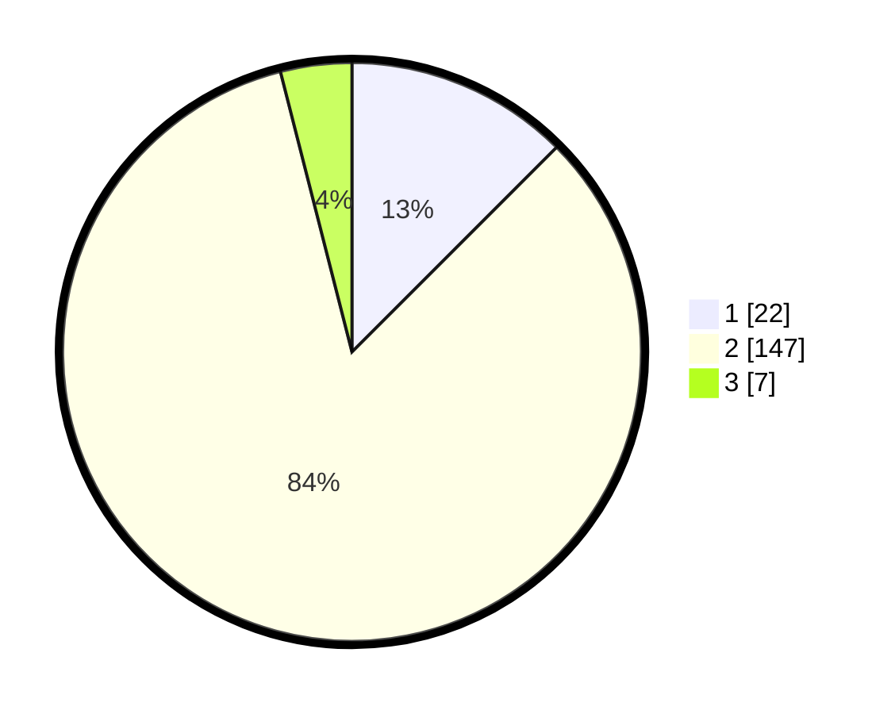

# Hasil

## Grafik

## Tabel

| No. | Nama Paslon    | Suara | Suara (raw) | Persentase |
|:--- |:-------------- | -----:| -----------:| ----------:|
| 1   | ANIES MUHAIMIN | 22    | [22][p-1]   | 12,50      |
| 2   | PRABOWO GIBRAN | 147   | [147][p-2]  | 83,52      |
| 3   | GANJAR MAHFUD  | 7     | [7][p-3]    | 3,98       |

[p-1]: https://github.com/gigit-pemilu/pemilu-2024/blob/main/pilpres/hitung-suara/sub/33-jawa-tengah/sub/29-brebes/sub/15-larangan/sub/2001-kamal/sub/002-tps/sub/paslon-1.txt
[p-2]: https://github.com/gigit-pemilu/pemilu-2024/blob/main/pilpres/hitung-suara/sub/33-jawa-tengah/sub/29-brebes/sub/15-larangan/sub/2001-kamal/sub/002-tps/sub/paslon-2.txt
[p-3]: https://github.com/gigit-pemilu/pemilu-2024/blob/main/pilpres/hitung-suara/sub/33-jawa-tengah/sub/29-brebes/sub/15-larangan/sub/2001-kamal/sub/002-tps/sub/paslon-3.txt

## Foto C Plano

https://sirekap-obj-formc.kpu.go.id/a049/pemilu/ppwp/33/29/15/20/01/3329152001002-20240214-220940--ec043fb8-69bb-41e9-ae49-a0efe0b72d8a.jpg

https://sirekap-obj-formc.kpu.go.id/a049/pemilu/ppwp/33/29/15/20/01/3329152001002-20240215-010523--a83b89ad-b4bb-4908-8e02-8116e0582e7d.jpg

https://sirekap-obj-formc.kpu.go.id/a049/pemilu/ppwp/33/29/15/20/01/3329152001002-20240214-220716--ad6f7221-ec01-4ab9-b8ba-197f2c4aa2d6.jpg

## Metadata

| Key        | Value               |
| ---------- | ------------------- |
| Time Stamp | 2024-02-15 12:00:28 |

