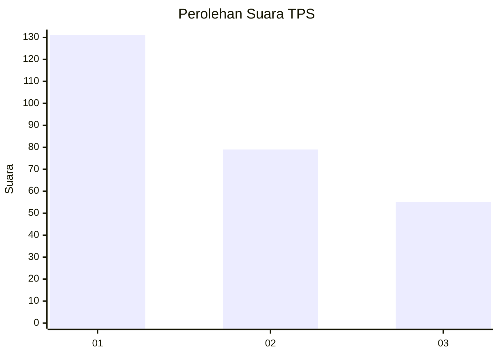
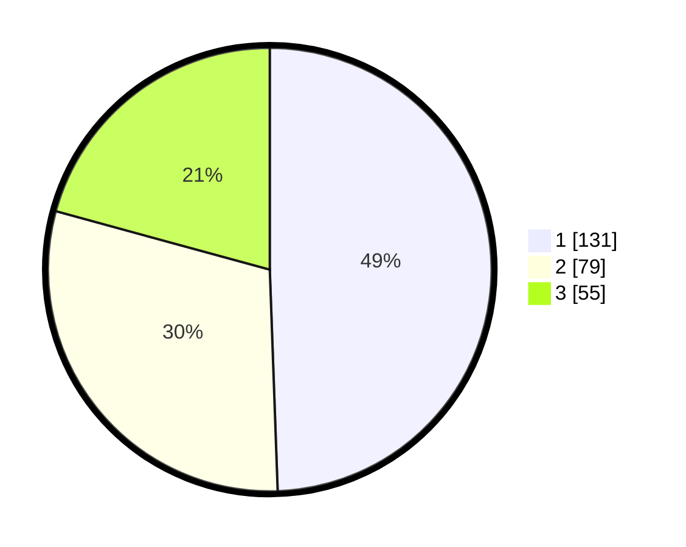

# Hasil

## Grafik

## Tabel

| No. | Nama Paslon    | Suara | Suara (raw) | Persentase |
|:--- |:-------------- | -----:| -----------:| ----------:|
| 1   | ANIES MUHAIMIN | 131   | [131][p-1]  | 49,43      |
| 2   | PRABOWO GIBRAN | 79    | [79][p-2]   | 29,81      |
| 3   | GANJAR MAHFUD  | 55    | [55][p-3]   | 20,75      |

[p-1]: https://github.com/gigit-pemilu/pemilu-2024-33-jawa-tengah/blob/main/pilpres/hitung-suara/sub/33-jawa-tengah/sub/29-brebes/sub/15-larangan/sub/2004-larangan/sub/007-tps/sub/paslon-1.txt
[p-2]: https://github.com/gigit-pemilu/pemilu-2024-33-jawa-tengah/blob/main/pilpres/hitung-suara/sub/33-jawa-tengah/sub/29-brebes/sub/15-larangan/sub/2004-larangan/sub/007-tps/sub/paslon-2.txt
[p-3]: https://github.com/gigit-pemilu/pemilu-2024-33-jawa-tengah/blob/main/pilpres/hitung-suara/sub/33-jawa-tengah/sub/29-brebes/sub/15-larangan/sub/2004-larangan/sub/007-tps/sub/paslon-3.txt

## Foto C Plano

https://sirekap-obj-formc.kpu.go.id/cc8a/pemilu/ppwp/33/29/15/20/04/3329152004007-20240214-230150--2bab6e9c-93ae-4f7d-8a13-04dd1fba3c71.jpg

https://sirekap-obj-formc.kpu.go.id/cc8a/pemilu/ppwp/33/29/15/20/04/3329152004007-20240214-230246--cd057447-b5a0-4512-a2d8-96ec12c6ef57.jpg

https://sirekap-obj-formc.kpu.go.id/cc8a/pemilu/ppwp/33/29/15/20/04/3329152004007-20240214-230316--80aea236-b166-4cd8-9b6b-875ff80636b8.jpg

## Metadata

| Key        | Value               |
| ---------- | ------------------- |
| Time Stamp | 2024-02-24 22:31:28 |

