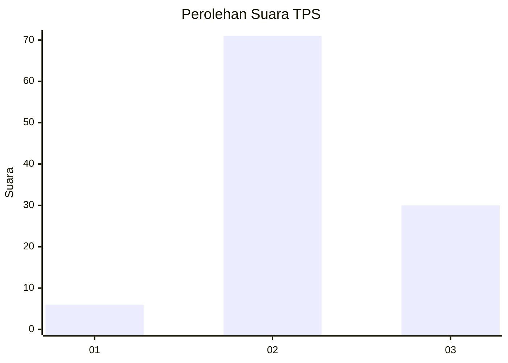
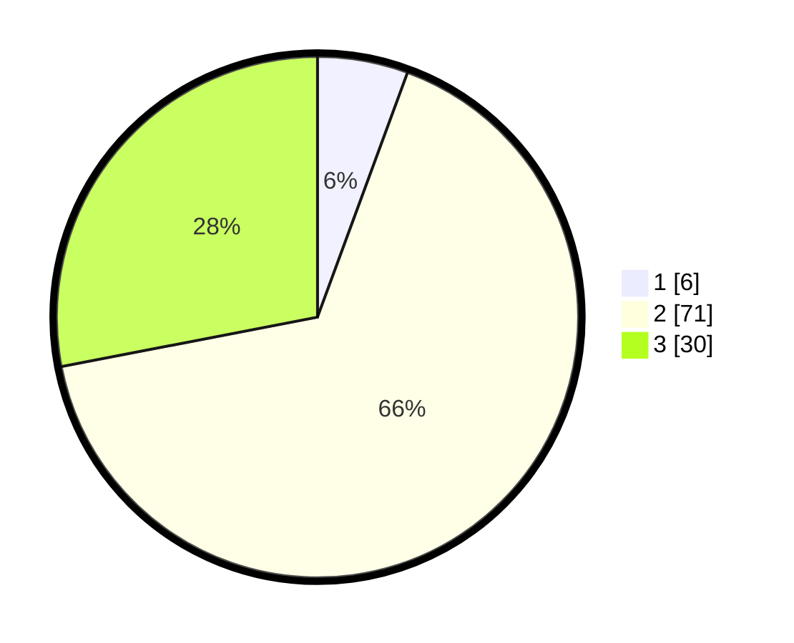

# Hasil

## Grafik

## Tabel

| No. | Nama Paslon    | Suara | Suara (raw) | Persentase |
|:--- |:-------------- | -----:| -----------:| ----------:|
| 1   | ANIES MUHAIMIN | 6     | [6][p-1]    | 5,61       |
| 2   | PRABOWO GIBRAN | 71    | [71][p-2]   | 66,36      |
| 3   | GANJAR MAHFUD  | 30    | [30][p-3]   | 28,04      |

[p-1]: https://github.com/gigit-pemilu/pemilu-2024-33-jawa-tengah/blob/main/pilpres/hitung-suara/sub/33-jawa-tengah/sub/29-brebes/sub/15-larangan/sub/2004-larangan/sub/046-tps/sub/paslon-1.txt
[p-2]: https://github.com/gigit-pemilu/pemilu-2024-33-jawa-tengah/blob/main/pilpres/hitung-suara/sub/33-jawa-tengah/sub/29-brebes/sub/15-larangan/sub/2004-larangan/sub/046-tps/sub/paslon-2.txt
[p-3]: https://github.com/gigit-pemilu/pemilu-2024-33-jawa-tengah/blob/main/pilpres/hitung-suara/sub/33-jawa-tengah/sub/29-brebes/sub/15-larangan/sub/2004-larangan/sub/046-tps/sub/paslon-3.txt

## Foto C Plano

https://sirekap-obj-formc.kpu.go.id/d194/pemilu/ppwp/33/29/15/20/04/3329152004046-20240214-233241--a08777e7-4a9a-43ef-8f44-df51958ae027.jpg

https://sirekap-obj-formc.kpu.go.id/d194/pemilu/ppwp/33/29/15/20/04/3329152004046-20240214-233526--84062477-5660-462f-afec-69a69decd9cf.jpg

https://sirekap-obj-formc.kpu.go.id/d194/pemilu/ppwp/33/29/15/20/04/3329152004046-20240214-233635--89e84faa-00b6-4270-9890-307a5b9d53c8.jpg

## Metadata

| Key        | Value               |
| ---------- | ------------------- |
| Time Stamp | 2024-02-19 06:16:00 |

