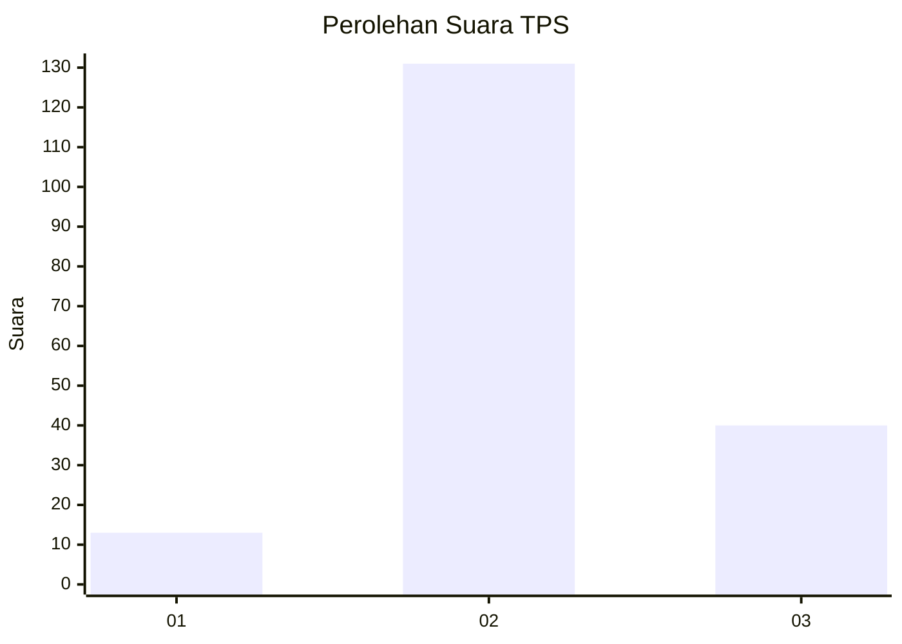

# Hasil

## Grafik

## Tabel

| No. | Nama Paslon    | Suara | Suara (raw) | Persentase |
|:--- |:-------------- | -----:| -----------:| ----------:|
| 1   | ANIES MUHAIMIN | 13    | [13][p-1]   | 7,07       |
| 2   | PRABOWO GIBRAN | 131   | [131][p-2]  | 71,20      |
| 3   | GANJAR MAHFUD  | 40    | [40][p-3]   | 21,74      |

[p-1]: https://github.com/gigit-pemilu/pemilu-2024/blob/main/pilpres/hitung-suara/sub/33-jawa-tengah/sub/29-brebes/sub/15-larangan/sub/2005-luwunggede/sub/001-tps/sub/paslon-1.txt
[p-2]: https://github.com/gigit-pemilu/pemilu-2024/blob/main/pilpres/hitung-suara/sub/33-jawa-tengah/sub/29-brebes/sub/15-larangan/sub/2005-luwunggede/sub/001-tps/sub/paslon-2.txt
[p-3]: https://github.com/gigit-pemilu/pemilu-2024/blob/main/pilpres/hitung-suara/sub/33-jawa-tengah/sub/29-brebes/sub/15-larangan/sub/2005-luwunggede/sub/001-tps/sub/paslon-3.txt

## Foto C Plano

https://sirekap-obj-formc.kpu.go.id/3c8e/pemilu/ppwp/33/29/15/20/05/3329152005001-20240215-010219--83a2e79f-5e15-4b16-9724-5c863d0bb1ac.jpg

https://sirekap-obj-formc.kpu.go.id/3c8e/pemilu/ppwp/33/29/15/20/05/3329152005001-20240215-010319--627f8940-5c2f-45e0-8fac-e68f8fd442b6.jpg

https://sirekap-obj-formc.kpu.go.id/3c8e/pemilu/ppwp/33/29/15/20/05/3329152005001-20240215-010413--3d58ca6b-f38c-4540-bb74-f8a82ddb34ee.jpg

## Metadata

| Key        | Value               |
| ---------- | ------------------- |
| Time Stamp | 2024-02-19 06:16:00 |

