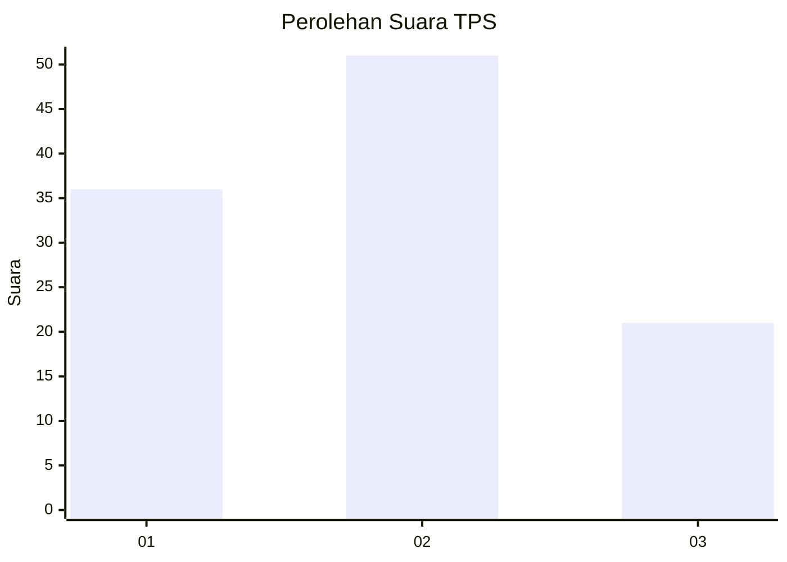
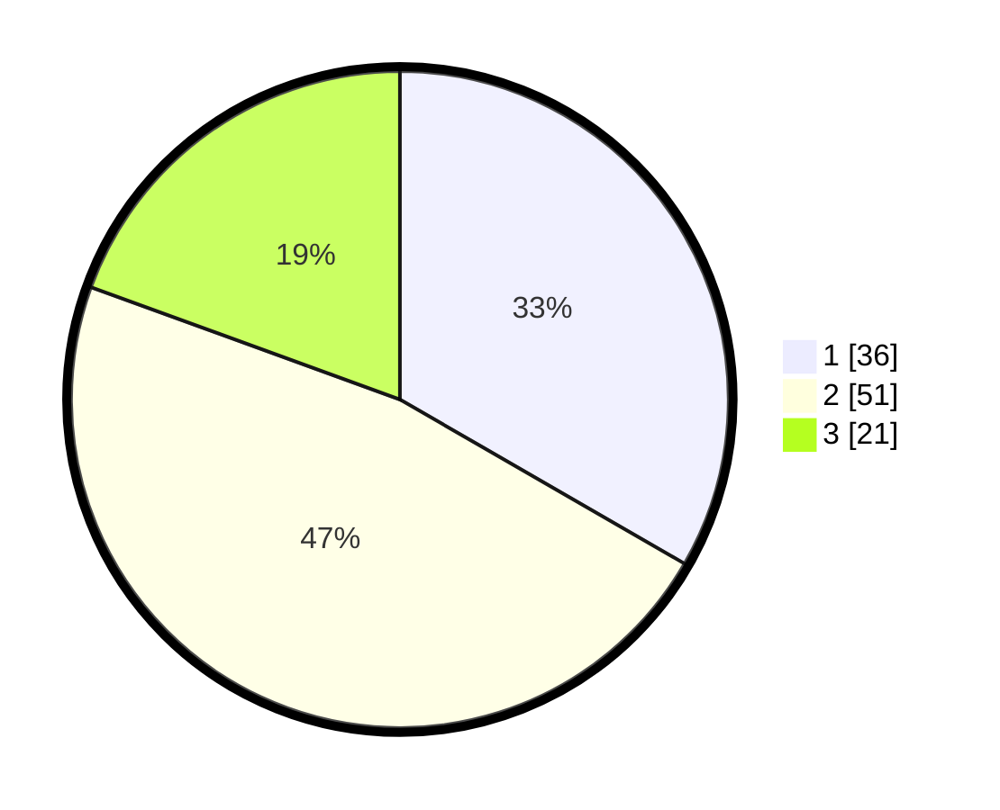

# Hasil

## Grafik

## Tabel

| No. | Nama Paslon    | Suara | Suara (raw) | Persentase |
|:--- |:-------------- | -----:| -----------:| ----------:|
| 1   | ANIES MUHAIMIN | 36    | [36][p-1]   | 33,33      |
| 2   | PRABOWO GIBRAN | 51    | [51][p-2]   | 47,22      |
| 3   | GANJAR MAHFUD  | 21    | [21][p-3]   | 19,44      |

[p-1]: https://github.com/gigit-pemilu/pemilu-2024-33-jawa-tengah/blob/main/pilpres/hitung-suara/sub/33-jawa-tengah/sub/29-brebes/sub/15-larangan/sub/2008-sitanggal/sub/043-tps/sub/paslon-1.txt
[p-2]: https://github.com/gigit-pemilu/pemilu-2024-33-jawa-tengah/blob/main/pilpres/hitung-suara/sub/33-jawa-tengah/sub/29-brebes/sub/15-larangan/sub/2008-sitanggal/sub/043-tps/sub/paslon-2.txt
[p-3]: https://github.com/gigit-pemilu/pemilu-2024-33-jawa-tengah/blob/main/pilpres/hitung-suara/sub/33-jawa-tengah/sub/29-brebes/sub/15-larangan/sub/2008-sitanggal/sub/043-tps/sub/paslon-3.txt

## Foto C Plano

https://sirekap-obj-formc.kpu.go.id/3bd3/pemilu/ppwp/33/29/15/20/08/3329152008043-20240215-070831--282eb148-1adc-4f53-920b-d0198203c204.jpg

https://sirekap-obj-formc.kpu.go.id/3bd3/pemilu/ppwp/33/29/15/20/08/3329152008043-20240214-141933--6c087a20-553c-4999-a1fa-5544323c1146.jpg

https://sirekap-obj-formc.kpu.go.id/3bd3/pemilu/ppwp/33/29/15/20/08/3329152008043-20240215-071111--c139593d-c6a8-4ef5-8789-cfa8091fd0ed.jpg

## Metadata

| Key        | Value               |
| ---------- | ------------------- |
| Time Stamp | 2024-02-15 15:00:29 |

