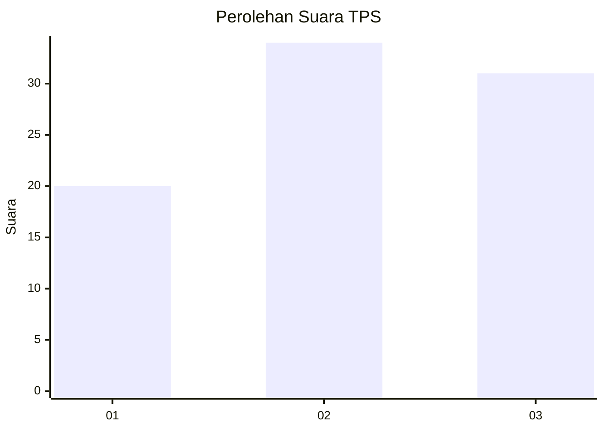
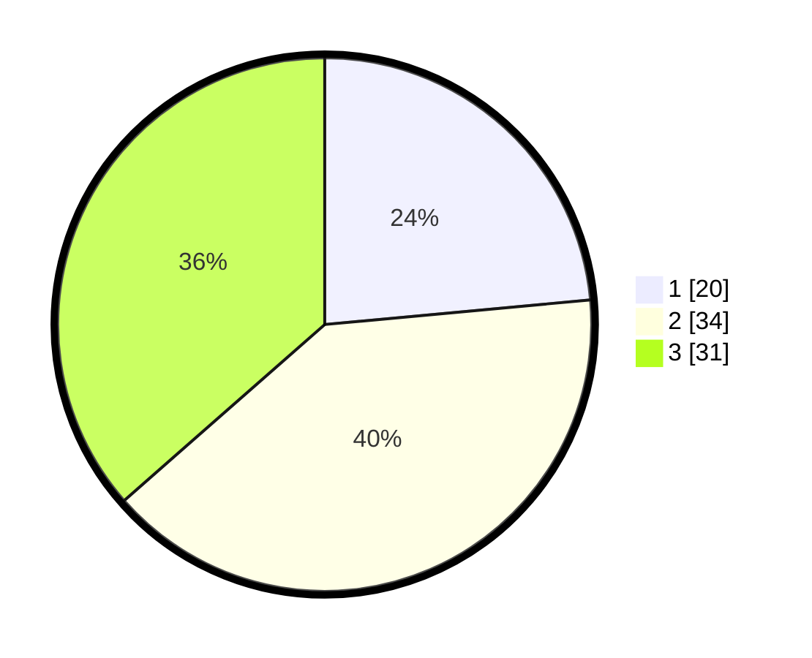

# Hasil

## Grafik

## Tabel

| No. | Nama Paslon    | Suara | Suara (raw) | Persentase |
|:--- |:-------------- | -----:| -----------:| ----------:|
| 1   | ANIES MUHAIMIN | 20    | [20][p-1]   | 23,53      |
| 2   | PRABOWO GIBRAN | 34    | [34][p-2]   | 40,00      |
| 3   | GANJAR MAHFUD  | 31    | [31][p-3]   | 36,47      |

[p-1]: https://github.com/gigit-pemilu/pemilu-2024/blob/main/pilpres/hitung-suara/sub/33-jawa-tengah/sub/29-brebes/sub/15-larangan/sub/2008-sitanggal/sub/050-tps/sub/paslon-1.txt
[p-2]: https://github.com/gigit-pemilu/pemilu-2024/blob/main/pilpres/hitung-suara/sub/33-jawa-tengah/sub/29-brebes/sub/15-larangan/sub/2008-sitanggal/sub/050-tps/sub/paslon-2.txt
[p-3]: https://github.com/gigit-pemilu/pemilu-2024/blob/main/pilpres/hitung-suara/sub/33-jawa-tengah/sub/29-brebes/sub/15-larangan/sub/2008-sitanggal/sub/050-tps/sub/paslon-3.txt

## Foto C Plano

https://sirekap-obj-formc.kpu.go.id/be27/pemilu/ppwp/33/29/15/20/08/3329152008050-20240215-001847--268eab37-f8e9-43d1-8458-2402013bae75.jpg

https://sirekap-obj-formc.kpu.go.id/be27/pemilu/ppwp/33/29/15/20/08/3329152008050-20240214-141553--8ad2c0a7-b27d-4faa-8fa3-65096e46d9a1.jpg

https://sirekap-obj-formc.kpu.go.id/be27/pemilu/ppwp/33/29/15/20/08/3329152008050-20240214-141729--ea5d1e5d-f693-4603-a830-a8ca098d78f7.jpg

## Metadata

| Key        | Value               |
| ---------- | ------------------- |
| Time Stamp | 2024-02-25 15:00:00 |

