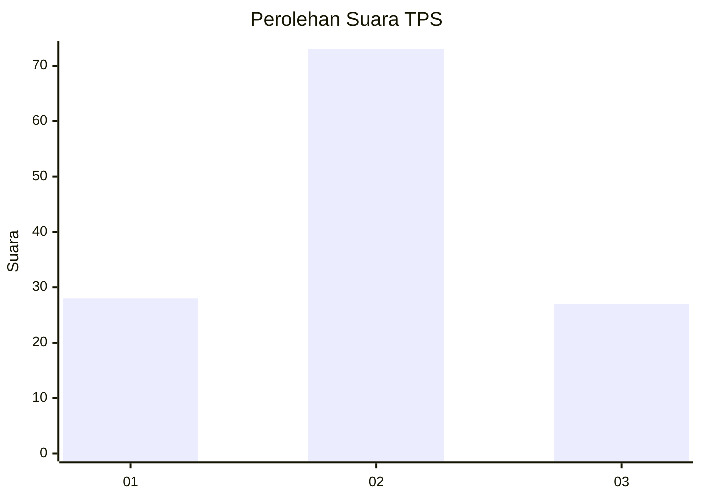
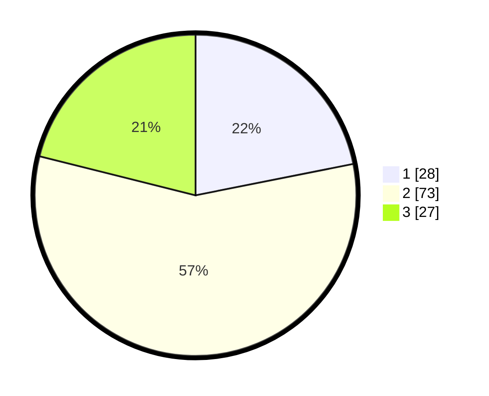

# Hasil

## Grafik

## Tabel

| No. | Nama Paslon    | Suara | Suara (raw) | Persentase |
|:--- |:-------------- | -----:| -----------:| ----------:|
| 1   | ANIES MUHAIMIN | 28    | [28][p-1]   | 21,88      |
| 2   | PRABOWO GIBRAN | 73    | [73][p-2]   | 57,03      |
| 3   | GANJAR MAHFUD  | 27    | [27][p-3]   | 21,09      |

[p-1]: https://github.com/gigit-pemilu/pemilu-2024/blob/main/pilpres/hitung-suara/sub/33-jawa-tengah/sub/29-brebes/sub/15-larangan/sub/2008-sitanggal/sub/051-tps/sub/paslon-1.txt
[p-2]: https://github.com/gigit-pemilu/pemilu-2024/blob/main/pilpres/hitung-suara/sub/33-jawa-tengah/sub/29-brebes/sub/15-larangan/sub/2008-sitanggal/sub/051-tps/sub/paslon-2.txt
[p-3]: https://github.com/gigit-pemilu/pemilu-2024/blob/main/pilpres/hitung-suara/sub/33-jawa-tengah/sub/29-brebes/sub/15-larangan/sub/2008-sitanggal/sub/051-tps/sub/paslon-3.txt

## Foto C Plano

https://sirekap-obj-formc.kpu.go.id/21dd/pemilu/ppwp/33/29/15/20/08/3329152008051-20240214-220703--dc74156a-670f-4f5a-be8f-3c29d662487a.jpg

https://sirekap-obj-formc.kpu.go.id/21dd/pemilu/ppwp/33/29/15/20/08/3329152008051-20240214-220941--86a9b90c-bc45-4683-90c6-146bc84e6740.jpg

https://sirekap-obj-formc.kpu.go.id/21dd/pemilu/ppwp/33/29/15/20/08/3329152008051-20240214-221202--cafc50f0-6f7b-4f7d-acb4-5c2efdccf16f.jpg

## Metadata

| Key        | Value               |
| ---------- | ------------------- |
| Time Stamp | 2024-02-24 22:31:28 |

