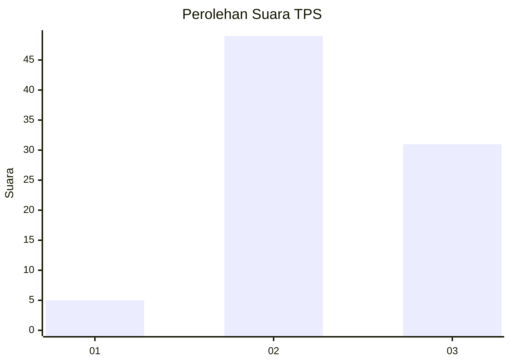
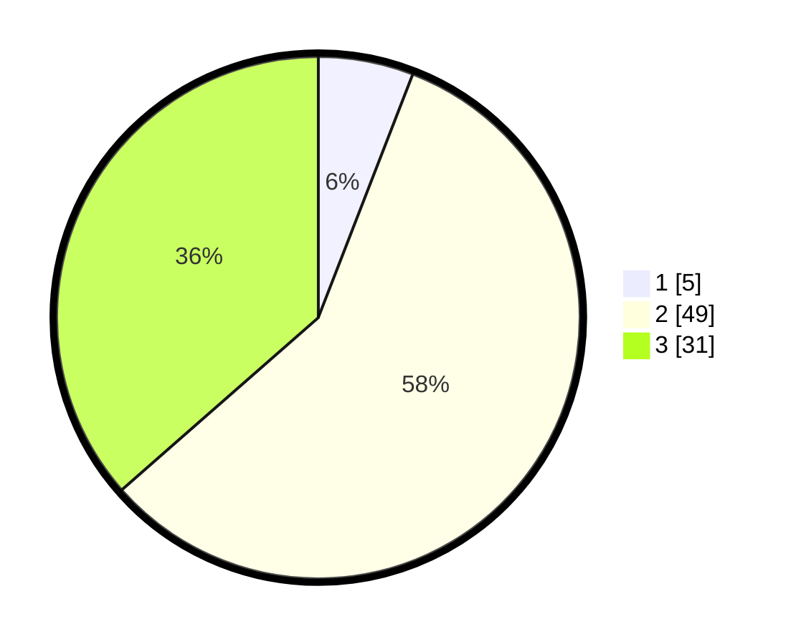

# Hasil

## Grafik

## Tabel

| No. | Nama Paslon    | Suara | Suara (raw) | Persentase |
|:--- |:-------------- | -----:| -----------:| ----------:|
| 1   | ANIES MUHAIMIN | 5     | [5][p-1]    | 5,88       |
| 2   | PRABOWO GIBRAN | 49    | [49][p-2]   | 57,65      |
| 3   | GANJAR MAHFUD  | 31    | [31][p-3]   | 36,47      |

[p-1]: https://github.com/gigit-pemilu/pemilu-2024/blob/main/pilpres/hitung-suara/sub/33-jawa-tengah/sub/29-brebes/sub/15-larangan/sub/2008-sitanggal/sub/053-tps/sub/paslon-1.txt
[p-2]: https://github.com/gigit-pemilu/pemilu-2024/blob/main/pilpres/hitung-suara/sub/33-jawa-tengah/sub/29-brebes/sub/15-larangan/sub/2008-sitanggal/sub/053-tps/sub/paslon-2.txt
[p-3]: https://github.com/gigit-pemilu/pemilu-2024/blob/main/pilpres/hitung-suara/sub/33-jawa-tengah/sub/29-brebes/sub/15-larangan/sub/2008-sitanggal/sub/053-tps/sub/paslon-3.txt

## Foto C Plano

https://sirekap-obj-formc.kpu.go.id/d77c/pemilu/ppwp/33/29/15/20/08/3329152008053-20240214-141006--111c570e-87e2-491c-8c13-8bbbaaf79fae.jpg

https://sirekap-obj-formc.kpu.go.id/d77c/pemilu/ppwp/33/29/15/20/08/3329152008053-20240214-141612--99e5bc82-3002-4279-9302-b7e3f4f79ca9.jpg

https://sirekap-obj-formc.kpu.go.id/d77c/pemilu/ppwp/33/29/15/20/08/3329152008053-20240214-215133--52fb4b4f-c93f-461b-96fb-65c659b42951.jpg

## Metadata

| Key        | Value               |
| ---------- | ------------------- |
| Time Stamp | 2024-02-15 15:00:29 |

