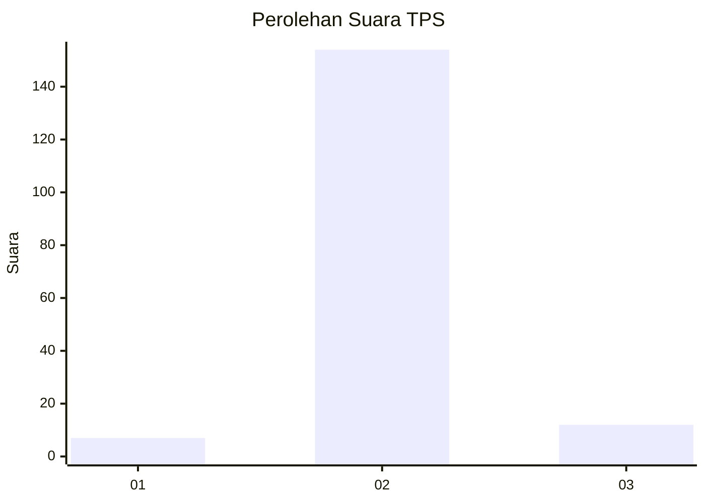
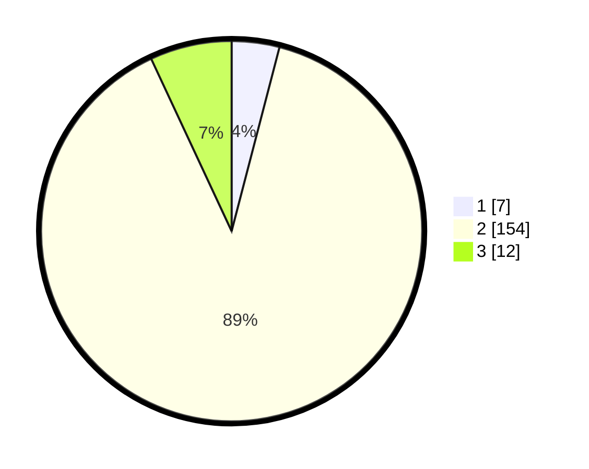

# Hasil

## Grafik

## Tabel

| No. | Nama Paslon    | Suara | Suara (raw) | Persentase |
|:--- |:-------------- | -----:| -----------:| ----------:|
| 1   | ANIES MUHAIMIN | 7     | [7][p-1]    | 4,05       |
| 2   | PRABOWO GIBRAN | 154   | [154][p-2]  | 89,02      |
| 3   | GANJAR MAHFUD  | 12    | [12][p-3]   | 6,94       |

[p-1]: https://github.com/gigit-pemilu/pemilu-2024/blob/main/pilpres/hitung-suara/sub/33-jawa-tengah/sub/29-brebes/sub/15-larangan/sub/2010-wlahar/sub/020-tps/sub/paslon-1.txt
[p-2]: https://github.com/gigit-pemilu/pemilu-2024/blob/main/pilpres/hitung-suara/sub/33-jawa-tengah/sub/29-brebes/sub/15-larangan/sub/2010-wlahar/sub/020-tps/sub/paslon-2.txt
[p-3]: https://github.com/gigit-pemilu/pemilu-2024/blob/main/pilpres/hitung-suara/sub/33-jawa-tengah/sub/29-brebes/sub/15-larangan/sub/2010-wlahar/sub/020-tps/sub/paslon-3.txt

## Foto C Plano

https://sirekap-obj-formc.kpu.go.id/b6b8/pemilu/ppwp/33/29/15/20/10/3329152010020-20240214-222733--a4786625-0943-4daf-96a2-f4877ce49c80.jpg

https://sirekap-obj-formc.kpu.go.id/b6b8/pemilu/ppwp/33/29/15/20/10/3329152010020-20240215-091759--3f3d54cf-0124-49ed-9fb9-9c1d1a1c2b05.jpg

https://sirekap-obj-formc.kpu.go.id/b6b8/pemilu/ppwp/33/29/15/20/10/3329152010020-20240214-222938--acf96232-7a35-4d5e-b05f-01c009a31fb2.jpg

## Metadata

| Key        | Value               |
| ---------- | ------------------- |
| Time Stamp | 2024-02-15 19:30:26 |

