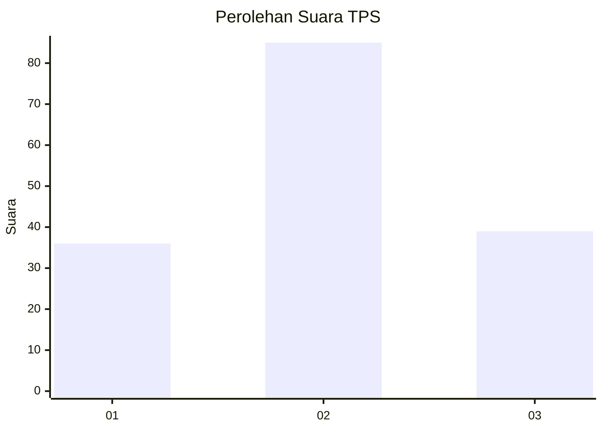
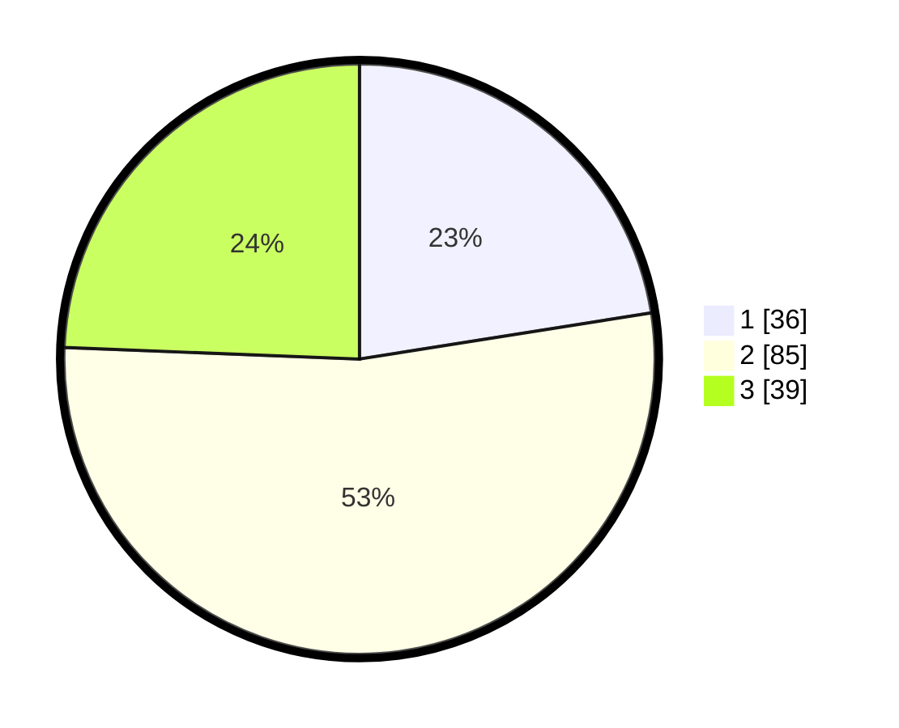

# Hasil

## Grafik

## Tabel

| No. | Nama Paslon    | Suara | Suara (raw) | Persentase |
|:--- |:-------------- | -----:| -----------:| ----------:|
| 1   | ANIES MUHAIMIN | 36    | [36][p-1]   | 22,50      |
| 2   | PRABOWO GIBRAN | 85    | [85][p-2]   | 53,13      |
| 3   | GANJAR MAHFUD  | 39    | [39][p-3]   | 24,38      |

[p-1]: https://github.com/gigit-pemilu/pemilu-2024-33-jawa-tengah/blob/main/pilpres/hitung-suara/sub/33-jawa-tengah/sub/29-brebes/sub/16-ketanggungan/sub/2001-baros/sub/003-tps/sub/paslon-1.txt
[p-2]: https://github.com/gigit-pemilu/pemilu-2024-33-jawa-tengah/blob/main/pilpres/hitung-suara/sub/33-jawa-tengah/sub/29-brebes/sub/16-ketanggungan/sub/2001-baros/sub/003-tps/sub/paslon-2.txt
[p-3]: https://github.com/gigit-pemilu/pemilu-2024-33-jawa-tengah/blob/main/pilpres/hitung-suara/sub/33-jawa-tengah/sub/29-brebes/sub/16-ketanggungan/sub/2001-baros/sub/003-tps/sub/paslon-3.txt

## Foto C Plano

https://sirekap-obj-formc.kpu.go.id/1b67/pemilu/ppwp/33/29/16/20/01/3329162001003-20240214-200629--08d72ca7-eaec-46bd-866a-f794a0cc39ab.jpg

https://sirekap-obj-formc.kpu.go.id/1b67/pemilu/ppwp/33/29/16/20/01/3329162001003-20240216-205023--5a399578-ace1-4e4f-8b0c-03cd2052652a.jpg

https://sirekap-obj-formc.kpu.go.id/1b67/pemilu/ppwp/33/29/16/20/01/3329162001003-20240216-205209--7f127f37-1394-42f1-8fc0-6efd7233d6d3.jpg

## Metadata

| Key        | Value               |
| ---------- | ------------------- |
| Time Stamp | 2024-02-17 09:00:02 |

