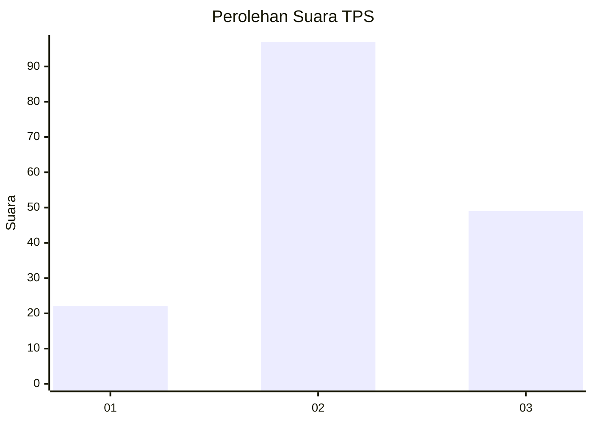
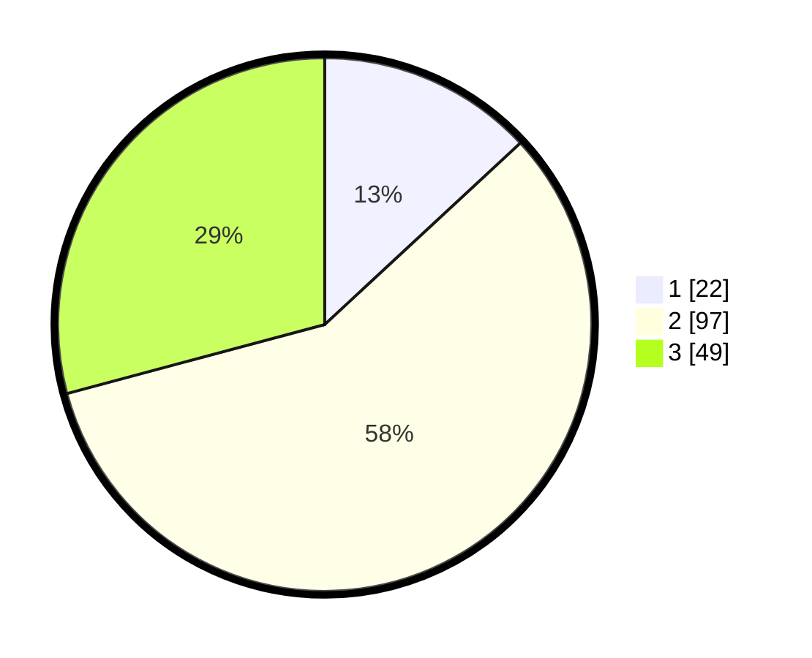

# Hasil

## Grafik

## Tabel

| No. | Nama Paslon    | Suara | Suara (raw) | Persentase |
|:--- |:-------------- | -----:| -----------:| ----------:|
| 1   | ANIES MUHAIMIN | 22    | [22][p-1]   | 13,10      |
| 2   | PRABOWO GIBRAN | 97    | [97][p-2]   | 57,74      |
| 3   | GANJAR MAHFUD  | 49    | [49][p-3]   | 29,17      |

[p-1]: https://github.com/gigit-pemilu/pemilu-2024/blob/main/pilpres/hitung-suara/sub/33-jawa-tengah/sub/29-brebes/sub/16-ketanggungan/sub/2001-baros/sub/005-tps/sub/paslon-1.txt
[p-2]: https://github.com/gigit-pemilu/pemilu-2024/blob/main/pilpres/hitung-suara/sub/33-jawa-tengah/sub/29-brebes/sub/16-ketanggungan/sub/2001-baros/sub/005-tps/sub/paslon-2.txt
[p-3]: https://github.com/gigit-pemilu/pemilu-2024/blob/main/pilpres/hitung-suara/sub/33-jawa-tengah/sub/29-brebes/sub/16-ketanggungan/sub/2001-baros/sub/005-tps/sub/paslon-3.txt

## Foto C Plano

https://sirekap-obj-formc.kpu.go.id/70c5/pemilu/ppwp/33/29/16/20/01/3329162001005-20240217-140151--b5bce996-b2a0-491d-a9cb-88110a9b40fb.jpg

https://sirekap-obj-formc.kpu.go.id/70c5/pemilu/ppwp/33/29/16/20/01/3329162001005-20240217-140256--9169c7c0-359d-472c-8b75-611f7a262bd0.jpg

https://sirekap-obj-formc.kpu.go.id/70c5/pemilu/ppwp/33/29/16/20/01/3329162001005-20240217-140357--851abcaa-6ac5-41f4-be52-1b75d537dd56.jpg

## Metadata

| Key        | Value               |
| ---------- | ------------------- |
| Time Stamp | 2024-02-17 14:45:18 |

