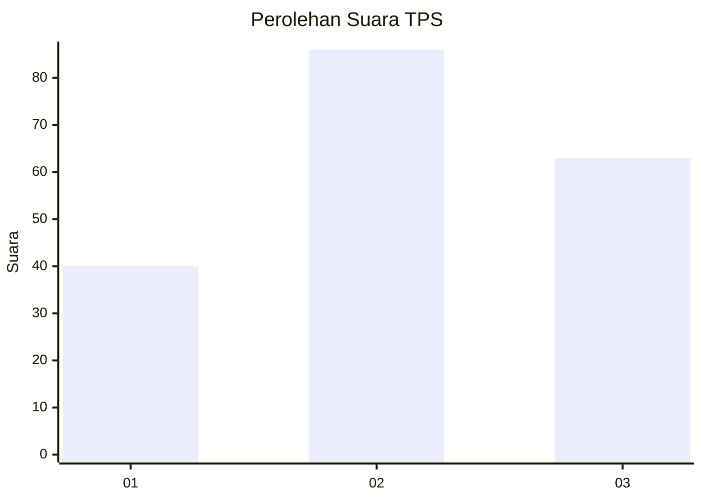
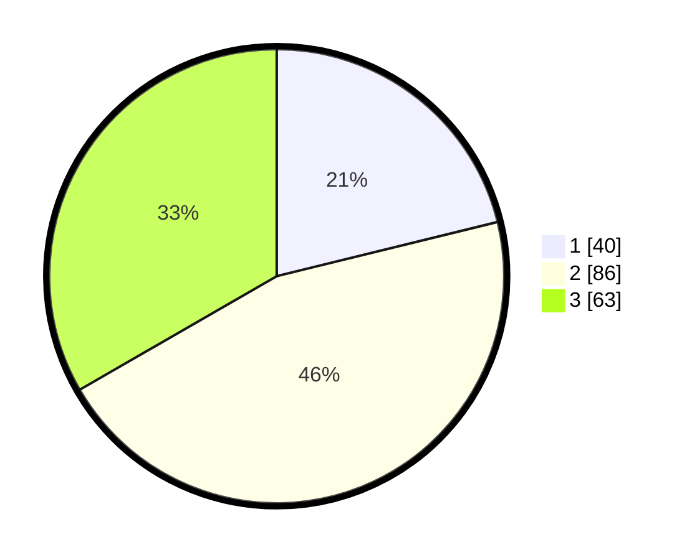

# Hasil

## Grafik

## Tabel

| No. | Nama Paslon    | Suara | Suara (raw) | Persentase |
|:--- |:-------------- | -----:| -----------:| ----------:|
| 1   | ANIES MUHAIMIN | 40    | [40][p-1]   | 21,16      |
| 2   | PRABOWO GIBRAN | 86    | [86][p-2]   | 45,50      |
| 3   | GANJAR MAHFUD  | 63    | [63][p-3]   | 33,33      |

[p-1]: https://github.com/gigit-pemilu/pemilu-2024/blob/main/pilpres/hitung-suara/sub/33-jawa-tengah/sub/29-brebes/sub/16-ketanggungan/sub/2001-baros/sub/006-tps/sub/paslon-1.txt
[p-2]: https://github.com/gigit-pemilu/pemilu-2024/blob/main/pilpres/hitung-suara/sub/33-jawa-tengah/sub/29-brebes/sub/16-ketanggungan/sub/2001-baros/sub/006-tps/sub/paslon-2.txt
[p-3]: https://github.com/gigit-pemilu/pemilu-2024/blob/main/pilpres/hitung-suara/sub/33-jawa-tengah/sub/29-brebes/sub/16-ketanggungan/sub/2001-baros/sub/006-tps/sub/paslon-3.txt

## Foto C Plano

https://sirekap-obj-formc.kpu.go.id/4d48/pemilu/ppwp/33/29/16/20/01/3329162001006-20240216-234853--825c553d-dd71-4c55-9bbe-14ef2f857cf5.jpg

https://sirekap-obj-formc.kpu.go.id/4d48/pemilu/ppwp/33/29/16/20/01/3329162001006-20240216-235032--13dcebd0-1bfd-45d0-a9ef-7d995783aa7d.jpg

https://sirekap-obj-formc.kpu.go.id/4d48/pemilu/ppwp/33/29/16/20/01/3329162001006-20240216-235206--f13f39ef-ca59-4b69-b46d-1cd994fa993b.jpg

## Metadata

| Key        | Value               |
| ---------- | ------------------- |
| Time Stamp | 2024-02-17 09:00:02 |

