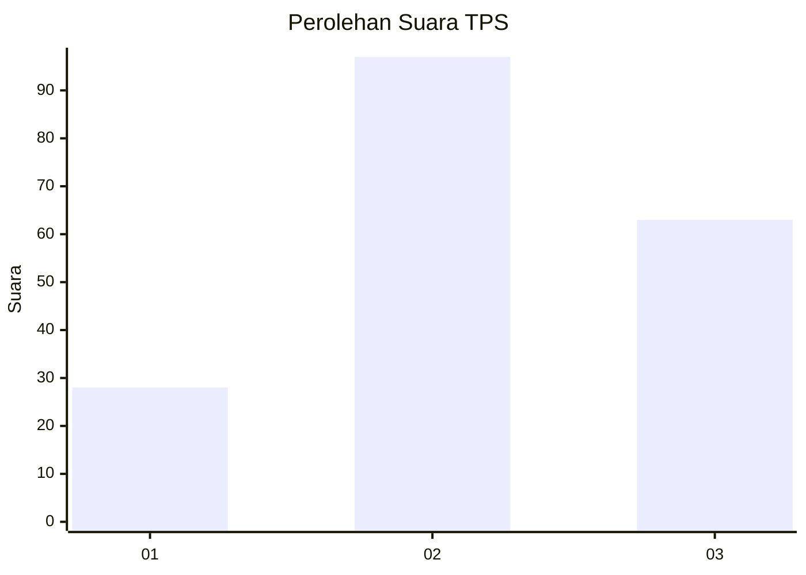
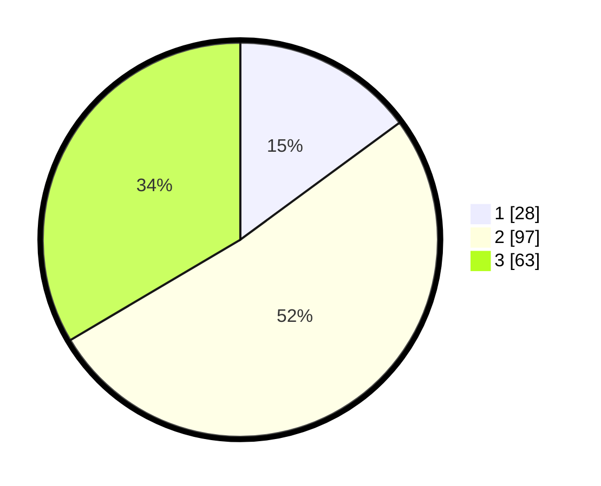

# Hasil

## Grafik

## Tabel

| No. | Nama Paslon    | Suara | Suara (raw) | Persentase |
|:--- |:-------------- | -----:| -----------:| ----------:|
| 1   | ANIES MUHAIMIN | 28    | [28][p-1]   | 14,89      |
| 2   | PRABOWO GIBRAN | 97    | [97][p-2]   | 51,60      |
| 3   | GANJAR MAHFUD  | 63    | [63][p-3]   | 33,51      |

[p-1]: https://github.com/gigit-pemilu/pemilu-2024-33-jawa-tengah/blob/main/pilpres/hitung-suara/sub/33-jawa-tengah/sub/29-brebes/sub/16-ketanggungan/sub/2001-baros/sub/008-tps/sub/paslon-1.txt
[p-2]: https://github.com/gigit-pemilu/pemilu-2024-33-jawa-tengah/blob/main/pilpres/hitung-suara/sub/33-jawa-tengah/sub/29-brebes/sub/16-ketanggungan/sub/2001-baros/sub/008-tps/sub/paslon-2.txt
[p-3]: https://github.com/gigit-pemilu/pemilu-2024-33-jawa-tengah/blob/main/pilpres/hitung-suara/sub/33-jawa-tengah/sub/29-brebes/sub/16-ketanggungan/sub/2001-baros/sub/008-tps/sub/paslon-3.txt

## Foto C Plano

https://sirekap-obj-formc.kpu.go.id/7a63/pemilu/ppwp/33/29/16/20/01/3329162001008-20240215-011053--9911dcca-a5a9-4cf8-a29b-d293f7cf3ebf.jpg

https://sirekap-obj-formc.kpu.go.id/7a63/pemilu/ppwp/33/29/16/20/01/3329162001008-20240215-011226--2a64ea63-bbc0-4ed9-960e-0b3616711c3a.jpg

https://sirekap-obj-formc.kpu.go.id/7a63/pemilu/ppwp/33/29/16/20/01/3329162001008-20240215-011439--5f85e007-8a01-410d-825d-85b230bc7bdc.jpg

## Metadata

| Key        | Value               |
| ---------- | ------------------- |
| Time Stamp | 2024-02-24 22:31:28 |

