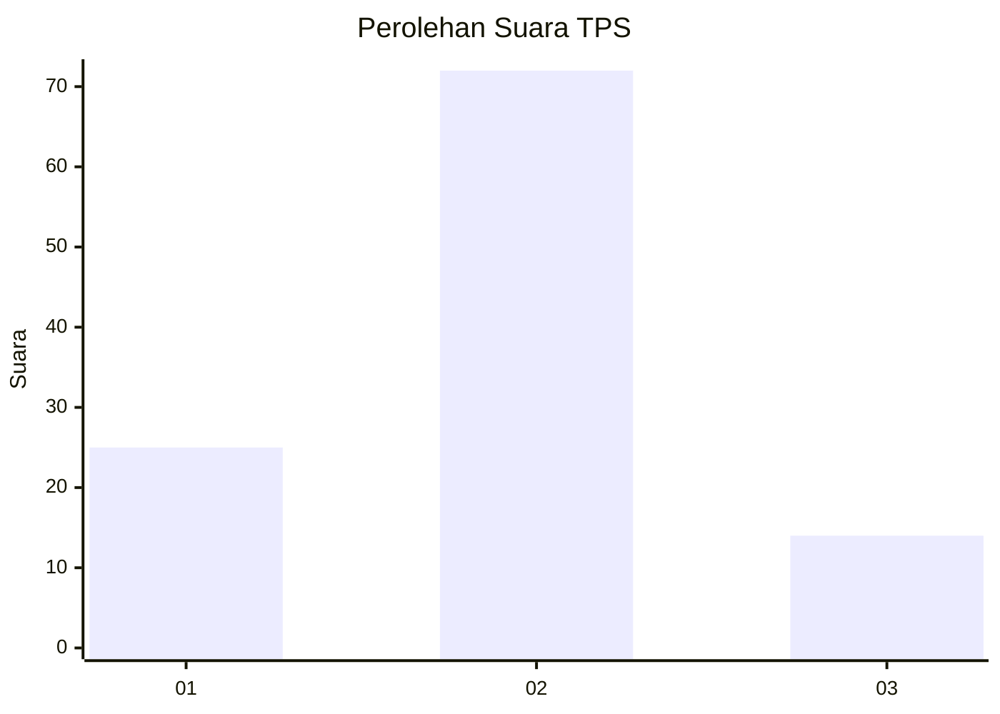
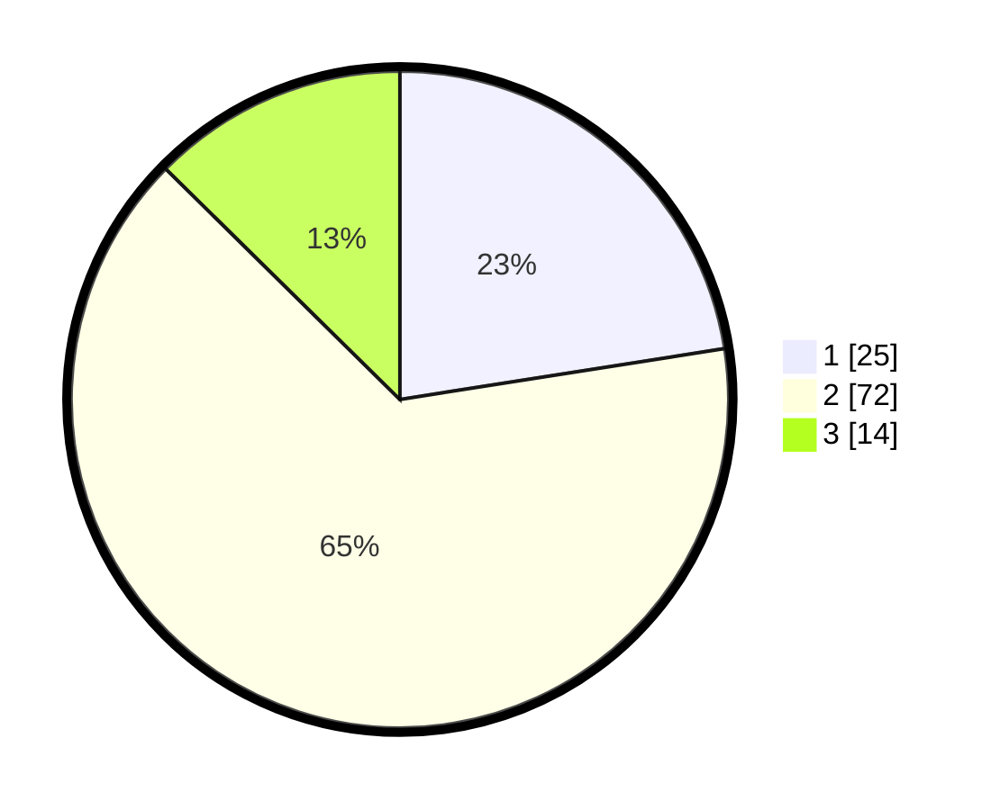

# Hasil

## Grafik

## Tabel

| No. | Nama Paslon    | Suara | Suara (raw) | Persentase |
|:--- |:-------------- | -----:| -----------:| ----------:|
| 1   | ANIES MUHAIMIN | 25    | [25][p-1]   | 22,52      |
| 2   | PRABOWO GIBRAN | 72    | [72][p-2]   | 64,86      |
| 3   | GANJAR MAHFUD  | 14    | [14][p-3]   | 12,61      |

[p-1]: https://github.com/gigit-pemilu/pemilu-2024-33-jawa-tengah/blob/main/pilpres/hitung-suara/sub/33-jawa-tengah/sub/29-brebes/sub/16-ketanggungan/sub/2016-pamedaran/sub/002-tps/sub/paslon-1.txt
[p-2]: https://github.com/gigit-pemilu/pemilu-2024-33-jawa-tengah/blob/main/pilpres/hitung-suara/sub/33-jawa-tengah/sub/29-brebes/sub/16-ketanggungan/sub/2016-pamedaran/sub/002-tps/sub/paslon-2.txt
[p-3]: https://github.com/gigit-pemilu/pemilu-2024-33-jawa-tengah/blob/main/pilpres/hitung-suara/sub/33-jawa-tengah/sub/29-brebes/sub/16-ketanggungan/sub/2016-pamedaran/sub/002-tps/sub/paslon-3.txt

## Foto C Plano

https://sirekap-obj-formc.kpu.go.id/a222/pemilu/ppwp/33/29/16/20/16/3329162016002-20240215-124952--000bfa65-93a8-4e91-ba8c-ec5104988b42.jpg

https://sirekap-obj-formc.kpu.go.id/a222/pemilu/ppwp/33/29/16/20/16/3329162016002-20240215-125043--a99adf23-6a01-4643-8c60-63bafb246cb9.jpg

https://sirekap-obj-formc.kpu.go.id/a222/pemilu/ppwp/33/29/16/20/16/3329162016002-20240215-125143--1d0a3c1a-3bb6-408c-a7b6-8da7fad57dfb.jpg

## Metadata

| Key        | Value               |
| ---------- | ------------------- |
| Time Stamp | 2024-02-15 16:00:26 |

